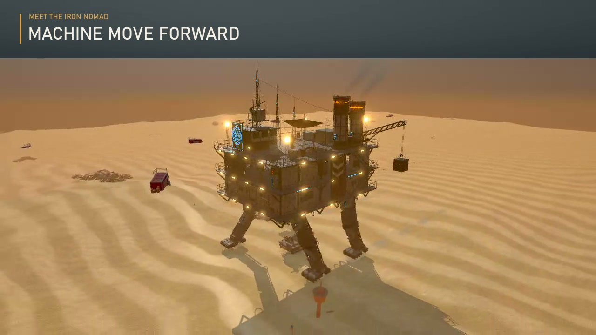

# Machine Move Forward

Keep your home alive as it walks through a hostile desert. **Machine Move Forward** is a third-person survival shooter about salvaging supplies, building a mobile base, defending its machinery, and following radio signals into abandoned industrial outposts.

[**Play the prototype**](https://hwashburn1011.github.io/machine-move-forward/) · [**Watch the 40-second trailer**](https://hwashburn1011.github.io/machine-move-forward/trailer/)

[](https://hwashburn1011.github.io/machine-move-forward/trailer/)

The trailer opens in a browser player with playback controls. [Download the MP4](https://hwashburn1011.github.io/machine-move-forward/trailer/media/machine-move-forward-trailer.mp4). This is an in-development desktop browser game; use a keyboard and mouse.

## Playable features

- Salvage reel, inventory, storage, crafting, refinery, workbench, power and fuel.
- Buildable floors, walls, doorways, rails, roofs, stairs, stations and equipment on a 2m grid.
- Localized engine and leg damage, repair, weight, gait, rooms and enemy pathfinding over player construction.
- Rifle and shotgun combat, two infantry types, and a boarding skiff with hull, crew and hook damage targets.
- Manual deck gun with power draw, aim, damage, repair and persistence.
- A ranged raider gunboat with separate hull, weapon and engine damage, visible shell warnings and disable outcomes.
- Earned automatic salvage collectors with persistent storage, and powered defense turrets that track exposed enemies.
- Original Blender characters, machine, weapons, skiff and expedition models with procedural fallbacks.
- Radio-led Wreck One followed by Relay Foundry: route choice, direct gunboat hazard, detour, sanctuary hold, gangway exploration, journals, required uniques and departure.
- Local saves with safe Save & Quit boundaries and persistent inventory, construction, upgrades and expedition progress.

## Run the game

```bash
npm install
npm run dev                 # http://localhost:5173
npm test                    # deterministic unit tests
npm run build               # TypeScript and production build
npm run lint
npm run test:e2e            # Playwright browser suite
```

The title screen offers New Game, Continue and Settings. Click the canvas for pointer lock. `Esc` opens the pause menu; Save & Quit waits for a safe boundary during an encounter.

## Controls

| Key | Action |
| --- | --- |
| `WASD` | Move |
| Mouse | Look |
| `Shift` | Sprint |
| `Ctrl` / `C` | Crouch |
| `Space` | Jump |
| LMB | Fire |
| RMB | Aim |
| `R` | Reload |
| `1` / `2` | Rifle / shotgun |
| `F` | Fire salvage reel |
| `E` | Use stations, radio, journals, uniques and deck gun |
| Hold `E` | Repair or cut a boarding hook |
| `B` | Build mode |
| `Tab` | Inventory |
| `M` | Mute |
| `Esc` | Close panel, leave gun or pause |

Build mode uses `G` for category, `1`–`9` for the active piece, mouse wheel for level, `Q`/`E` to rotate, LMB to place and RMB to demolish. Demolition refunds 60%; build weight affects machine speed.

## Expedition chapter

The first eligible salvage chest after the opening contains the radio. Complete the guided defense, power the radio, and follow its signal. Wreck One is a physical dock: slow at the safe boundary, cross the authored gangway, read its three logs and recover the Course Gyro. Returning to the radio enables departure.

The Course Gyro unlocks the Navigation Helm. Choose a shorter direct route with a gunboat encounter or a longer detour. The machine holds outside the Foundry until nearby fighting ends, then docks for exploration. Recover the Salvage Controller and Tracking Servo and read the Foundry's records before returning aboard. These components unlock the automatic collector and defense turret.

Collectors reel in nearby salvage and store it in six slots for later transfer. Automatic turrets consume power, turn toward visible infantry or gunboat components, and fire only with a clear shot. Position and power both matter.

## Developer harnesses

All browser harnesses use the real game. Run them one at a time when using the software renderer, and set `MMF_PORT` when another checkout already owns port 5173.

```bash
node tools/first-run.mjs
node tools/chapter-flow.mjs
node tools/expansion-flow.mjs
node tools/automation-acceptance.mjs
node tools/shoot.mjs out.png [waitMs] ["?params"]
node tools/drive.mjs
node tools/combat.mjs [out.png]
node tools/combat-regression.mjs
node tools/build.mjs
node tools/craft.mjs [out.png]
node tools/opening.mjs [out.png]
node tools/deck.mjs
node tools/boarding.mjs
node tools/boarding-navigation.mjs
node tools/stairs.mjs
node tools/art/verify-assets.mjs
node tools/art/verify-expedition-assets.mjs
node tools/art/review-game.mjs
node tools/art/review-chapter.mjs
```

Harnesses can use `?nomenu=1` for a controlled start, `?nospawn=1` to suppress encounters, `?nolock=1` to skip pointer lock, `?quality=low|medium|high|ultra`, `?seed=name`, `?nosound=1`, and `?cam=far|front|side|sky`. `?opening=1` forces the rooftop opening. `?notex=1` and `?nomodel=1` force procedural compatibility paths.

Set `MMF_HARDWARE=1` to use hardware-accelerated Chrome on Windows. The expansion performance harness is `node tools/art/expansion_v1/performance.mjs --seconds=20 --cycles=24`; it measures frame times and repeated device rebuilds. Capture and trailer reproduction instructions are in [docs/media/README.md](docs/media/README.md).

### Debug keys

| Key | Action |
| --- | --- |
| `F1` / `F2` | Quicksave / quickload |
| `F3` | Debug overlay |
| `F4` | Spawn an enemy |
| `F5` | Give ammo and scrap |
| `F6` | God mode |
| `F7` | Jump 500m |
| `F8` | Cycle quality |
| `F9` | Bypass post-processing |
| `F10` | Cycle time of day |

## Architecture

The simulation keeps the machine at the world origin while the desert scrolls around it. This keeps Rapier physics stable and lets the same procedural geometry drive the build grid, navigation cells and colliders. Rendering uses Three.js, TypeScript and Vite; Blender supplies the original authored art.

`src/game` owns orchestration and the fixed 60Hz loop. `src/core` provides renderer, physics, input and events. `src/data` holds definitions. `src/machine` owns geometry, movement and power. `src/building` owns grid placement, rooms and colliders. `src/combat`, `src/enemies`, `src/vehicles` and `src/defense` implement encounters. `src/story`, `src/data/routes.ts`, `src/save` and `src/ui` implement the campaign and expedition presentation. `src/art` contains loaders, authored model validation and procedural fallbacks.

The machine and build pieces remain procedural where collision fidelity matters. Authored models are used where silhouette, animation or surface detail earns the load path. Missing or invalid assets fall back without preventing boot. See [ASSETS.md](ASSETS.md), [the art README](docs/art/README.md), [graphics-v3 delivery](docs/art/graphics-v3/README.md), and [expedition art notes](docs/art/expedition.md).

## Licences

Third-party models and textures retain their individual licences and provenance in [ASSETS.md](ASSETS.md). Original project code, Blender artwork and trailer music are identified separately there; public repository access does not grant an additional licence to those works.
