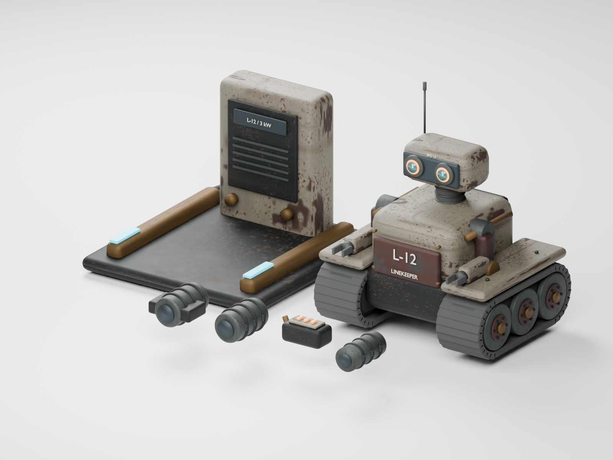

# Fieldwork kit

Original Blender geometry and materials authored for Machine Move Forward. The kit contains L-12 Linekeeper, its charging dock, and four distinct weapon attachments. No downloaded models or external stock artwork are used.

- Editable source: `fieldwork-kit.blend` (packed materials).
- Runtime: `public/models/authored/fieldwork-kit.glb`, 5,097,532 bytes.
- Complete kit: 65,032 triangles / 82 meshes. L-12 and the dock are separate named hierarchies; each weapon borrows only its selected attachment.
- L-12 has animated wheel, sensor and arm pivots. The runtime moves its physics capsule; it is not a skinned human rig.
- glTF validator: zero errors and zero warnings. Six invalid export tangents were repaired during packing.
- Unreal 5.8.2 imports: six static meshes with verified centimetre bounds, plus `/Game/NomadFieldwork/Review`. The Unreal import validates editable asset interchange; browser gameplay uses the GLB.
- Blender MCP review: scene `Nomad L-12 fieldwork review` appended through port 9876; the nine existing scenes were preserved.

Reproduction scripts live in `tools/art/fieldwork/`: build, render, optimize, glTF validate, separate FBX export, Unreal import, and additive MCP review. Intermediate exports and Unreal-generated caches are ignored by Git.
