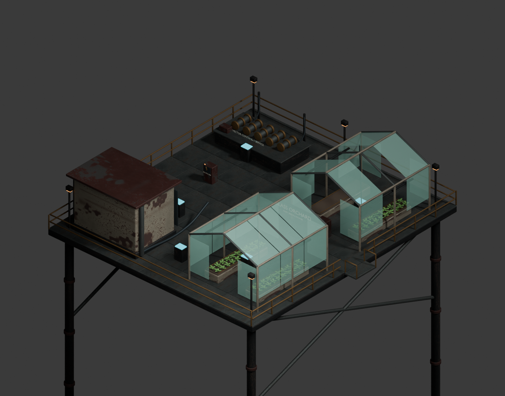
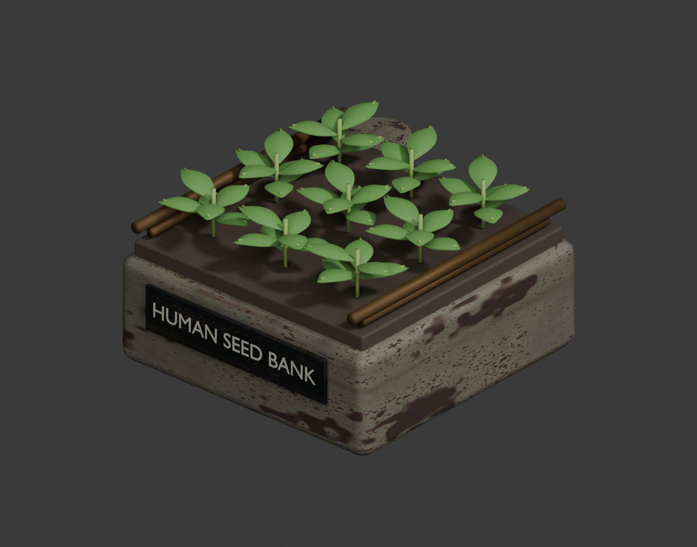
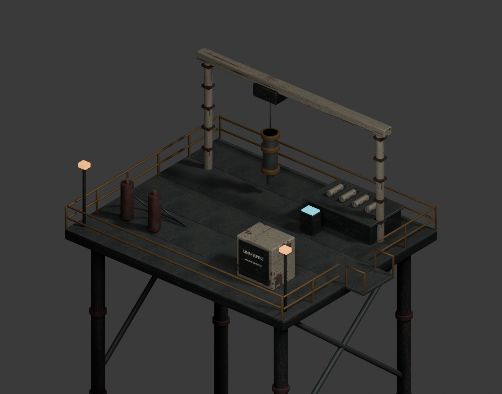

# Glass Orchard art delivery

Three original project models made in Blender 5.1, using the existing project's
weathered industrial PBR palette. No paid assets, downloaded geometry, or external
generation service was used.

The September 15 clearance pass moves the port switch cabinet beside the greenhouse
entrance. Its Blender anchor, runtime GLB, fallback marker and collision box agree;
triangle count remains 164,116. The rebuilt GLB validates with zero errors and warnings.
The [in-game doorway review](../../docs/campaign/orchard-normal-route-map.md) records
normal-speed movement through the corrected entrance in an isolated full-art fixture.

| Asset | Source | Triangles | Runtime GLB |
| --- | --- | ---: | ---: |
| Greenhouse and archive destination | `glass-orchard.blend` | 164,116 | 15.1 MB |
| Buildable seed garden, both growth stages | `seed-garden.blend` | 24,996 | 5.9 MB |
| Linekeeper repair depot | `route-repair-depot.blend` | 34,528 | 9.2 MB |

The Orchard has two peaked glasshouses, growing beds, irrigation, warm grow
lights, missing panes, an archive housing, a governor service bench, isolator
cabinets, railings and practical lamps. The seed garden has curved leaf meshes,
stems, separate growing/ready groups, a water reservoir and irrigation pipes.
The depot includes an overhead hoist, suspended actuator, spare cylinders,
service bottles, hoses and a repair locker.

Runtime models live under `public/models/authored/`. Packed Blender masters are
editable; intermediate GLB/FBX exports and Unreal caches are excluded from Git.
Blender uses metres; export conversion maps Blender `(x,-z,y)` to game `(x,y,z)`.
Interaction anchors and collision definitions are recorded in `src/data/story.ts`
and `src/data/opportunities.ts`.

Rebuild in order using Blender's `--background --python` with
`tools/art/glass_orchard/build_orchard.py`, `build_garden.py` and `build_depot.py`.
Then run `node tools/art/glass_orchard/optimize.mjs` and `validate.mjs`.
`render_review.py` renders all three source reviews. The optimization preserves
geometry and converts embedded images to WebP, retaining lossless normal/ORM
maps. Runtime material reuse avoids uploading repeated campaign textures.

All three GLBs have zero validation errors and warnings; see
[glTF validation](gltf-validation.json) and [optimization](optimization.json).
Unreal Engine 5.8.2 imported all three FBX exports as native static meshes with
the expected centimetre dimensions and created `/Game/GlassOrchard/Review`.
See [Unreal validation](unreal-validation.json) and `tools/art/glass_orchard/import_unreal.py`.

