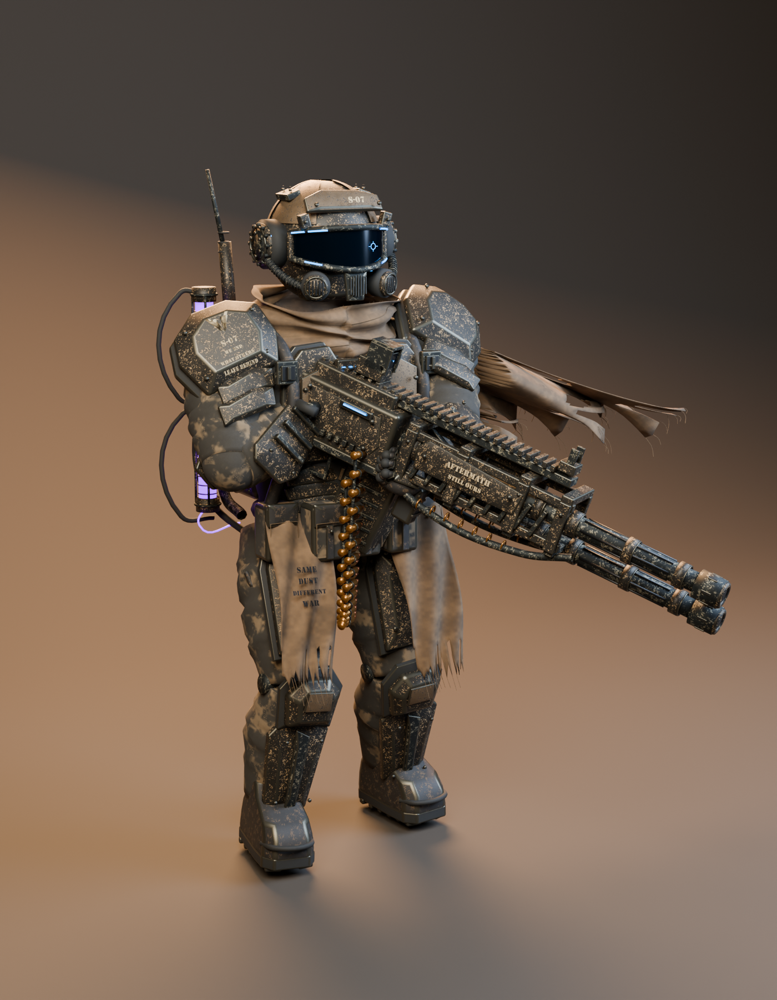

# S—07 / GUNNER

[Download the full portable art package](https://github.com/hwashburn1011/machine-move-forward/releases/download/v0.2.0/S07_Gunner_Package.zip). Editable Blender sources, textures and optimized models remain in this repository. The `exports/` and native Unreal binary links below refer to files inside that package; unpack it into this directory to use those paths. Current gameplay derivatives are versioned separately alongside the game integration.

A detailed, original Blender interpretation of the supplied gunner image: layered weathered armor, a panoramic blue visor, mechanical respirator, woven scarf and torn cloak, purple backpack reservoirs, articulated gloves, and a separate belt-fed heavy weapon.

## Open the model

| File | Use |
| --- | --- |
| [S07_Gunner.blend](source/S07_Gunner.blend) | Editable parts, 50-bone rig, reference pose, packed textures, studio and reference image. |
| [S07_Engine_Setup.blend](source/S07_Engine_Setup.blend) | Combined character mesh and separate weapon, arranged for engine work. |
| [S07_Character_Rigged.glb](exports/S07_Character_Rigged.glb) | Neutral A-pose character with skeleton and embedded materials. |
| [S07_Character_Rigged.fbx](exports/S07_Character_Rigged.fbx) | Skeletal FBX for Unreal and other DCC tools. |
| [S07_Heavy_Weapon.glb](exports/S07_Heavy_Weapon.glb) / [FBX](exports/S07_Heavy_Weapon.fbx) | Independent weapon with named grip and muzzle transforms. |
| [S07_Showcase.glb](exports/S07_Showcase.glb) | Static character and weapon in the reference pose. |
| [S07Preview.uproject](unreal/S07Preview.uproject) | Unreal 5.8 project. Final assets are under `Content/S07_Ready`. |

The local interactive viewer is at `http://127.0.0.1:5195/viewer/` while its preview server is running. The package includes Three.js and its MIT license, so it needs no online asset service. After extracting the ZIP, run `python -m http.server 8000 --bind 127.0.0.1` from the package folder and open `http://127.0.0.1:8000/viewer/` to use it again. Select the reference pose, neutral character, or weapon; drag to orbit and scroll to zoom. It is a local review page, not a published game update.

## Editing and posing

Open `S07_Gunner.blend`, select `S07_Rig`, and enter Pose Mode. The `Gun_Ready` action is a single authored pose. To see the neutral model, switch the armature to **Rest Position**; to author another pose, clear or replace the action and clear pose transforms. The exported rigged character is already in the neutral pose.

The rig includes spine, neck, head, clavicles, arms, hands, segmented fingers, thumbs, legs and feet. Armor has explicit rigid weights; the torso has blended spine weights. The cloth has bone attachments and an authored wind shape. It does not have cloth simulation. The weapon is independent and has `Muzzle`, `Grip.R`, and `Grip.L` helper transforms. It is not automatically attached to an animation controller.

The source keeps 833 character components and 404 weapon components independently editable. Exports combine those into one character mesh and one weapon mesh, split into material primitives by glTF viewers. All visible text is geometry, so no font installation is needed.

## Detail and materials

| Asset | Triangles | Material slots |
| --- | ---: | ---: |
| Character | 317,386 | 14 |
| Weapon | 128,188 | 12 |
| Combined showcase | 445,574 | 26 across both meshes |

The character is approximately 2.15 meters tall including the antenna. Blender uses meters, Z up and -Y forward; glTF uses its standard Y-up convention.

The 18 original PNGs comprise six tileable material sets: BaseColor, tangent Normal, and ORM. Armor and camouflage use 2048-pixel maps; the remaining sets use 1024-pixel maps. BaseColor uses sRGB; Normal and ORM are data textures. ORM is R=occlusion, G=roughness, B=metallic; the occlusion channel is neutral white, not a baked character AO map. Plain metallic, rubber, stencil and emissive materials complete the palette. UVs intentionally tile across parts; they are not a unique character paint atlas.

This is a detailed hero asset. There are no reduced LODs, animation pack, physics asset, retargeter, or completed gameplay integration. For many characters on screen, create LODs and profile in the target game. The skeleton is original, rather than the Unreal Mannequin skeleton.

## Unreal Engine

The included project was imported and checked using Unreal Engine **5.8.2**. Open it and browse `Content/S07_Ready` for the Skeletal Mesh, Skeleton, separate Static Mesh weapon, 16 materials and 18 textures. The final package includes this verified asset folder. The project contains assets rather than a playable demo level.

For a fresh manual import of these FBX files with Unreal's legacy FBX importer, use **Import Uniform Scale = 100**, **Convert Scene = enabled**, **Convert Scene Unit = disabled**, and import the character as a Skeletal Mesh with a new skeleton. Those are the settings validated for these specific exports. Native Unreal bounds were checked at roughly 215 cm tall. Use the supplied native assets to avoid repeating material setup.

Unreal materials in the included project are wired to BaseColor, Normal, Roughness, Metallic and emissive inputs. Normal maps have their green channel flipped for Unreal; ORM textures have sRGB disabled. If importing FBX into another project manually, reconnect packed material channels as needed. Epic documents the FBX importer and its material limitations in the [FBX import options reference](https://dev.epicgames.com/documentation/unreal-engine/fbx-import-options-reference-in-unreal-engine?lang=en-US) and [FBX material pipeline](https://dev.epicgames.com/documentation/en-us/unreal-engine/fbx-material-pipeline-in-unreal-engine).

## Reference fidelity and review

The supplied image was repeatedly compared against full-body and helmet renders. Refinements included the visor, separate armor layers, helmet hoses, rounded boot shapes, stance, shoulder and thigh-cloth clearance, readable markings, barrel separation, and portable material colors. The backpack rear, boots, muzzle and hidden surfaces were designed to fit the visible aesthetic. This is a 3D interpretation of one view, not an exact multi-view reconstruction.

- [Full reference pose](preview/01_S07_reference_pose.png)
- [Neutral front](preview/02_S07_neutral_front.png)
- [Back and equipment](preview/03_S07_back_equipment.png)
- [Helmet detail](preview/04_S07_helmet_detail.png)
- [Supplied reference](reference/gunner.png)

Geometry and procedural textures were made for this request. No downloaded third-party character or weapon model was used.

## Validation and rebuilding

Validation reports live in `source`: glTF validation, Blender importer round trips, tangent cleanup, native Unreal import and asset manifest. Both skeletal formats were re-imported, checked for valid weight sums and finite coordinates, and posed. All three GLBs pass the Khronos validator without errors or warnings. The browser viewer was also checked with each delivered model.

The construction scripts remain in the game workspace under `tools/art/gunner_s07`. Rebuild in this order using isolated background Blender processes: `build.py`, `polish.py`, `fit.py`, `drape.py`, `cloth_thickness.py`, then `deliver.py` on the saved source. Run `clean_gltf.py` and `validate.mjs` afterward. `deliver.py -- renders` creates review images; `render_back.py` positions the backdrop for the reverse view. `validate_blender.py` tests actual imports, and `import_unreal.py` creates the native assets in the isolated preview project.
