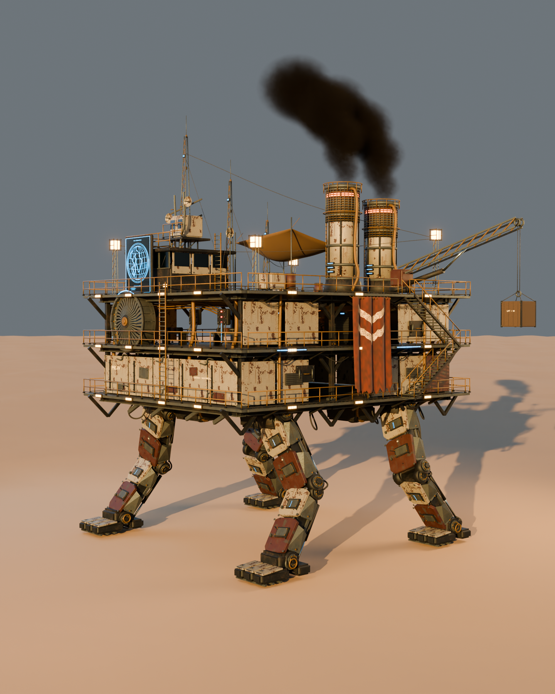

# Iron Nomad — four-legged mobile foundry

[Download the full portable art package](https://github.com/hwashburn1011/machine-move-forward/releases/download/v0.2.0/IronNomad_3D_Package.zip). Editable Blender sources, textures and optimized models remain in this repository. The `exports/` and native Unreal binary links below refer to files inside that package; unpack it into this directory to use those paths. Current gameplay derivatives are versioned separately alongside the game integration.


An original Blender vehicle model based on the supplied walking-fortress illustration, intended as the visual basis for the player's main machine in **Machine Move Forward**.



## Open the model

- **[Complete ZIP package](IronNomad_3D_Package.zip):** sources, exports, textures, viewer, reference, previews, validation reports, and rebuild scripts.
- **[Editable master](source/IronNomad_Master.blend):** individual armor plates, machinery, cables, fabric, lights, and structural parts. Textures are packed into the file.
- **[Review scene](source/IronNomad_Review.blend):** the same model with a camera, desert studio, lighting, and volumetric exhaust. Press F12 in Blender to render the hero view.
- **[Portable assembly](source/IronNomad_Portable.blend):** geometry consolidated by moving assembly, explicit triangles, and the active walking preview.
- **[Full-detail GLB](exports/iron-nomad-full.glb)** and **[FBX](exports/iron-nomad-full.fbx):** portable geometry, materials, named parts, and rigid component animation.
- **[Reduced-detail GLB](exports/iron-nomad-game.glb):** a lighter mesh retaining the four leg assemblies and the principal accessories.
- **[Collision proxies](exports/iron-nomad-colliders.glb):** separate coarse geometry for deck floors, major equipment, and stairs.
- **[Interactive viewer](viewer/index.html):** orbit, zoom, detail cameras, reference comparison, walking animation, crane rotation, wireframe, and night lighting.

Run the viewer over HTTP, rather than opening its HTML directly. From the game repository:

```powershell
python -m http.server 5197 --bind 127.0.0.1 --directory assets/iron-nomad
```

Then visit **http://127.0.0.1:5197/viewer/**. The viewer vendors its open-source dependencies and needs no CDN or account.

## What was modeled

Exactly **four mechanical legs**, each with a hip bearing, upper and lower articulated segments, layered cheek armor, hydraulic cylinders and rods, service hatches, hoses, retaining bolts, ankle housing, and three broad toe pads.

The fortress has **three deck levels**, perimeter catwalks, open workshop bays, railings, a switchback exterior stair, ladders, braced steel framing, pressure vessels, pump skids, distribution boards, underbody gearboxes, and hanging cable bundles. The upper deck carries a command cabin, a blue cartographic display, radio lookout, lattice antennas, microwave dishes, canvas awning, cargo, and two caged furnace towers with glowing heat slots.

A deep front turbine, cyan light strips, warm caged floodlights and task lamps, weathered double-chevron banner, and a lattice crane with a suspended crate follow the illustration's most recognizable details. The crane, hoist load, and turbine have separate pivots.

The reference was reviewed in cropped detail and against repeated front, side, leg, rear, and upper-deck renders. Refinements included deeper turbine construction, wider legs and feet, layered armor, heavier surface wear, corrected banner chevrons, stair placement, mounting brackets, and readable display text. The back and other unseen surfaces are original interpretations. This remains a modeled adaptation of the illustration; its dense cinematic atmosphere and every irregular surface detail are not reproduced exactly.

## Scale and animation contract

- Units: **meters**. Blender is Z-up, facing **-Y**. The GLB scene is Y-up, facing **+Z**. Preserve the scene root's conversion transform and the supplied hierarchy.
- Main deck footprint: **16 × 20 m**, with perimeter ledges outside that rectangle. Deck surfaces are **10.6, 14.2, and 17.8 m** above ground. Mast height is approximately **31.35 m**; the crane extends beyond the hull.
- Root: `IronNomad_FourLegWalker`. Its extras declare `assetId: iron-nomad` and `legCount: 4`.
- Leg IDs: `FrontLeft`, `FrontRight`, `RearLeft`, `RearRight`. Each has `Leg_<ID>_Hip`, `_Upper`, `_Lower`, and `_Foot`. Upper segments are parented to hips; lower segments and feet are under the machine root. Retain this arrangement when playing the supplied animation.
- GLB clip: **`Walker_Walk`**, one looping **4-second** rigid-node animation. It is a demonstration gait with four phase offsets and no root translation or terrain adaptation. The FBX contains corresponding baked component curves.
- The master opens in its designed still stance; its NLA tracks are muted. Unmute `Walker_Walk` tracks to preview motion, or use the portable Blender file/viewer.
- `Turbine_Rotor` rotates around its local Z. `CargoCrane_Yaw` also rotates around local Z; suggested preview limits are ±35 degrees. `Crane_Jib` and `Hoist_Load` remain separate. Moving the load vertically also requires adjusting the suspension cables; no hoist simulation is included.
- Other anchors: `FootContact_<ID>`, `PlayerSpawn`, `DeckAccess_0/1/2`, `EngineService`, `Exhaust_A`, and `Exhaust_B`. See [the assembly manifest](source/manifest.json) for pivots, light anchors, and collider definitions.

This is **component animation, not a skinned skeletal rig**. The FBX is not a ready-made Unreal Skeletal Mesh. An Unreal implementation needs an Actor/component setup or a skeletal conversion, plus engine materials and effects. Unreal import and gameplay have not been tested in this pass.

## Materials, lights, and performance

Original tiled PBR maps provide chipped ivory paint, oxide-red paint, bare steel, charcoal steel, and aged brass. Cloth, rubber, glass, and emissive materials are included. Original PNG maps remain in `textures/`: color maps use sRGB, normal and ORM maps use non-color data. ORM channels follow R=occlusion, G=roughness, B=metalness; reconnect these channels when rebuilding an engine material. These are material textures, not unique baked lightmaps.

`exports/` contains conventional GLBs with embedded PNGs. `optimized/` contains smaller **Meshopt + WebP** GLBs for the included viewer and compatible runtimes. The full version uses color maps up to 2K and detail maps up to 1K; the reduced version uses color maps up to 1K and detail maps up to 512. WebP reduces file transfer, not uncompressed GPU texture residency. Full metrics are recorded in [the export manifest](source/export-manifest.json) and [compression report](optimized/optimize-manifest.json).

| Variant | Triangles | Mesh assemblies | Material primitives | Compressed GLB |
| --- | ---: | ---: | ---: | ---: |
| Full | 551,156 | 33 | 191 | 32.70 MiB |
| Reduced | 231,312 | 33 | 191 | 16.14 MiB |

The editable master retains **4,592 individual parts**. Selected texture residency including mipmaps is approximately 133.3 MiB for the full compressed variant and 45.3 MiB for the reduced variant.

The geometry includes emissive fixtures and **83 light/area-light anchors**. It does not create 83 engine lights. The viewer uses eight local lights and one shadow-casting sun; engine integration should choose a similarly bounded light budget. Volumetric smoke, desert ground, camera, and studio lights are confined to the review scene. The exports contain exhaust anchors for later engine effects.

The reduced mesh is a runtime candidate, not a guarantee of 60 FPS in the complete game. It still has many material primitives. The separate playable derivative supplies collision, gait binding and local game profiling. Distant LODs and further material batching remain possible optimizations.

In short walking-viewer samples on the local RTX 3070, both variants averaged approximately 60 FPS with a 1628 × 1080 render canvas, four-sample antialiasing, shadows, and bloom. The measured 95th-percentile frame interval was 17.7–17.9 ms. This measures the standalone viewer, not gameplay with enemies and physics.

## Game integration status

**Iron Nomad now replaces the playable machine.** The separate gameplay derivative adds two internal stairwells, collision for substantial surfaces, distance-driven four-leg IK, workshop lighting, exhaust, and matching save/docking behavior. Its decks are at 8.83, 11.83 and 14.83 metres. See [the playable integration](../../docs/art/iron-nomad-playable/README.md) for files, validation and rebuilding.

The original master, viewer and ZIP retain the reference-scale delivery described above. The 46 original box proxies are not the runtime collision shell; the playable derivative uses a separate evaluated surface export plus runtime floors and ramps.

## Verification and rebuilding

- [GLB validation](source/gltf-validation.json): conventional and compressed files, scene count, four complete leg assemblies, animation, finite transforms, embedded resources.
- [Blender round trip](source/blender-validation.json): full/reduced GLB and FBX imports, meter scale, four independently moving feet, loop closure, and collision-only export.
- [Browser validation](source/browser-validation.json): actual GPU rendering, both detail levels, four animation phases, crane control, reference toggle, and browser errors.
- [Review images](preview/): complete model, turbine/workshop, banner and stairs, leg construction, rear, upper deck, and viewer captures.

Generators are under `tools/art/iron_nomad/` in the game repository. Use Blender 5.1 with its bundled Python/numpy:

```powershell
blender --background --factory-startup --python tools/art/iron_nomad/build.py
blender --background --factory-startup --python tools/art/iron_nomad/export.py
python tools/art/iron_nomad/clean_gltf.py assets/iron-nomad/exports
node tools/art/iron_nomad/optimize.mjs iron-nomad-full iron-nomad-game
node tools/art/iron_nomad/validate.mjs
blender --background --factory-startup --python tools/art/iron_nomad/validate_blender.py
blender --background --factory-startup --python tools/art/iron_nomad/render.py -- hero
```

Other render modes: `front`, `banner`, `leg`, `rear`, `top`. The render script selects NVIDIA OptiX on this machine; change that setting for another render device. Scripts resolve `assets/iron-nomad/` relative to the repository layout. The ZIP retains that layout and includes the generator folder. Install the repository's node dependencies before running compression or browser validation; Blender editing and the packaged viewer do not require them.

## Provenance

Geometry, material maps, mechanical animation, and graphic linework are original project work created in Blender from the user-supplied reference. No downloaded source meshes, paid model service, or AI-generated model intermediary was used. The supplied illustration is retained as reference; no third-party license is asserted for it.

Viewer dependencies: Three.js (MIT) and Meshoptimizer (MIT), with license files in `viewer/vendor/`. Blender is the open-source authoring tool. Existing project asset credits remain unchanged.
