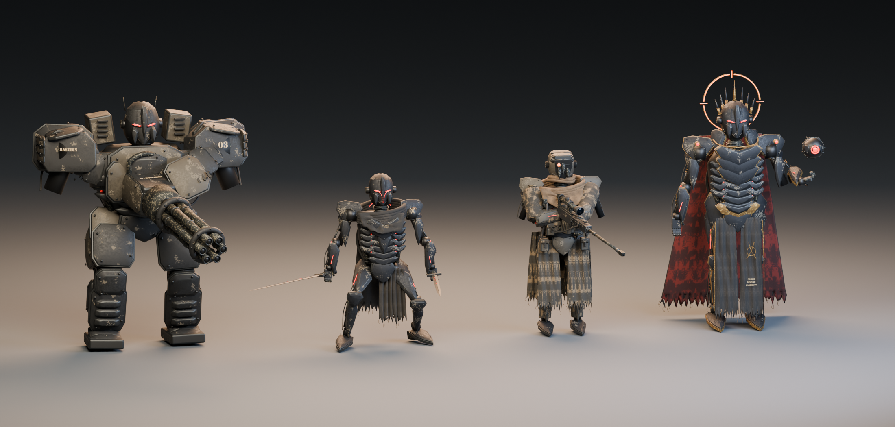

# Four reference-derived mech enemies

[Download the full portable art package](https://github.com/hwashburn1011/machine-move-forward/releases/download/v0.2.0/Mech_Enemy_Collection.zip). Editable Blender sources, textures and optimized models remain in this repository. The `exports/` and native Unreal binary links below refer to files inside that package; unpack it into this directory to use those paths. Current gameplay derivatives are versioned separately alongside the game integration.

Four original Blender models based on the supplied `badmechs.png`: **Bastion** (heavy gunner), **Revenant** (blade assassin), **Warden** (precision rifleman), and **Sovereign** (commander with a separate drone).

These are detailed procedural interpretations of the illustration, with inferred hidden surfaces. The portable collection below retains the original neutral rigs. Separate animated combat versions are now integrated into the game's random infantry waves, with idle, walk, run, attack and death clips, attached weapons, and ranged aiming warnings. See [gameplay integration](../../docs/art/mech-enemies/README.md). S-07 is the playable main character.

## Open and inspect

Run `python -m http.server 5196 --bind 127.0.0.1` from this folder, then visit `http://127.0.0.1:5196/viewer/`. The viewer includes a model selector, reference pose, neutral skeleton, reduced-detail mesh, separate equipment, wireframe, orbit controls and a reference-image toggle. Its Three.js dependencies are bundled for offline use.

| Character | Editable Blender source | Rigged GLB | Skeletal FBX | Separate equipment |
| --- | --- | --- | --- | --- |
| Bastion | [Blender](source/bastion.blend) | [GLB](exports/bastion_rigged.glb) | [FBX](exports/bastion_rigged.fbx) | [Rotary cannon](exports/bastion_equipment.glb) |
| Revenant | [Blender](source/revenant.blend) | [GLB](exports/revenant_rigged.glb) | [FBX](exports/revenant_rigged.fbx) | [Sword](exports/revenant_equipment.glb) |
| Warden | [Blender](source/warden.blend) | [GLB](exports/warden_rigged.glb) | [FBX](exports/warden_rigged.fbx) | [Precision rifle](exports/warden_equipment.glb) |
| Sovereign | [Blender](source/sovereign.blend) | [GLB](exports/sovereign_rigged.glb) | [FBX](exports/sovereign_rigged.fbx) | [Sentry drone](exports/sovereign_equipment.glb) |

Each equipment GLB has a corresponding `_equipment.fbx`. Each character also has `_showcase.glb` (static pose with equipment) and `_game.glb` (reduced-detail neutral skeleton). The `optimized/` folder mirrors all 16 GLBs with Meshopt geometry compression and WebP textures. Use `exports/` for tools that do not support those extensions.

[Mech_Collection.blend](source/Mech_Collection.blend) contains the four static showcase models and the collection render setup. Use the individual character files for rig editing.

## Rig and scale

The sources are Blender 5.1 files with packed textures, reference image, studio cameras, individually editable armor/mechanical/cloth components, and an original **46-bone skeleton**. The `Reference_Pose` action is a single editable pose, not a motion-capture or combat animation. Clear pose transforms or choose Rest Position to inspect the neutral A pose.

Skeletons cover spine, head, clavicles, arms, wrists, legs, feet, four three-segment fingers and a thumb on each hand. Armor and segmented fingers have explicit rigid weights. Cloth is skeleton-bound, with no cloth simulation. Arbitrary animation sets will need retargeting and pose-clearance review; these are not Unreal Mannequin skeletons.

One glTF unit is one metre. Approximate neutral total heights, including crown/antennae: Bastion **2.85 m**, Revenant **2.17 m**, Warden **2.07 m**, Sovereign **2.90 m**. Verify these bounds when selecting FBX import scale in your engine. Blender source is Z-up, facing -Y; glTF exports are Y-up, facing +Z. Weapon/drone origins are independent of the body, with muzzle and grip markers on the weapons. Duplicate the Revenant sword for its second hand.

## Detail budgets

| Character | Full body triangles | Reduced body triangles | Compressed reduced GLB | Bones |
| --- | ---: | ---: | ---: | ---: |
| Bastion | 154,332 | 74,078 | 4.11 MB | 46 |
| Revenant | 149,258 | 71,643 | 4.04 MB | 46 |
| Warden | 200,514 | 76,194 | 5.23 MB | 46 |
| Sovereign | 199,642 | 95,827 | 5.71 MB | 46 |

Separate equipment: rotary cannon 47,604 triangles; sword 4,380; rifle 26,076; drone 9,184. The reduced meshes are optional alternatives, not an automatic engine LOD system. Enemy-count performance has not been benchmarked in gameplay.

Materials include original tileable base-color, OpenGL tangent normal and roughness/metallic maps. ORM is R=neutral AO, G=roughness, B=metallic. Emissive details have their own materials. Standard exports embed PNGs; optimized exports use up to 1K base color and 512px normal/ORM images. UVs are tiled per surface rather than a unique baked atlas. No third-party character models or purchased textures were used. Blender, Three.js and Meshoptimizer are open-source tools; Three.js's MIT license is included in the viewer.

## Validation

- All 32 standard/compressed GLBs: **zero glTF validation errors and warnings**.
- Sixteen character/equipment GLB and FBX imports checked in Blender: finite bounds, matching scale, all four rigs retain 46 bones and normalized skin weights; arm posing moves the expected vertices.
- All 16 interactive viewer selections load without browser errors. All eight full/reduced character meshes pass a live deformation check.
- Reference, close-up and back renders were visually reviewed. Reports are in `source/*validation.json`.

## Rebuild

Repository scripts are in `tools/art/mech_enemies/`. For each archetype, run background Blender with `build.py -- <name>`, then load its source and run `refine.py -- <name>` and `final_fit.py -- <name>`. Warden additionally uses `warden_fit.py`. These refinement passes modify the source and must not be applied repeatedly without rebuilding. Export with `export.py -- <name>`; run `clean_gltf.py`, `node optimize.mjs`, `node validate.mjs`, then the Blender and browser validation scripts. `render.py`, `collection.py`, and `stage_mcp.py` create the review views and append separate review scenes to the running Blender MCP session.
