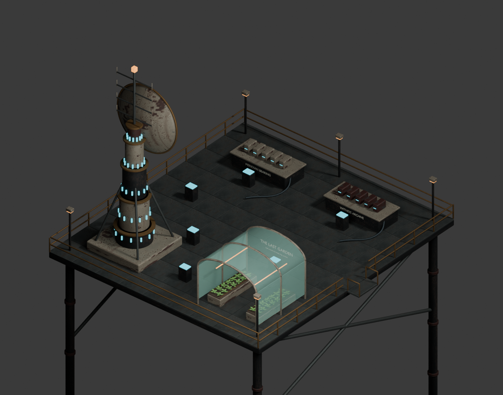
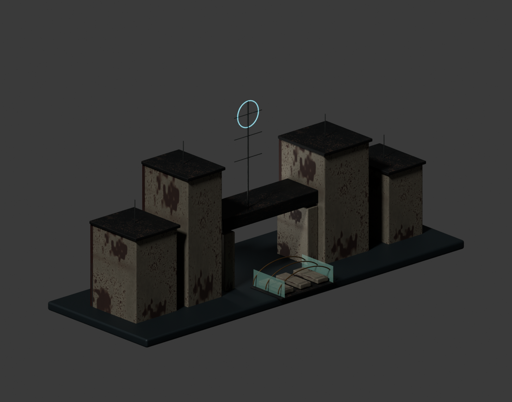

# Last Garden at Meridian art

Two original Blender 5.1 models, built for the current campaign using the
project's weathered industrial palette and original Iron Nomad PBR textures.
No external source mesh, paid asset, or external generation service was used.

| Asset | Editable source | Triangles | Runtime GLB |
| --- | --- | ---: | ---: |
| Transmitter, garden and archive platform | [last-garden-meridian.blend](last-garden-meridian.blend) | 139,716 | 13.50 MB |
| Distant refuge facade | [meridian-horizon.blend](meridian-horizon.blend) | 40,984 | 9.35 MB |

The destination has an 18×20m deck, a gangway, a layered transmitter with
flanges and illuminated status rings, a curved parabolic reflector, a receiver
and braces, a sheltered garden with curved leaf geometry, archive cartridge
benches, shielded cables, practical lamps and railings. Semantic interaction
anchors remain separate from the material-batched meshes. The garden entrance
and central walking aisles are open, with glass, beds, machinery and consoles
matched by gameplay colliders.

The refuge is a distant visual set for the arrival: four maintained towers,
recessed warm windows, a gateway, greenhouse hoops and a cyan signal halo. It
contains no crowd or gameplay rewards. The visual does not confirm who maintains
the channel. Runtime clones borrow the shared model cache; the arrival camera
owns no gameplay state or independent clock.

## Rebuild and review

Run the following scripts through Blender's `--background --python` option,
in separate processes:

1. `tools/art/meridian/build_meridian.py`
2. `tools/art/meridian/build_horizon.py`

Then run `node tools/art/meridian/optimize.mjs` and
`node tools/art/meridian/validate.mjs`. The original geometry is retained;
embedded images become WebP, with lossless normal/ORM maps. The two models share
the existing campaign's uploaded `Array_` materials and textures in the game.

`render_review.py` creates the source review images. All exported meshes use
metres and the existing Blender `(x,-z,y)` / game `(x,y,z)` conversion. Packed
masters are versioned; interchangeable GLB/FBX exports and Unreal caches are
excluded from source control.

Both runtime files have **zero glTF errors and warnings**. Native Unreal 5.8.2
imports created `/Game/Meridian/Review` with the expected centimetre dimensions.
Run `import_unreal.py` through the Python commandlet against
`unreal/Meridian.uproject` to rebuild it. See [glTF validation](gltf-validation.json),
[Unreal validation](unreal-validation.json), and [optimization](optimization.json).

Blender MCP on port 9876 appended a separate **Meridian campaign review** scene,
preserving all seven previously open scenes. The review script is
`tools/art/meridian/open_mcp_review.py`.

