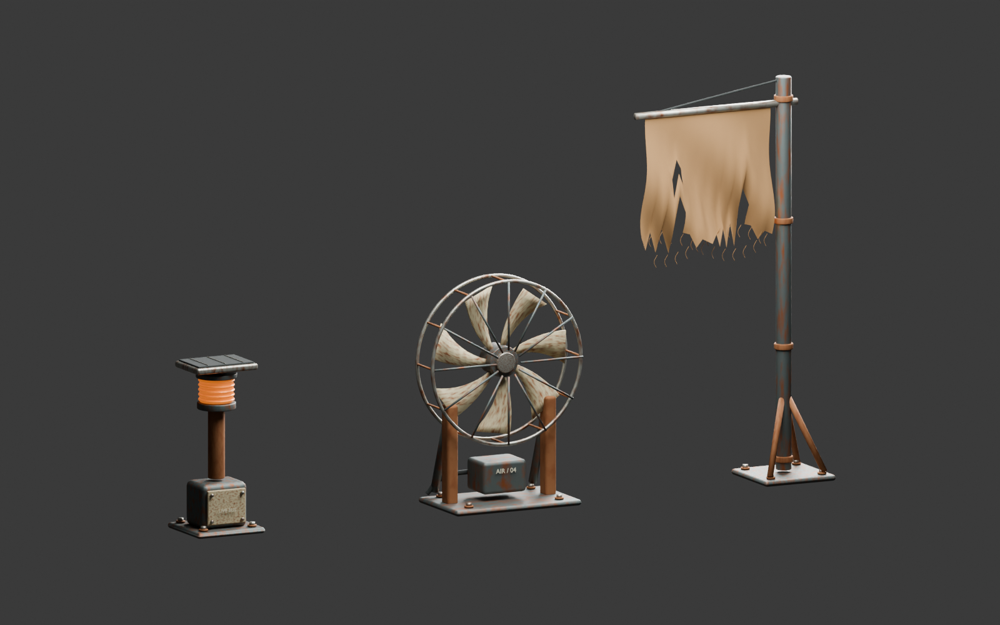

# Wind-worn desert kit

Three original procedural Blender assemblies, authored for Machine Move Forward. No downloaded models, external textures or paid services are used.

- **WindMast**: flanged steel mast, foundation bolts, gussets, clamps, tension cable and torn canvas with holes, ragged edges and individual loose threads.
- **WindVent**: skid-mounted fan with braces, smooth rolled cage rings, protective wires, seven curved solid vanes, bearing boss, old motor mount and severed conduit.
- **RoadBeacon**: bolted battery enclosure, service door/fasteners, post, ridged amber lens, cap and solar housing with cell dividers.

`WindWornProps.blend` is the editable source. `../../godot/art/wind-worn-props.glb` is the native runtime kit: 30,084 triangles across 20 material batches, with distinct `WindCloth`, `WindRotor` and `BeaconLens` assemblies. Godot generates automatic mesh LODs/shadow meshes at import. Static parts are merged by material; bolts, curved surfaces and cloth geometry remain intact.

Rebuild from the repository root:

```powershell
& 'C:/Program Files/Blender Foundation/Blender 5.1/blender.exe' --background --python tools/art/native_atmosphere/build.py
```

The builder saves the source before laying out its studio contact sheet. The `.blend` uses procedural material wear for source rendering; the GLB contains the PBR base materials, and Godot supplies corresponding procedural oxidation, canvas and beacon shaders. These are not baked image textures.

The native canvas shader pins the upper seam and moves the hem; the fan rotates around its actual bearing; beacon emission pulses without allocating a dynamic light. Material/animation bindings, grounded deterministic placement and obstacle clearance are in `godot/scripts/world_atmosphere.gd`.

`tools/art/native_atmosphere/review_mcp.py` appends an isolated review scene through the Blender MCP connection on port 9876, preserving existing scenes. Both the Blender contact sheet and native runtime captures were inspected. Runtime placement review also exposed and led to a fix for the original CPU/GPU terrain-height mismatch.


