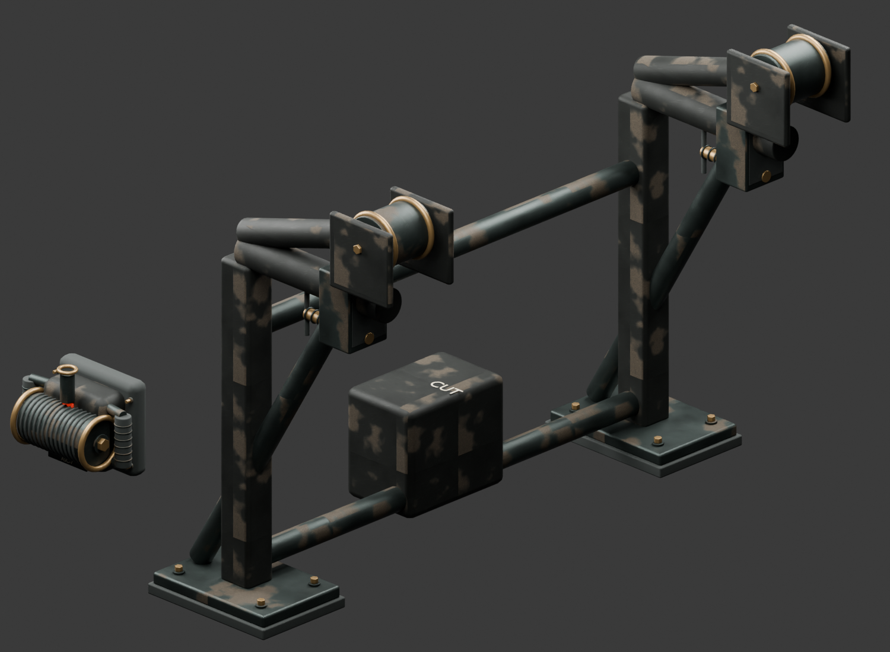
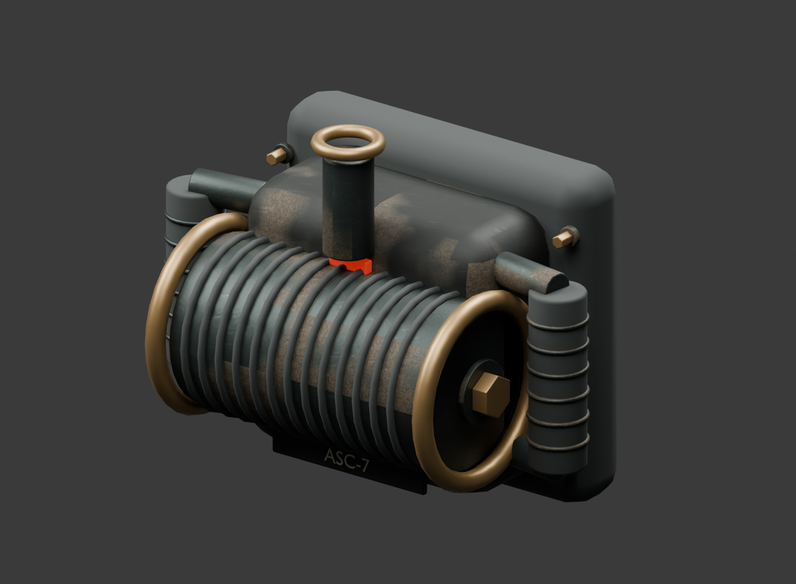

# Boarding clamp and powered ascender

Original Blender hardware for the existing native skiff raids. No downloaded models or textures were used; repository licensing applies.



`BoardingHardware.blend` preserves 133 separate mesh parts, review cameras and studio lights. The runtime asset is `../../godot/art/boarding-hardware.glb`: two shared mesh nodes, 45,071 triangles, two original 512-pixel PBR sets, 3,774,076 bytes. Native import generates LODs. The GLB has no lights or collision bodies.

| Assembly | Editable parts | Triangles |
|---|---:|---:|
| BoardingClamp | 80 | 26,262 |
| BoardingAscender | 53 | 18,809 |

The clamp has grounded mounting shoes, captive bolts, forged uprights, compression braces, adjustable jaws, grooved fairlead rollers and a central release marked CUT. Its two cable markers preserve the existing boarding lanes. The ascender has a padded mounting plate, cast gearbox, wound drum, brass flanges, rubber grips, guard rails, throat/eye and a small engaged indicator. All dimensions are in metres, +Y up.



The clamp origin matches the existing hook at Y=16.25; soles extend to local Y=-0.22 and sit on the authored deck. `Fairlead_A` and `Fairlead_B` are actual cable exits. `Grip_L`, `Grip_R` and `TetherEye` describe the handheld assembly. Runtime wrist targets include the hand's grasp offset above each grip marker. The native rig carries the device around the waist during stow/retrieval and supports it at the chest during ascent.

Rebuild from the repository root:

```powershell
& 'C:\Program Files\Blender Foundation\Blender 5.1\blender.exe' --background --python tools/art/native_enemies/build_boarding.py
node tools/art/native_enemies/validate_boarding.mjs
& test-results/godot-tools/Godot_v4.7.2-stable_win64_console.exe --headless --path godot --editor --import
```

The recipe reuses repository machining and material helpers, saves the editable scene before joining export meshes, and records counts in `manifest.json`. `validation.json` reports zero glTF errors/warnings; native checks independently find no collapsed triangles.

Append the review scene through Blender MCP on port 9876 while retaining existing scenes:

```powershell
& C:\Python311\python.exe tools/art/graphics_v2/mcp_client.py code --file tools/art/native_enemies/review_boarding_mcp.py
```

See the [native boarding review](../../docs/godot-port/boarding-review.md) for behavior, verification and measurements.
