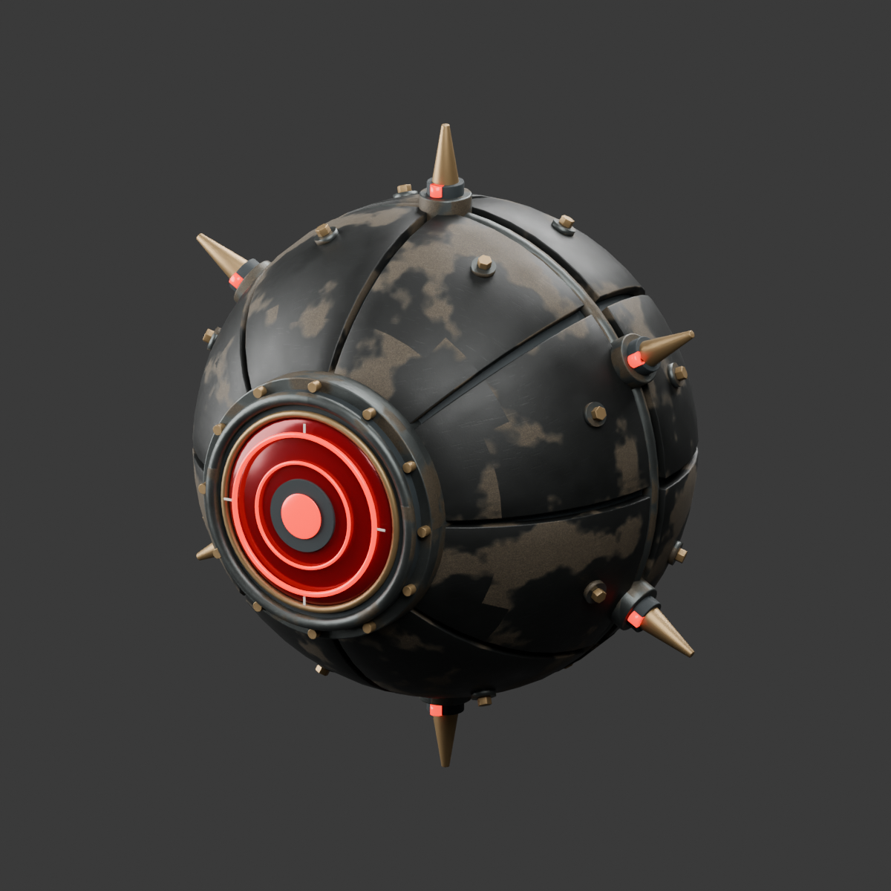
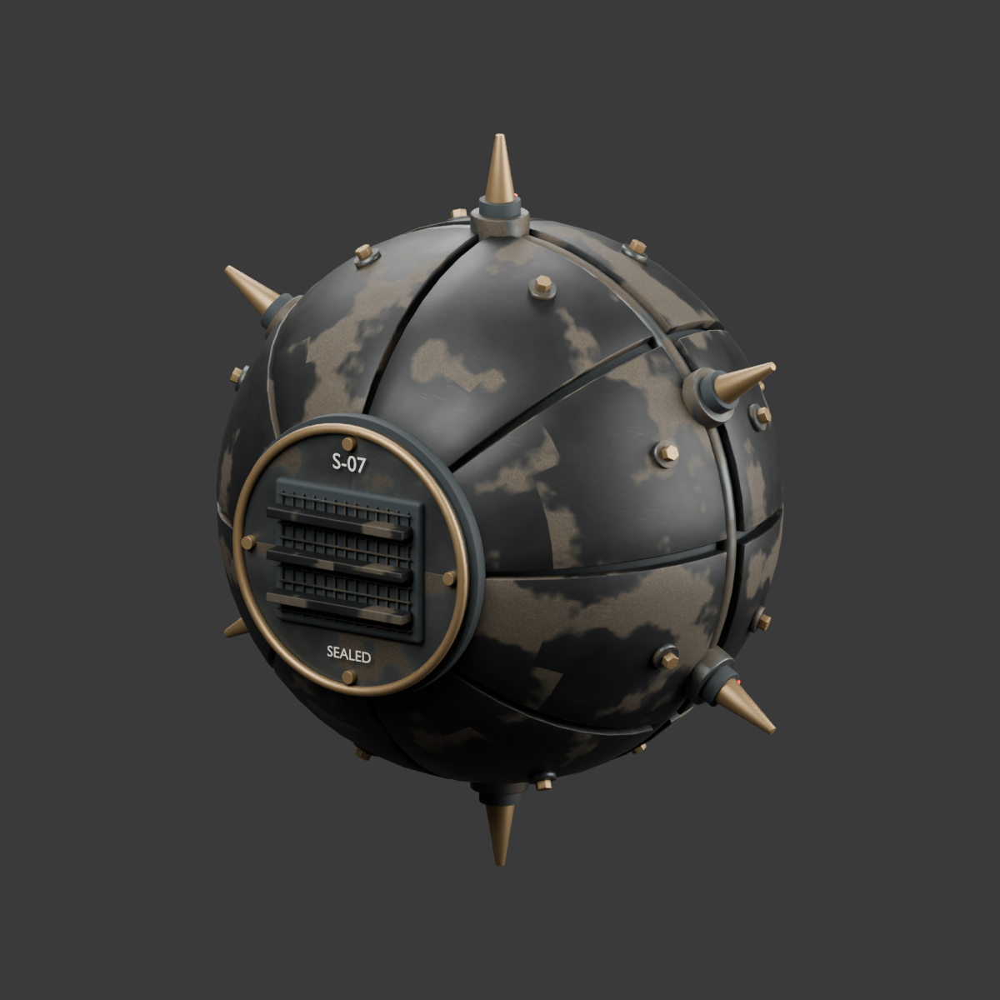

# Sovereign support drone

Original Blender model based on the small orb above the commander's hand in the user's `badmechs.png` reference. Segmented curved charcoal armor, continuous sealed inner hull, machined optics, concentric red phosphor, captive fasteners, short radial locators and a screened/louvred rear service cap. The worn PBR maps are generated locally; no downloaded models or textures are included.




`SovereignDrone.blend` preserves 134 editable parts, materials, studio lights and front camera. `../../godot/art/sovereign-drone.glb` contains seven static material batches and named `DroneCenter`/`DroneMuzzle` markers, 49,763 triangles and two embedded 512-pixel PBR sets. All curves, panel seams and hardware remain actual geometry. Native import retains generated LODs and shadow meshes; the runtime model introduces no light nodes. The first draft used 61,699 triangles; reducing redundant curved subdivisions retained the final smooth silhouette.

Model coordinates use metres and +Z forward, before the commander's original uniform scale. Attach at the existing `equipment_0` BoneAttachment origin with a +90-degree local X rotation. Its widest locator span is approximately 0.43 m in source units, about 0.34 m after the existing character fit.

Run from the repository root in a separate Blender process; the recipe resets only that process's scene:

```powershell
& 'C:\Program Files\Blender Foundation\Blender 5.1\blender.exe' -b --python tools/art/native_enemies/build_drone.py
node tools/art/native_enemies/validate.mjs
& test-results/godot-tools/Godot_v4.7.2-stable_win64_console.exe --headless --path godot --editor --import
& test-results/godot-tools/Godot_v4.7.2-stable_win64_console.exe --headless --path godot --script res://tools/bake_sovereign_body.gd
```

The recipe uses the repository's existing geometry and generated-weathering helpers, including the local Quiet Array material library. Pass `-- --no-render` to skip studio renders when rebuilding an unchanged model. `manifest.json` and `validation.json` record the final export; glTF validation has no errors or warnings. Informational unused-attribute/empty-marker messages are expected.

The geometry-only `sovereign-body.res` removes 3,856 baked drone triangles and 1,884 associated LOD triangles from the original imported commander. Runtime surface overrides reuse the exact original materials, avoiding embedded material copies. All other original vertex, skin, normal, UV and bound buffers, LOD thresholds, triangle winding and animation assets remain intact. `tools/godot/setup.ps1` rebuilds this resource after normal source import.

To append the editable model through the running Blender MCP server on port 9876, without replacing existing scenes:

```powershell
& C:\Python311\python.exe tools/art/graphics_v2/mcp_client.py code --file tools/art/native_enemies/review_drone_mcp.py
```

See the [native integration review](../../docs/godot-port/enemy-equipment-review.md) for gameplay behavior, tests and measured cost.
