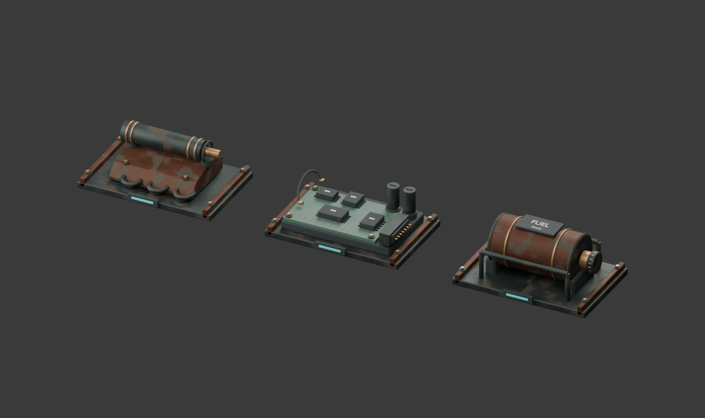

# Recovered robot supplies

Original Blender models for the native game's existing enemy rewards. These replace the small floating cyan cubes with recognizable scrap, circuit components and sealed fuel. No downloaded assets or external textures were used; repository licensing applies.



`RecoveredSupplies.blend` retains 195 individually editable mesh parts, a studio camera and lights. The runtime GLB is `../../godot/art/recovered-supplies.glb`; it contains three mesh nodes, shared materials, two original 512-pixel PBR sets and no lights or physics bodies. Each model is about 37 × 26 cm, in metres, +Y up, with its supporting base at Y=0. Native import generates LODs.

| Model node | Editable parts | Triangles | Material surfaces |
|---|---:|---:|---:|
| ScrapDropMesh | 44 | 11,625 | 6 |
| ComponentDropMesh | 100 | 18,645 | 7 |
| FuelDropMesh | 51 | 11,925 | 6 |

Scrap includes bent plate, retained actuator, collars, bearings and sheared fins. Electronics include a PCB, chips, contact pins, traces, capacitors and a terminated lead. Fuel has a rounded cell, formed caps, retaining straps, cap flutes, label and connected protective rails. Bases, bolts, saddles and leads were revised after source/native inspection to avoid unsupported parts. A small cyan identifier has low emission and casts no realtime light.

Rebuild from the repository root:

```powershell
& 'C:\Program Files\Blender Foundation\Blender 5.1\blender.exe' --background --python tools/art/native_enemies/build_loot.py
node tools/art/native_enemies/validate_loot.mjs
& test-results/godot-tools/Godot_v4.7.2-stable_win64_console.exe --headless --path godot --editor --import
```

The recipe reuses repository machining/PBR helpers and runs in an isolated Blender process. It saves editable source before joining parts into the three export meshes. `manifest.json` records source counts; `validation.json` records zero glTF errors and warnings. Native geometry checks independently find zero collapsed triangles and identity mesh transforms.

To append the review scene through the running Blender MCP on port 9876 while preserving existing scenes:

```powershell
& C:\Python311\python.exe tools/art/graphics_v2/mcp_client.py code --file tools/art/native_enemies/review_loot_mcp.py
```

See the [native integration review](../../docs/godot-port/loot-review.md) for placement, pickup/save behavior and measured rendering costs.
