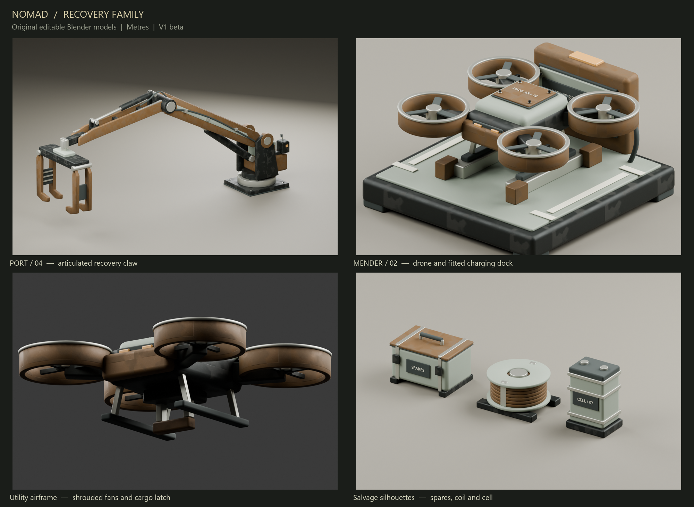

# Nomad recovery family — V1 beta

Six original models built as editable Blender geometry for the native Godot game.
The family shares muted ochre, mineral enamel, restrained surface wear, scoured
hardware and small amber indicators. No downloaded models or reference images.



`NomadSalvageBeta.blend` contains 275 individually editable mesh parts at each
assembly's independent origin. `NomadSalvageBetaReview.blend` contains the same
assemblies staged with studio lighting and cameras after runtime batching.
Four Cycles renders were inspected; the contact sheet combines those renders.
The live Blender MCP review uses the editable source, preserving the prior scene
and saving a copy as `MCP-session-preserved.blend` before appending anything.

| Export in `../../godot/art/` | Triangles | Material batches |
| --- | ---: | ---: |
| `beta-port-claw.glb` | 32,330 | 28 |
| `beta-salvage-drone.glb` | 20,476 | 15 |
| `beta-salvage-dock.glb` | 9,035 | 7 |
| `beta-salvage-cassette.glb` | 2,896 | 6 |
| `beta-salvage-coil.glb` | 6,636 | 4 |
| `beta-salvage-cell.glb` | 2,148 | 5 |

All GLBs use metres, Y up, baked geometry, portable embedded PBR maps and named
empty markers. Seven shared material designs cover the set; individual GLBs
embed only their required maps. Static siblings are joined by material during
export; the editable master is saved before joins. Runtime has no lights,
cameras, animations or collision authored inside the model files.

## Integration contract

The original machine `CargoCrane_Yaw` global origin is
`(-9.4875, 16.03, 7.8)`, with a inherited basis diagonal
`(-.75, .833333, -.8)`. **Install the new crane at that position with unit scale
and identity basis.** The native replacement is already in game metres. Hide the
old complete crane only after repair; its suspended crate belongs to the old
assembly. The new arm points toward local -X, the machine's port side.

The exact hierarchy and **parent-local** coordinates are:

```text
PortClaw
  SlewPivot      (0, .35, 0)        # rotate Y if desired
    CraneInteract (.94, .99, .42)
    ShoulderPivot (0, 1.25, 0)
      ElbowPivot  (-3.48, 1.75, 0)
        HoistAnchor (-3.60, -.57, 0)
          ClawHead  (0, -.45, 0)
            CargoAnchor (0, -1.00, 0)
            JawA (0, -.05, -.91)
            JawB (0, -.05, +.91)
```

`HoistAnchor` is `(-7.08, 2.78, 0)` relative to `PortClaw`. The head can be detached
while preserving its global transform and suspended from a runtime cable. Its
two cupped jaws remain children. The throat is 1.80 m across local Z. Jaw hinge
motion uses local X. Keep cargo upright under the head; these jaws fit the
existing salvage chest bounds `X ±.81928, Y -.565…+.577, Z -.64117…+.592`.
Main-arm rigid motion alone does not solve hydraulic-rod articulation; keep the
rest pose or implement the rod endpoint constraints when animating those joints.

The complete crane occupies `X -7.42…+.83, Y 0…3.862, Z ±1.070`. Its base seal
touches Y=0. Use a base/body collider near `offset (.02,.92,0)` and
`half (.83,.92,.74)`, avoiding a giant box around the open space under the boom.
The runtime can keep the head and distant arm non-walkable as moving machinery.

The carry-fit review found that closing the jaws to X rotations −0.20 / +0.20
requires raising the cargo marker from its authored −1.00 to **−0.70 m**. The
native runtime applies that override so the toes support the chest instead of
intersecting it. See `carry-fit-review.json` and the reviewed
`carry-fit-closed-raised-cargo.png`. The drone marker remains −0.90 m.

`DroneRoot` uses its **flight-body centre** as origin. It is 1.374 m wide, 1.234 m
long and .519 m tall. `CargoAnchor=(0,-.90,0)` aligns the chest top to its visible
lifting latch at Y=-.323. `RotorFL`, `RotorFR`, `RotorRL`, `RotorRR` rotate around
their local Y axes. The drone's `DroneDockPoint=(0,-.28,0)` is the bottom of its
landing skids, not the body origin.

`SalvageDock/DroneDockPoint=(0,.60,0)` gives the **drone root position** when
parked. The skids then rest on the raised guide rails at Y=.32; the central
latch clears the tray. Do not subtract the drone marker again. The dock is
1.52 × .812 × 1.55 m and the complete parked assembly fits the existing
collector-auto collider `half (.82,.55,.82)`. `CargoDeposit=(0,.27,.48)` is a
visual deposit cue, not a location at which to leave a full-sized chest.

Cassette, coil and cell are distinct future salvage silhouettes with exact
ground origins, separate from the larger collectible chest. Their narrow
footprints are recorded in `manifest.json`; do not reuse the chest's ground
offset when spawning them independently. Integration into drop tables is a
gameplay decision; merely adding these art files does not add them to the loop.

## Rebuild and validation

From the repository root:

```powershell
& 'C:/Program Files/Blender Foundation/Blender 5.1/blender.exe' --background --python tools/art/native_salvage_beta/build.py
node tools/art/native_salvage_beta/validate.mjs
& C:/Python311/python.exe tools/art/native_salvage_beta/contact_sheet.py
& C:/Python311/python.exe tools/art/animation_polish/mcp_request.py tools/art/native_salvage_beta/review_mcp.py
```

Use `-- --no-render` only when rebuilding unchanged reviewed geometry. Native
Godot imports and gameplay collision/collection verification belong to the
integration checks. `validation.json` records zero glTF errors and warnings for
all six models, exact marker presence, triangle accounting, grounded origins,
dock envelope and the drone's cargo latch fit. Informational unused texture UV
and empty-marker notices are expected.
