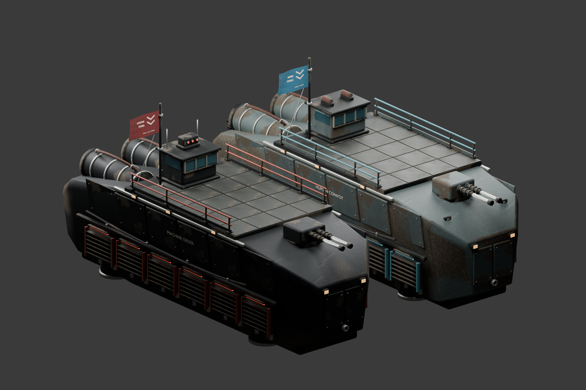

# Native crossfire ships

Two original Blender assemblies replace the plain human convoy and robot warship presentations in the existing scanner battle. They retain the five crew positions, deck height, faction flags, fire origin and story roles. The preserved Three.js assets are unchanged.



[CrossfireShips.blend](CrossfireShips.blend) retains 555 human / 549 robot source parts: tapered hulls, fitted replaceable armor, captive fasteners, recessed cooling louvres, cable saddles, plated decks, tubular guardrails with mounting feet, glazed bridges, connected service lines, rounded engine casings with open exhausts, lift plenums, hollow gun barrels and restrained navigation lights. Human service equipment and the robot sensor array distinguish the two ships. Both reuse their original project-owned faction flags.

| Assembly | Triangles | Batched mesh objects | GLB bytes |
| --- | ---: | ---: | ---: |
| Human convoy | 106,624 | 13 | 9,306,556 |
| Robot warship | 106,600 | 13 | 9,283,316 |

The source keeps parts separate; runtime exports join static pieces by material, retaining the flag and semantic `DeckOrigin`/`FireAnchor` nodes. Each GLB normalizes Blender numeric suffixes on node names. Metre scale, Y-up, bow towards −Z. Standing surface: Y=8.08 m. The hulls remain cinematic scenery, with no new gameplay collision.

Original 512×512 base-colour, roughness/metallic and normal maps reuse the project's procedural wear recipe. Maps are packed in the source and GLBs; Godot's extracted images and import settings are retained in `godot/art/`. All new geometry has UVs, bevels/weighted normals where appropriate, portable triangles and tangents. The original flag UVs/textures are retained.

The NPS description of [Hercules machinery](https://www.nps.gov/safr/learn/historyculture/oceantugsunderworld.htm) and its discussion of [ship material weathering](https://home.nps.gov/articles/000/when-the-rust-settles.htm) informed service fittings and finish. These are conceptual references, not borrowed mesh or texture assets. No downloaded meshes, texture images or paid generation services were used.

Rebuild from the repository root in an isolated Blender process:

```powershell
& 'C:/Program Files/Blender Foundation/Blender 5.1/blender.exe' --background --python-exit-code 1 --python tools/art/native_ships/build.py
& 'test-results/godot-tools/Godot_v4.7.2-stable_win64_console.exe' --headless --path godot --editor --import
```

The generator imports `tools/art/glass_orchard/common.py`, which resets the scene. Do not run it in an existing interactive Blender session. `tools/art/native_ships/review_mcp.py` appends the finished source as a separate review scene through the project's port-9876 MCP client and preserves the user's other scenes.

[Native verification and measured rendering cost](../../docs/godot-port/ship-refinement-review.md). The generators require the previously prepared `godot/assets/runtime/battle-*.glb` for the original flags. These files are produced by the existing native asset preparation step.
