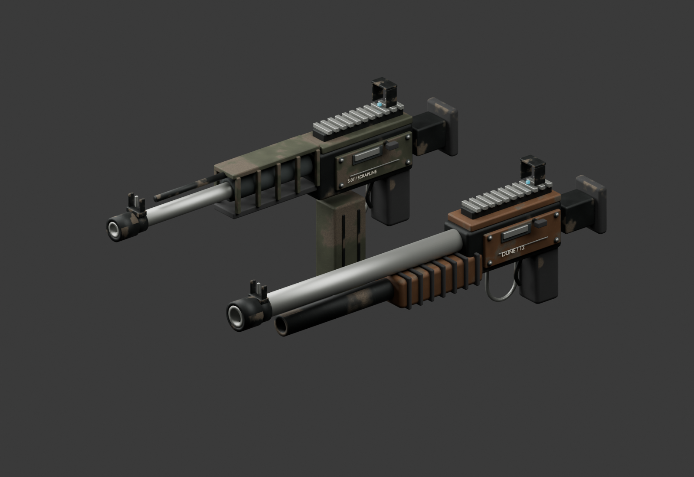

# Native held weapons

Two original Blender assemblies refine the existing Scrapline rifle and shotgun for the native game. They retain their compact 0.88 m / 0.95 m lengths and existing gameplay roles. Original browser meshes and definitions are untouched.



The [packed editable source](NomadWeapons.blend) contains layered receiver panels, recessed fasteners, sliding-bolt detail, open handguard bays, a hollow muzzle, connected sight collars, rubber grip ribs, separate magazine/pump parts, small stencils and sling mounts. Metre-scale exports point along +Z. `GripOrigin`, `SupportGrip`, `Muzzle`, `MuzzleMount` and `BodyMount` are semantic anchors; independent exports normalize Blender's numeric name suffixes.

| Assembly | Triangles | Batched mesh objects | GLB bytes |
| --- | ---: | ---: | ---: |
| Rifle | 16,620 | 10 | 3,250,816 |
| Shotgun | 13,560 | 9 | 3,075,080 |

The manifest is generated from the exported geometry. Original procedural 512×512 base-colour, roughness/metallic and normal maps give steel, faded coatings and rubber different surface responses. Geometry is UV-mapped and triangulated before portable tangent export. All maps are packed into the source and GLBs; Godot's extracted textures/import settings are retained under `godot/art/`.

Rebuild in an isolated Blender process from the repository root:

```powershell
& 'C:/Program Files/Blender Foundation/Blender 5.1/blender.exe' --background --python-exit-code 1 --python tools/art/native_weapons/build.py
& 'test-results/godot-tools/Godot_v4.7.2-stable_win64_console.exe' --headless --path godot --editor --import
```

The generator imports the project's existing `glass_orchard/common.py` geometry helpers, which reset the scene. Do not execute that generator inside an existing interactive Blender session. The separate `tools/art/native_weapons/review_mcp.py` safely appends its finished review scene through the port-9876 Blender MCP client, preserving other scenes.

The [native review](../../docs/godot-port/weapon-presentation-review.md) records hand-placement, combat, attachment and GPU checks. These are presentation changes, with the existing reload clips retained; they do not add detachable-magazine choreography, new weapons or progression. No downloaded source meshes, third-party texture images or paid generation service was used.
