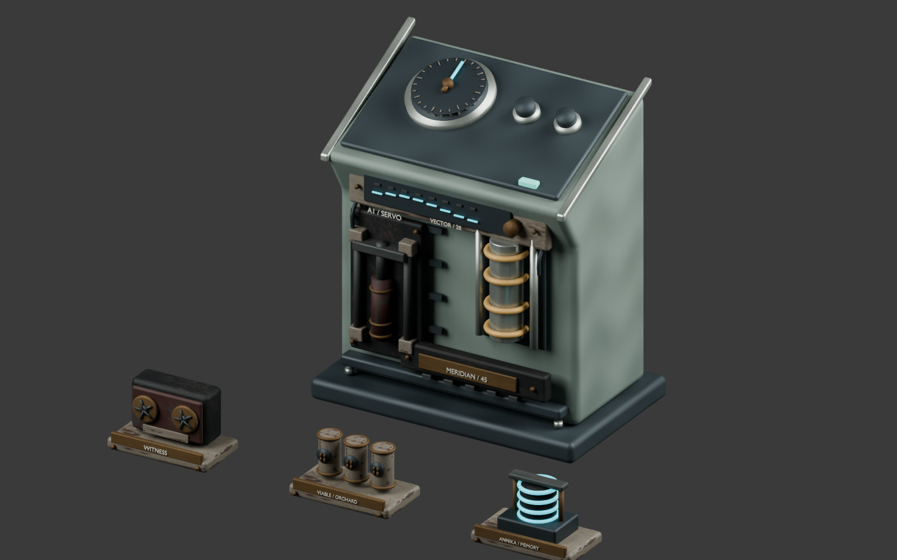

# Earned Nomad progression

Original Blender-authored detail for the existing Navigation Helm and keepsake shelf.
No downloaded models or third-party art are used. The kit reuses the project's
original weathered industrial palette at 256px, in metres with Y-up runtime export.

- `nomad-progress.blend` is the editable source, with separate named modules.
- `public/models/authored/nomad-progress.glb` is the optimized game asset.
- `previews/progression-kit.png` is a studio review with the existing Helm.
- `bounds.json` and `gltf-validation.json` compare source/export bounds.
- `blender-mcp.json` records the appended Blender review, preserving prior scenes.

The actuator, vector calibration unit and Meridian cartridge appear only for their
actual recovered campaign facts. The cyan bearing needle follows actual heading;
its light and the governor display follow Helm power. Existing GyroInstalled and
HelmInteract anchors remain authoritative. The full assembly remains inside the
existing pedestal footprint, with no new colliders, costs, rewards or save fields.

The existing buildable shelf displays one physical record cassette, sealed seed
sample set, or protected ANNIKA core according to its validated selected fact.
The exhibit sits on the top shelf at local Y=1.526, inside the shelf's floor
footprint. Its existing waveform and inspectable text remain available. The models
borrow immutable cache geometry/materials; only the Helm's emission material is
cloned and disposed by its presentation owner.

Rebuild in repository root:

```powershell
& 'C:/Program Files/Blender Foundation/Blender 5.1/blender.exe' --background --python tools/art/progression/build.py
node tools/art/progression/optimize.mjs
node tools/art/progression/validate.mjs
& 'C:/Program Files/Blender Foundation/Blender 5.1/blender.exe' --background --python tools/art/progression/render.py
python tools/art/animation_polish/mcp_request.py tools/art/progression/open_mcp_review.py
```

The build also emits an FBX in ignored `exports/` for reuse. This iteration does
not claim an Unreal gameplay integration. Runtime GLB is 2,095,380 bytes and
30,704 triangles across all mutually exclusive and earned components, with zero
glTF errors or warnings. Most detail remains hidden until earned; this is a whole
kit count, not the number drawn for each shelf.


