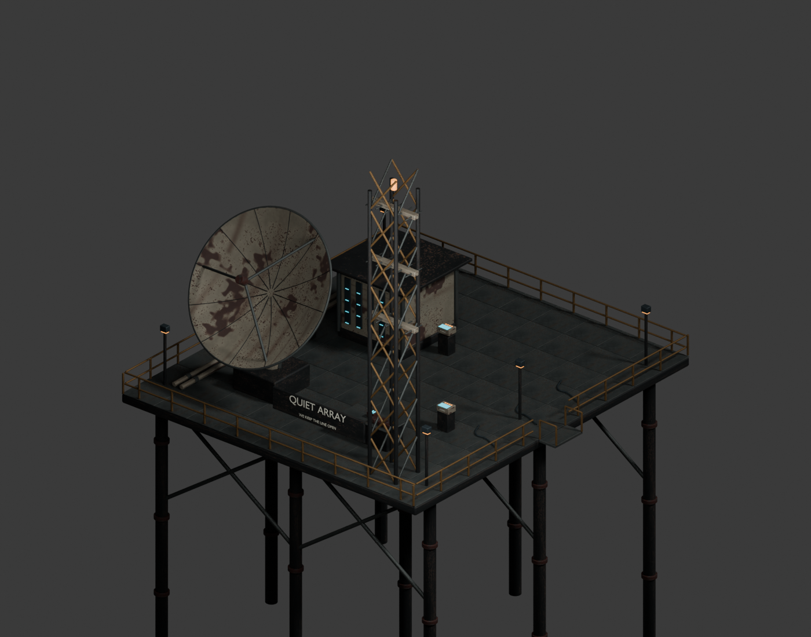
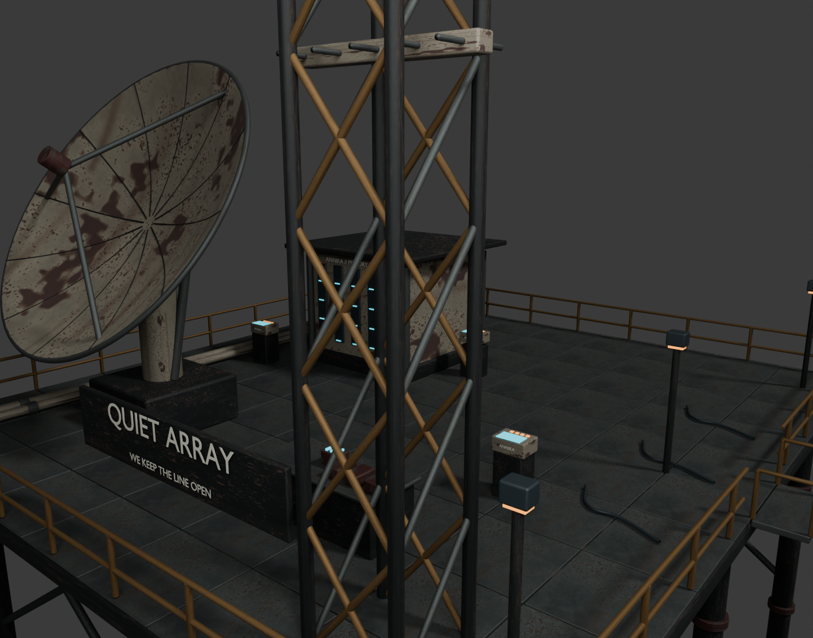

# Quiet Array and route discoveries

Original project art authored in Blender 5.1, using the Iron Nomad's original painted steel, oxide, brass and bare-metal PBR maps. No downloaded meshes or paid generation service was needed. The four editable `.blend` files pack their textures. The game uses the GLBs under `public/models/authored/`; procedural equivalents remain available if a model fails validation.

| Asset | Editable source | Runtime file | Meshes | Triangles | Runtime bytes |
| --- | --- | --- | ---: | ---: | ---: |
| Quiet Array | `QuietArray.blend` | `quiet-array.glb` | 22 | 140,654 | 13,152,968 |
| Water cache | `water-cache.blend` | `route-water-cache.glb` | 11 | 32,044 | 9,217,232 |
| Burned service tender | `salvage-wreck.blend` | `route-salvage-wreck.glb` | 10 | 29,928 | 9,148,212 |
| Last shift transmitter | `memorial.blend` | `route-memorial.glb` | 11 | 35,408 | 9,380,204 |

Quiet Array has an 18×20 m deck, a smooth parabolic dish, service consoles, archive racks, a lattice mast, actuator cradle, bolted rails, braced supports, and amber/cyan practical lights. Optional sites use 12×10 m decks with distinct tank, damaged-vehicle, and memorial-antenna silhouettes. Walkways remain clear for the character capsule.

Authoring helpers convert game `(x,y,z)` into Blender `(x,-z,y)`. Named empty objects preserve gangway, reward and journal anchors. The numeric anchor report is in Blender coordinates; gameplay definitions use Y-up metres. Rails, consoles, machinery and deck collision are separately described in `src/data/story.ts` and `src/data/opportunities.ts`.

Runtime optimization retains geometry, replaces texture payloads with WebP, preserves normal/ORM data losslessly and repairs ten degenerate pole tangents on the dish. The four exports total about 41 MB, reduced from about 67 MB. The runtime loader shares equivalent palette materials and textures across the four models. Khronos glTF validation reports zero errors and zero warnings for every runtime file; informational unused-attribute notices remain.

## Rebuild

Run from the repository root in PowerShell, using the installed Blender path:

```powershell
& 'C:/Program Files/Blender Foundation/Blender 5.1/blender.exe' --background --python tools/art/quiet_array/build_array.py
& 'C:/Program Files/Blender Foundation/Blender 5.1/blender.exe' --background --python tools/art/quiet_array/build_opportunities.py
node tools/art/quiet_array/optimize.mjs
node tools/art/quiet_array/validate.mjs
& 'C:/Program Files/Blender Foundation/Blender 5.1/blender.exe' --background --python tools/art/quiet_array/render_review.py
```

Builders write editable sources and ignored GLB/FBX intermediates to `exports/`. Optimization writes the final public runtime files. The review script opens the saved source in a separate background process and produces both Blender renders; it does not replace the source with its lighting/camera setup.

The optional Unreal review project enables Python scripting. After building the FBXs, import them and create the native review map with:

```powershell
& 'C:/Program Files/Epic Games/UE_5.8/Engine/Binaries/Win64/UnrealEditor-Cmd.exe' "$PWD/assets/quiet-array/unreal/QuietArray.uproject" '-ExecutePythonScript=tools/art/quiet_array/import_unreal.py' -unattended -NullRHI -nosplash
```

Unreal 5.8.2 successfully imported all four static meshes, with seven or nine material slots and metre-to-centimetre dimensions checked. Generated Unreal content/caches are intentionally excluded; the source project, rebuild script and [import report](unreal-validation.json) are retained. The initial validation import reported smoothing-group warnings; the current exporter includes explicit face smoothing for subsequent rebuilds. No Unreal gameplay migration is claimed.

## Review evidence

The running Blender MCP endpoint on port 9876 also loaded the review as a new `Quiet Array campaign review` scene with 33 objects, preserving the previously open scenes. The bridge command is `python tools/art/animation_polish/mcp_request.py tools/art/quiet_array/open_mcp_review.py`; adjust the local checkout path in the review script on another machine.

[Geometry report](model-report.json), [opportunity budgets](opportunity-models.json), [optimization](optimization.json), [glTF validation](gltf-validation.json), and [in-game validation](../../docs/campaign/README.md).




