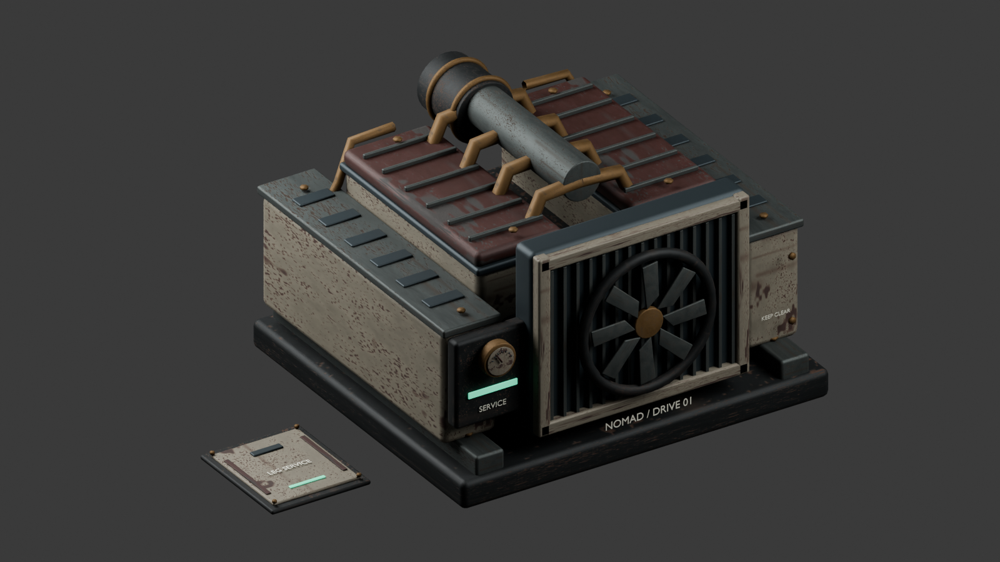

# Nomad workshop machinery

Original Blender geometry for the existing core engine and four leg service locations. No external meshes or texture packs were downloaded. The kit follows the Nomad's worn ivory paint, oxide-red covers, dark steel, copper pipes and restrained status lights.



`nomad-workshop.blend` contains two reusable roots:

- `NomadDriveCore`: 22,788 triangles, 10 meshes. Skid and vibration mounts, crankcase, two cylinder banks, ribbed rocker covers, intake runners and air filter, radiator, swept fan, pressure gauge, pipes, service labels and condition lamp. `DriveRotor` is a separate rigid animation pivot.
- `NomadLegServiceHatch`: 3,048 triangles, 7 meshes. Recessed handle, countersunk fasteners, cover, markings and condition lamp. Runtime places one at each existing leg repair anchor; the cover projects 27 mm above the deck.

The optimized runtime GLB is 4,104,744 bytes and 25,836 triangles. It shares the established `Array_*` material palette; only five status material instances are owned by the runtime for independent damage indication. Geometry, textures and ordinary materials remain loader-owned. There are no added lights, colliders, repair targets or gameplay changes.

The engine fits inside the original 2.8 × 1.8 × 2.6 m collision box. It replaces the fallback only when both named roots pass bounds checks. Missing or malformed art retains the original engine. The validator independently compares GLB accessor bounds with Blender measurements (2 mm tolerance) and enforces a 30,000-triangle kit budget.

Rebuild from the repository root:

```powershell
& 'C:/Program Files/Blender Foundation/Blender 5.1/blender.exe' --background --python tools/art/workshop/build.py
node tools/art/workshop/optimize.mjs
node tools/art/workshop/validate.mjs
& 'C:/Program Files/Blender Foundation/Blender 5.1/blender.exe' --background --python tools/art/workshop/render.py
python tools/art/animation_polish/mcp_request.py tools/art/workshop/open_mcp_review.py
```

The MCP review appends a new review scene without replacing existing scenes in the running Blender instance. FBX and unoptimized GLB exports are reproducible in the ignored `exports` directory. No Unreal import is claimed for this kit.
