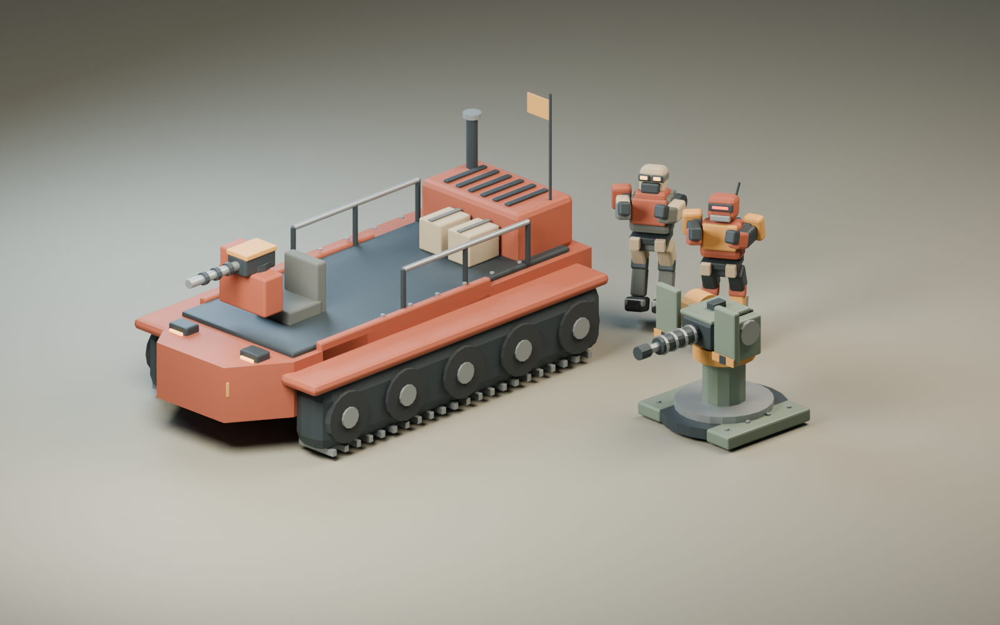

# Original desert-machine art pack

The current character and walker refinement is documented in
[graphics-v3/README.md](graphics-v3/README.md), including editable Blender sources,
in-game images, collision checks, and hardware results. It builds on
[graphics-v2](graphics-v2/README.md). The pack below is historical documentation.

The four assets in `public/models/authored/` were built specifically for this game
with Blender 5.1, using the reproducible source `tools/art/build_assets.py`.
They contain original geometry and animations, with no downloaded model parts,
texture dependencies, paid software, or generated-image service involved.



| Asset | Role | Triangles | Runtime size |
| --- | --- | ---: | ---: |
| `manual-turret.glb` | Mountable heavy gun, separate yaw/pitch pivots | 2,404 | 167 KB |
| `raider-skiff.glb` | Tracked boarding vehicle with crew deck and light gun | 10,176 | 549 KB |
| `scavenger.glb` | Armored salvage robot with red optic | 3,468 | 447 KB |
| `raider.glb` | Masked desert raider with goggles, cloth and backpack | 3,760 | 480 KB |

`asset-manifest.json` records exact output sizes. Each enemy contains a 16-joint
skin and six clips: Idle, Walking, Running, Climb, Punch, Death. The two silhouettes
and material palettes distinguish a mechanical scavenger from a human raider.

## Rebuild and edit

Open any file under `assets/blender/` directly in Blender. The runtime exports are
standard glTF 2.0 binaries, so they can also be imported into Godot or Unreal for
inspection. The game continues to run in Three.js with Rapier physics.

```powershell
& 'C:\Program Files\Blender Foundation\Blender 5.1\blender.exe' --background --factory-startup --python tools/art/build_assets.py
```

This regenerates the four GLBs, editable `.blend` source files, the art-review
scene, the preview above, and the manifest. The script creates its own scene in
the separate background process; it does not operate on an open Blender window.

Run `node tools/art/verify-assets.mjs` to load the actual exports with Three's
GLTFLoader and verify dimensions, mesh budgets, animated skeleton independence,
all six clips and the gun's moving muzzle pivots.

With the dev server running, `node tools/art/review-game.mjs` captures deck,
skiff, boarding, mounted-gun and power-loss art fixtures with both authored
models and the fallback path in `docs/art/game-review/`.
Set `MMF_PORT` when using a port other than 5173. These frames verify presentation;
gameplay acceptance lives in the separate browser tests.

## Runtime contracts

- All exports use metres and Y up.
- Gun and skiff face -Z; character animations face +Z, matching EnemyVisual.
- The turret stands at Y=0. `TurretYaw` is at Y=0.85, `TurretPitch` is 0.35
  above it, and `Muzzle` is 1.4m forward along the pitch node's -Z axis.
- Skiff dimensions are approximately 3.1m wide and 5.6m long. The crew stands on
  the deck at Y=1.2, at X=±0.59/Z=0.35; the pilot marker is Z=-1.45.
- `authoredPalette` glTF extras tell EnemyVisual to retain the designed cloth,
  armor and embedded eye lenses instead of tinting them like the old robot.
- `src/art/DefenseModels.ts` loads the templates, applies neutral paint wear,
  sets shadows and height fog, and supplies procedural fallback factories.
- Loading failures and `?nomodel=1` retain the code-generated art path. A model
  does not change the physics or placement dimensions.
- `BoardingEffects.ts` supplies an animated steel cable and incoming shell
  trails. The raider's independent Climb animation plays while crossing.

## Tool and asset provenance

Blender is free and open source. Its application license does not impose the
Blender license on the art files produced with it; see [Blender's license
explanation](https://www.blender.org/about/license/). The models here are original
project artwork. Existing third-party textures and the existing player model
retain the terms documented in `ASSETS.md`.

Export settings follow the [Blender glTF exporter
API](https://docs.blender.org/api/main/bpy.ops.export_scene.html).
