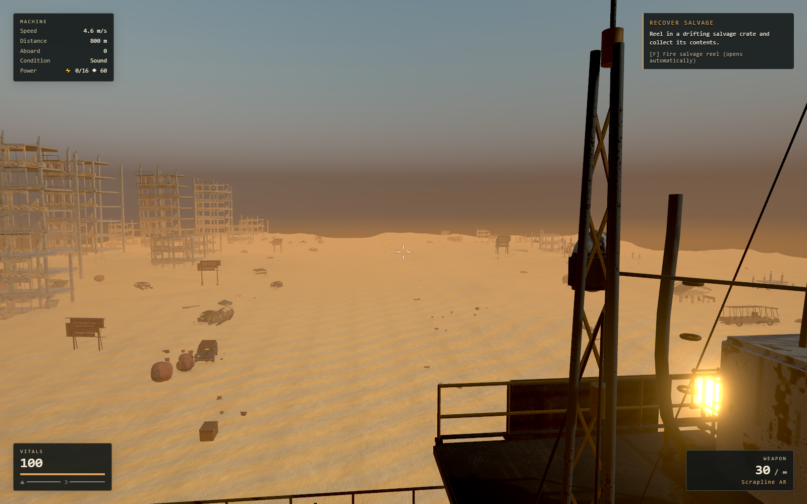
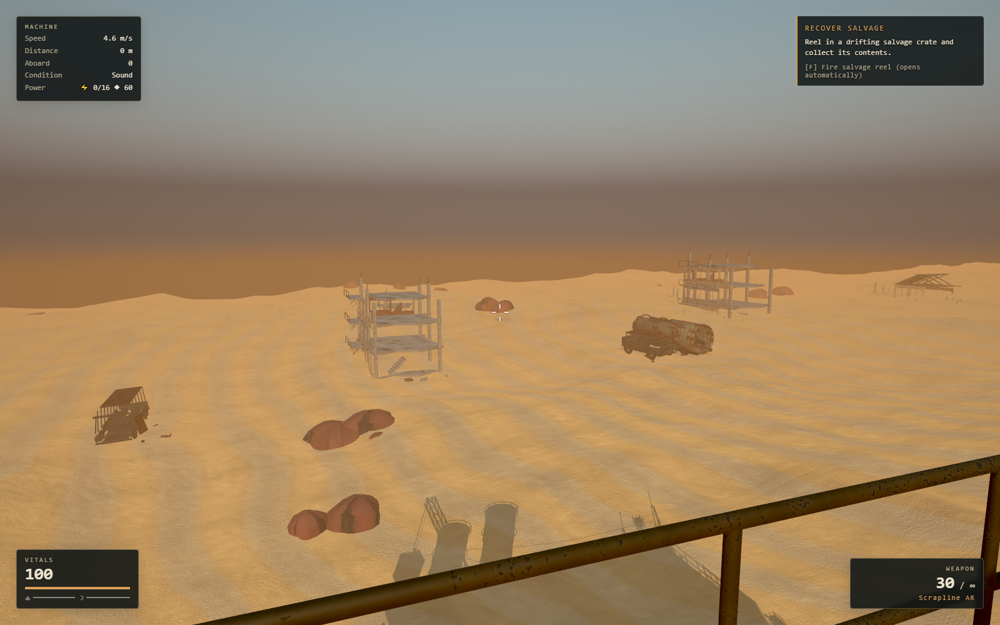
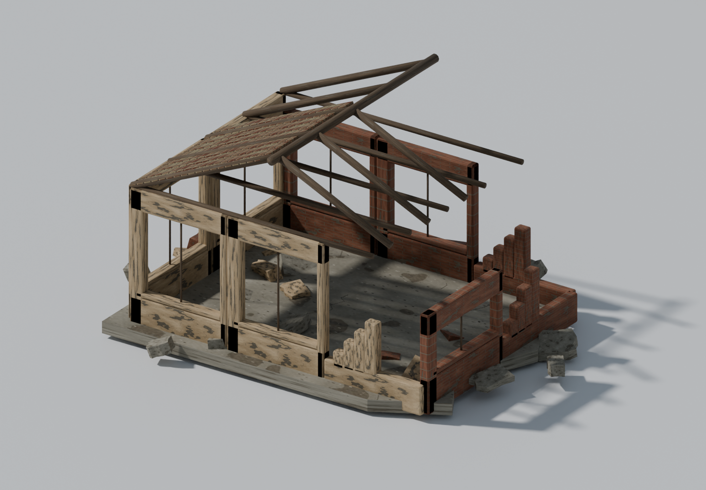
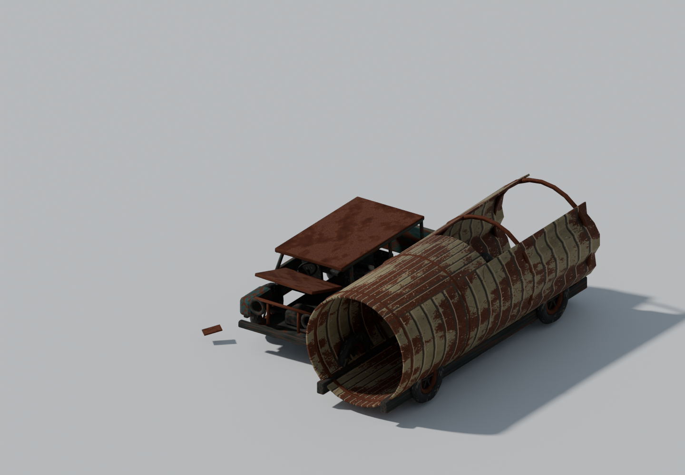

# Desert scenery and fuel recovery

The machine now eases down to 20% of its normal, load-adjusted speed when the fuel tank is empty. It still respects throttle, destroyed engines and scripted docking stops. Powered equipment shuts down as before. Salvage continues to arrive as the machine crawls: aim at a chest and press **F**, then approach a generator with recovered fuel and press **E**. Refueling restores the normal speed target through the existing smooth acceleration. The HUD and empty-generator prompt explain recovery.

The roadside pass adds 14 original Blender archetypes: sand-buried houses, ruined shops, exposed apartment frames and towers, industrial sheds, broken overpasses, hollow cars and buses, ruptured tankers, three torn sign designs, pylons and water towers. Three-chunk neighborhoods create town sections and industrial yards rather than independent scatter. Low ground walls disappear into dunes, while taller structures rise through the existing height fog. Rocks now use continuous erosion instead of disconnected randomized triangle positions.





The scenery is visual roadside dressing; it adds no enemy, resource, collision or mission rules. Placement reserves the central travel corridor and the starboard outpost/gangway area. Old saves regenerate the new deterministic scenery from their existing seed and distance.

## Art review and rebuild

Blender 5.1 authored the meshes, UVs, bevels, surface maps and reduced distant versions. The installed Blender MCP connection on port 9876 staged a separate review scene and generated close-up inspection renders. Unreal 5.8.2 imported all 14 meshes and the three PBR maps, assigned the material and generated a native review level. Engine-side checks verified mesh scale and material assignment; the game itself continues to run in Three.js.





[Editable sources, tool commands and visual reference attribution](../../../assets/desert-ruins/README.md). All shipped model geometry, weathering maps and fictional sign art are original; reference photographs were used for visual study only.

## Runtime budgets

- One shared geometry batch across nine chunks, with per-object frustum culling and one atlas material.
- 45 / 63 / 99 / 126 authored scenery instances at Low / Medium / High / Ultra, plus inexpensive existing rock and scrap scatter.
- Geometry uploaded once; chunk recycling reuses instance slots. Parent scrolling updates each frame; matrices rebase once per 64 metres to preserve precision.
- Distant meshes retain about 32% of the original triangles. Both levels use the same origin, UVs and scale. A 116–136m hysteresis band prevents repeated switching near the threshold.
- Runtime library: 8.62 MB, including geometry, both detail levels, 2048px base color and 1024px normal/roughness/metallic maps. The shared texture set occupies approximately 32 MiB with mipmaps after decoding. WebP reduces transfer size, not GPU residency.
- Missing or undecodable ruin assets fall back to the previous prop library; `?nomodel=1` keeps the procedural compatibility path.

The browser fallback check deliberately aborted the new GLB request and confirmed that all three legacy packs loaded with no page errors. [Fallback results](fallback-qa.json).

## Validation

1,101 unit tests passed, along with ESLint and the production build. Added checks cover empty-tank salvage recovery, refueling, engine/throttle/docking limits, seeded placement and safe corridors, source asset contracts, aligned detail levels, fog transforms, and bounded instance reuse through one million metres and quality changes.

The real browser game loaded all 14 archetypes with no page or shader errors. It exercised all quality tiers, saved and loaded an empty tank at 800m, confirmed generator output was zero, and moved four fuel units from carried resources into the tank. The speed target changed from 1.47 to 7.37 m/s and the recovery hint disappeared. [Browser results](visual-qa.json). The signal cinematic, face reveal, mixed-mech grapple boarding, hook cutting, combat-safe save boundaries, skip cleanup and legacy expedition route also passed the existing in-game harness. [Signal and boarding results](signal-check/visual-review.json).

Measured on the local RTX 3070 using hardware-accelerated Chrome, 1920×1080, High, DPR 1. The original performance harness runs real player/enemy simulation and continuous camera movement; it does not use the free camera that skips simulation. Baseline: main commit `e86aa8e`. Each row below represents a 12-second sample after loading and warmup.

| Scenario | Previous FPS | New FPS | Previous peak draws | New peak draws |
| --- | ---: | ---: | ---: | ---: |
| Deck | 60.0 | 59.7 | 777 | 721 |
| Rapid look | 59.8 | 60.0 | 825 | 793 |
| Eight mechs + rapid look | 59.5 | 60.0 | 1,147 | 1,138 |

A separate 15-second-per-scenario run through the denser ruined-town seed at 800m measured 60.0 / 59.9 / 59.5 FPS respectively, with 95th-percentile frame times at 16.7–16.8ms and no frames over 50ms in those samples. This is a bounded local measurement, not a guarantee for every machine or an unlimited enemy count. [Before](performance/before.json), [after](performance/after.json), [town stress run](performance/ruined-town.json).

Reproduce with the dev server running:

```powershell
$env:MMF_PORT='5201'
$env:MMF_QA_OUT='docs/art/desert-ruins/performance'
node tools/performance-smoothness.mjs --label=local --seconds=15 --seed=desert-review --distance=800
node tools/art/desert_ruins/gameplay_qa.mjs
```

The visual harness accepts `MMF_URL` for a production or preview base URL. Its saves are isolated to its temporary browser context.
