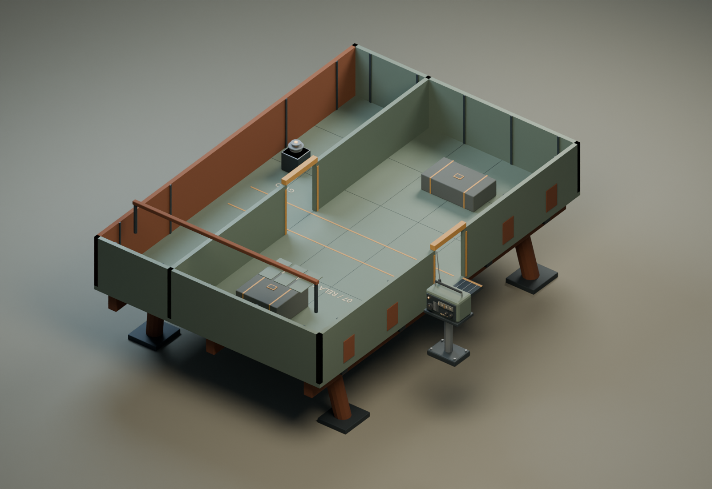
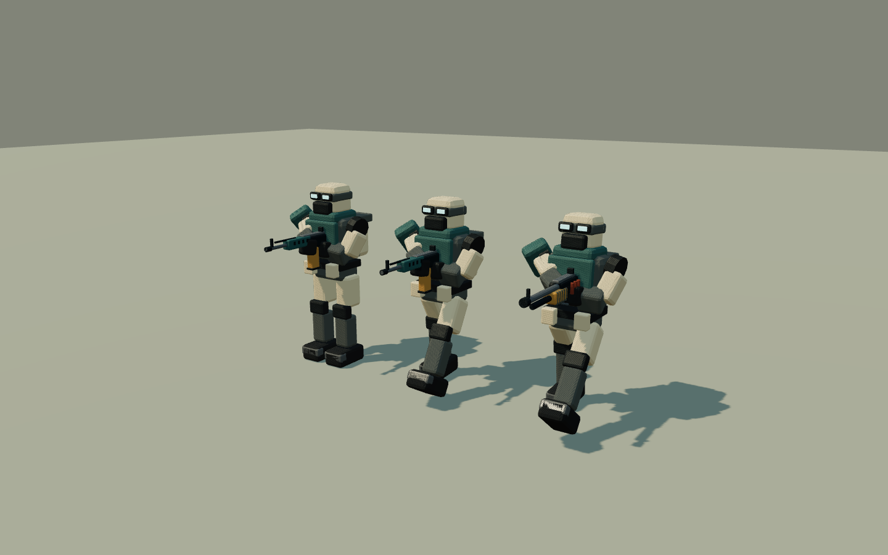

# Expedition art

Original project models authored with the installed Blender 5.1. No downloaded
meshes or paid tools were needed. The browser game remains Three.js and Rapier.



The runtime pack adds a salvaged receiver on a deck stand, a stranded relay
tender with three log locations and a course gyro, a teal/ivory desert engineer,
and two compact industrial weapons. Blender sources are in `assets/blender/`;
the GLB exports are in `public/models/authored/`.

## Editable sources and generation

- `tools/art/build_expedition_assets.py`: receiver, wreck and Blender review scene.
- `tools/art/build_player_asset.py`: original engineer skin and three gaits.
- `tools/art/build_weapon_assets.py`: rifle and pump shotgun with a known grip origin.
- `tools/art/build_assets.py`: shared palette/geometry helpers and defense pack.
- `tools/art/rebuild_characters.py`: regenerate enemy rigs without the full review render.

Run a generator with the installed Blender executable:

```powershell
& 'C:\Program Files\Blender Foundation\Blender 5.1\blender.exe' --background --factory-startup --python tools/art/build_expedition_assets.py
```

The generator uses a separate process and does not edit an open Blender session.

## Geometry contracts

The wreck stands at world `(12, 3.69, 0)` when docked. Its local floor surface is
Y=0, footprint X=-6..6 and Z=-9..9. The entry at X=-6 and internal doorway at
X=2 both leave Z=-1..1 clear; headers begin at Y=2.5. The gangway joins machine
edge X=5 to wreck edge X=6. Visuals and the explicit Rapier boxes share these
dimensions. Wreck exterior machinery stays outside its walkable walls.

The machine's starboard rail has a yellow retracting gate at Z=-1..1. It lowers
only when the gangway is deployed, and its collider closes with the gate after
departure or a fresh-game reset. A real machine-and-wreck Rapier test checks
the closed barrier, the entire open crossing, and closure after crossing.

`Gangway`, `CourseGyro`, `JournalCargo`, `JournalCrew` and `JournalRoute` remain
separate named nodes. The destination controls their discovery/deployment state.
The gyro is at local `(4.5, .92, 3)`; cargo and crew logs rest on solid containers;
the route sheet is wall mounted at `(-5.74, 1.05, -2)`.

The receiver's base is Y=0, panel faces -Z, and `SignalLamp` is separately named.
The game installs it after a successful early chest collection. The stand and
receiver reach 1.88m including the aerial.

The engineer faces +Z. A baked hand frame points held weapons +Z through every
idle/walk/run pose. Weapon GLBs use metre scale and a grip origin, removing
dependence on the old weapons' import conventions. Enemy walking and running
clips now keep the lowest planted boot close to the ground. Cable crossing uses
the animated hand positions to hang on the cable, with a short mount and mantle.

Machine upgrade addons are original Three.js meshes in
`src/art/ExpeditionModels.ts`: exposed rams, gearbox housings, copper coils,
governor shroud, reinforced breech and feed drum. Mechanical accessories stay
below the walkable deck; gun accessories follow the pitch pivot and preserve the
actual muzzle. They are cached per machine/turret and follow the active loadout.

## Verification

`node tools/art/verify-expedition-assets.mjs` is kept as a compatibility wrapper
for the browser validator at `tools/art/graphics_v2/validate.mjs`. Start the dev
server on port 5193 first (`npm run dev -- --port 5193 --strictPort`); the
browser validator then checks decoded authored assets and writes its report and
fixture captures under `docs/art/graphics-v2/`.

`tools/art/review-player.mjs` captures three real PlayerVisual poses with both
weapon assets using an isolated Vite fixture on port 5193. These art fixtures are
presentation checks; game acceptance and physical traversal are tested separately.

`tools/art/review-chapter.mjs` captures the receiver, dock, wreck interior,
research, journals and installed hardware from the running game, using both
authored assets and the fallback path. These are explicitly staged art views.



Existing third-party files retain their recorded provenance in `ASSETS.md`.
The old player remains an asset-load fallback; old weapon files are retained in
the repository but the primary weapon definitions select the authored GLBs.
