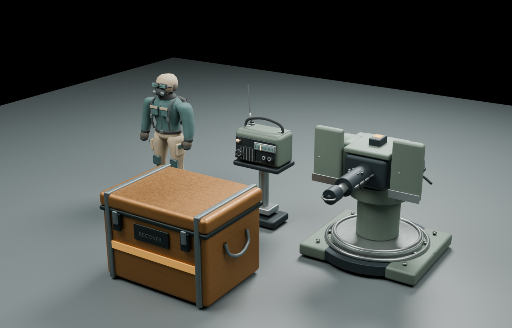

# Graphics pass — September 7, 2026

This pass is integrated into the existing Three.js game. It follows the user's
weathered industrial direction and 1080p/60 FPS midrange PC target. Sol refined
the task plan and reviewed integration; Luna built the hard-surface assets and
supporting code; Astra built characters and salvage equipment, corrected shared
modeling/material issues, and performed Blender and browser art review.



## Delivered

- Thirteen original Blender asset files: player, raider, scavenger, rifle,
  shotgun, radio, turret, boarding skiff, wreck, machine kit, station kit, chest,
  and forged hook. The station kit contains five independently placed modules.
- Rounded character silhouettes, shaped clothing, pockets, straps, seams,
  protective equipment, and smoothly blended limb weights on the existing rig.
  Idle/walk/run ground contact and weapon grip axes remain verified.
- Formed machinery housings, curved hoses, bearing rings, fasteners, recessed
  instruments, gun mechanisms, layered wreck panels, and interior dressing.
- Embedded authored color, normal, and roughness/metalness maps. Runtime loaders
  preserve those maps. Source PNG images and editable `.blend` files remain
  available; compressed runtime files use WebP and Meshopt.
- Real half-resolution GTAO, clearer lighting, restrained bloom/grain, corrected
  linear fog, stable terrain detail, smoother rocks, clustered desert props,
  fewer distant shadow casters, and improved pooled particles.
- Authored station placement previews and save/new-game template retention.
  Model-disabled gameplay still uses working procedural models.
- Quality changes update actual MSAA, resolution, AO, terrain, prop density,
  particle capacity, and lamp counts. Repeated switches release old buffers.
- Asset texture upload and encounter shader preparation happen during boot.

The walking machine's structural geometry and animation remain runtime-owned;
the Blender kit replaces its decorative detail layer. Existing gameplay,
colliders, first-chest radio reward, research, and chapter state are preserved.

## Sources and rebuilds

Editable sources: `assets/blender/graphics-v2/`. Staged PNG-bearing GLBs:
`assets/graphics-v2/staging/`. Original runtime backups:
`assets/graphics-v2/pre-pass-runtime/`. The open Blender session was accessed
through the MCP addon on localhost:9876; its original Scene and unsaved filepath
were preserved. Owned review scenes are `MMF_Graphics_Review` and
`MMF_Graphics_Final`.

Run each generator with Blender 5.1 `--background --factory-startup --python`:

1. `tools/art/graphics_v2/characters.py`
2. `tools/art/graphics_v2/hardsurface.py`
3. `tools/art/graphics_v2/expedition.py`
4. `tools/art/graphics_v2/machine_kit.py`
5. `tools/art/graphics_v2/salvage.py`

Then run `node tools/art/graphics_v2/optimize.mjs` and
`node tools/art/graphics_v2/validate_khronos.mjs`. Blender factory-startup is
required for generators that clear their isolated scene. Use `mcp_client.py`
only for scoped live-scene inspection and the provided review staging script.

The complete runtime pack is **20,383,588 bytes / 19.4 MiB**, down from
196,797,652 source GLB bytes. Normal/ORM maps use lossless WebP at 512px;
color maps generally use 1K quality-92 WebP. WebP reduces storage/transfer, not
GPU texture memory. The conservative sum of selected RGBA8 textures with mipmaps
is about **493 MiB** if every asset is resident, before render targets and legacy
terrain textures. The manifest records dimensions and per-asset estimates.

## Evidence

- [Runtime GLB checks](asset-validation-runtime.json): all 13 decode with real
  browser texture images; animated ground contact, weapon axes, required nodes,
  triangle budgets, corridor rays, and collider-aligned floor samples pass.
- [Khronos report](../../../assets/graphics-v2/optimized/khronos-report.json):
  zero schema errors for all 13. The validator does not support Meshopt itself;
  separate Three.js decoder and browser checks cover that path. Warnings about
  generated tangent space, unused/empty nodes, and skinned roots remain recorded.
- [Before hardware capture](before-hardware.json) and
  [after hardware capture](after-hardware.json): real RTX 3070 D3D11, Chrome 152,
  i9-11900KF, 1920×1080, DPR 1, High, 30-second traveling-deck captures.
  Before: **60.03 FPS**. After: **60.02 FPS**, p95 **16.8 ms**, peak about
  **1.54M submitted triangles** across all passes.
- [Runtime acceptance](runtime-acceptance.json): full eight-enemy pool plus a
  boarding skiff staged explicitly; **59.84 FPS**, p95 **16.7 ms**, peak **2.86M
  submitted triangles**. Repeated quality switching retained world progress and
  bounded geometry counts. These are rAF measurements, not isolated GPU timings
  or a claim about every midrange PC or a long play session.
- Build, type checks, ESLint, and **984 unit tests** pass. **38 browser tests**
  pass (23 initially, then the remaining 15 after fixing Chrome's missing icon
  request). The weapon checks exercise both weapons and all animation poses.
- With `MMF_GRAPHICS=1`, the radio-to-wreck chapter passes **37/37** checks and
  the guided first run passes **33/33**. These cover the real chest/reel path,
  powered crafting, gun crewing, repair, wreck crossing, and save/continue.

Run the production build on port 5194 and a Vite dev server on 5193 for the
isolated art fixture. Use hardware Chrome for local graphics review; ordinary
test harnesses retain their default SwiftShader mode for CI:

```powershell
$env:MMF_HARDWARE = '1'
$env:MMF_PORT = '5194'
npx playwright test
$env:MMF_GRAPHICS = '1'
node tools/chapter-flow.mjs
node tools/first-run.mjs
node tools/art/graphics_v2/validate.mjs
node tools/art/graphics_v2/runtime-check.mjs
```

Do not run multiple browser/GPU reviews together. `review-graphics.mjs` rejects
a software GPU backend for hardware performance claims.

## Remaining stretch work

The original plan was deliberately ambitious. This completed pass does not
claim a scanned-human character, custom authored LOD chains, KTX2/Basis GPU
texture compression, a fully replaced distant prop library, or new broken-state
meshes/damage textures for every structure. Detail-map resizing, draw batching,
culling, and measured High settings meet this pass's local performance target.
Existing structural construction pieces and upgrade accessories retain their
procedural representation. These are separate follow-up art tasks, not hidden
requirements for the playable build.
