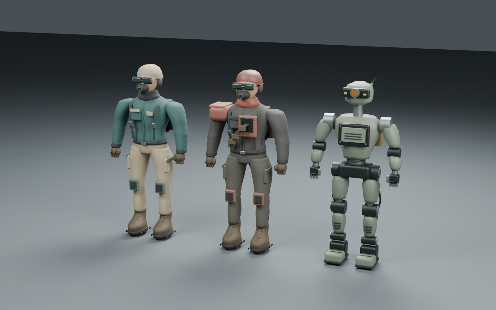
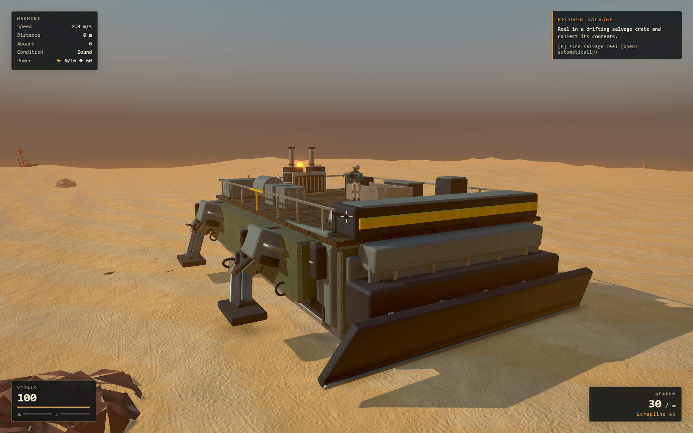

# Cohesive character and walker refinement

This round implements the Blender artwork and the associated visual/physical
fixes. The three gameplay expansions are fully planned, with implementation
packets for Luna; their gameplay systems have not been added this round.

- [Gameplay plan: routes, gunboat, specialist automation](../../superpowers/plans/2026-09-07-next-gameplay-expansion.md)
- [Art plan and five future asset construction briefs](../../superpowers/plans/2026-09-07-cohesive-blender-refinement.md)

Sol wrote the detailed gameplay packets and reviewed integration. Luna constructed
the walker and implemented its runtime integration. Astra rebuilt the characters,
directed the shared visual language, used the live Blender MCP on port 9876,
corrected the review findings, and inspected the Blender and real-game results.

## What changed

The player now has a fitted teal jacket, shaped sleeves and trousers, seams,
pockets, webbing, a defined respirator/goggle assembly, gloves, and constructed
boots and pack. The raider has a charcoal/rust palette, asymmetric shoulder armor,
chest protection and a different equipment silhouette. The scavenger has exposed
mechanical joints, actuators, rigid shells, segmented feet and a recessed sensor.
All three retain their existing rigs, gameplay sizes and animation contracts.

Catmull-Rom section profiles replace blocky body volumes. Subtle cloth, leather,
rubber and metal maps replace the earlier exaggerated fabric surface. Geometric
contact occlusion is baked into exported vertex colors. These remain original
stylized game characters; this is not a scan-based human character pipeline.



The walker now has formed side panels, service doors and gaskets, recessed
fasteners, routed engine pipes, radiator and exhaust construction, layered prow
armor, a raked cutting blade, and fitted rails/coaming. Six fixed deck equipment
skins replace the old blocks within the same collision envelopes. Twenty named
leg modules attach to the existing moving hip, thigh, knee, shin and foot pivots.
Feet remain level through body tilt and gait. The fixed collector skin is a
decorative winch; the proposed automatic collector is a separate future feature.



The lower-floor overlap was decorative framing crossing walkable space. The
frames are now at the ceiling and split around the stairwell. Authored side
castings and prow geometry also leave the lower room clear. The original deck,
stairs, equipment colliders, build occupancy, navigation link and retracting gate
remain authoritative. Missing or malformed model groups keep procedural visuals.
Reapplying or clearing the authored model restores the appropriate old skins.

Machine teardown now releases its owned procedural geometry; Game subsequently
releases the one loaded walker source's deduplicated GPU resources. Temporary
model removal preserves borrowed resources, so it remains safe to reuse a model.
Enemy health bars now keep a compact screen size during close combat. Their fill
shares the backing plate's camera-facing anchor so turning enemies do not displace it.

## Export inventory

| Rebuilt asset | Triangles | Runtime bytes | Estimated image residency with mipmaps |
| --- | ---: | ---: | ---: |
| Player | 52,156 | 1,685,692 | 17.3 MiB |
| Raider | 55,332 | 1,784,432 | 20.0 MiB |
| Scavenger | 24,512 | 996,156 | 12.0 MiB |
| Walker | 98,708 | 3,003,324 | 32.0 MiB |

The four replacements total 7.12 MiB. Runtime files use Meshopt and WebP, with
original staged PNG maps retained. Character maps are 512px; walker color maps
are 1024px and normal/ORM maps 512px. Residency is an RGBA8-plus-mip estimate for
embedded images, not measured total VRAM. WebP reduces transfer size, not VRAM.
Source geometry was not decimated to meet the budgets. No automatic LODs were
added in this round.

The public authored directory contains 14 GLBs (21.71 MiB), including the retained
legacy `machine-kit.glb`, which normal loading no longer requests. Radio, wreck,
manual gun, skiff, rifle, shotgun, stations, salvage chest and hook retain their
v2 models. They were reviewed beside the new assets; they were not rebuilt and
should not be presented as newly authored v3 models. Terrain, build-piece
geometry, lighting and effects retain the prior graphics pass.

## Visual evidence

- Matching [before](v2-front.png) / [after](v3-front.png) neutral character views.
- [Back construction](v3-back.png), [player](v3-player.png),
  [raider](v3-raider.png), [scavenger](v3-scavenger.png).
- Actual PlayerVisual idle/walk/run with both guns:
  [front](player-poses-front.png) / [back](player-poses-back.png).
- [Walker studio assembly](blender-walker-0001.png),
  [deck equipment](stations-game.png), [docked wreck](wreck-game.png).
- [Lower room with authored art](lower-room-staged.png) and
  [fallback art](lower-room-fallback.png).
- [Late sun](late-sun-game.png) and [interior at High quality](lower-room-high.png).

The walker studio uses real runtime segment matrices with the editable source
meshes. Retained procedural geometry is reconstructed for that review using
plain material proxies, so the game image is authoritative for final shading.
Docked chapter and combat images use explicitly staged game states. They are
visual checks, not evidence of a naturally completed long play session.

## Validation

- 994 unit tests across 87 files pass, including empty-group fallback,
  reapply/null behavior, articulated hips, foot contact and resource ownership.
- After the final health-bar adjustment, its 23 related unit tests, lint, build
  and the live quality/combat acceptance run pass again.
- TypeScript, ESLint and production build pass. The existing Vite large-chunk
  advisory remains; it is not a build failure.
- All 38 Playwright end-to-end tests pass against the final integration.
- All 37 radio/chapter checks pass with High-quality authored graphics, including
  the first eligible chest, docking, the gangway, gyro recovery and save/reload.
- All 33 guided first-run checks pass with authored graphics enabled.
- Four replacement GLBs: zero Khronos schema errors. Generated tangent-space
  warnings remain. The validator cannot decode Meshopt itself; the real browser
  validation covers that extension and embedded image decoding.
- Fourteen actual GLBs pass the browser checks for normals, UVs, image data,
  budgets, required pivots, enemy clips, independent cloned skeletons, weapon
  alignment and animated grounded bounds.
- Lower-room browser checks pass with authored and fallback models: both stair
  directions, all four walls, camera follow and enemy entry. Across 56 authored
  stride/body-tilt foot samples, the sole-to-target discrepancy is below 0.001 m.

Detailed outputs are stored beside this document. The tests use isolated browser
storage; the user's existing save was not modified.

## Hardware results

Measured on the installed RTX 3070 through hardware Chrome/D3D11 at 1920×1080,
High quality, device scale 1, 4× MSAA and half-resolution GTAO. Runs were sequential.

| Scenario | Mean FPS | 95th percentile frame | Peak submitted triangles |
| --- | ---: | ---: | ---: |
| Normal deck travel, 30 seconds | 60.02 | 16.8 ms | 1.85 million |
| Eight enemies plus boarding skiff, 20 seconds | 59.78 | 16.8 ms | 3.87 million |

Both runs report zero browser errors. Eight changes through Low/Medium/Ultra/High
preserve progress and keep geometry allocation bounded; the real AO and MSAA
settings switch correctly. See [travel results](final-hardware.json) and
[quality/combat results](runtime-acceptance.json).

These are requestAnimationFrame measurements, capped near display refresh, not
isolated GPU timings or proof of spare GPU capacity. They qualify the tested
machine and short scenarios, not every midrange PC or an unlimited built base.
Draw calls and submitted triangles increased with the refined geometry; future
large encounters should introduce distance LODs and measure their own budgets.

## Editable sources and reproduction

Sources are in [assets/blender/graphics-v3](../../../assets/blender/graphics-v3/):
`player.blend`, `raider.blend`, `scavenger.blend`, `machine-walker.blend`,
`character-lineup.blend` and `walker-review.blend`. Staged exports and original
maps remain in [assets/graphics-v3](../../../assets/graphics-v3/).
No downloaded model or texture parts were needed for these four replacements.

Run from the repository root:

```powershell
& 'C:\Program Files\Blender Foundation\Blender 5.1\blender.exe' --background --factory-startup --python tools/art/graphics_v3/characters.py
& 'C:\Program Files\Blender Foundation\Blender 5.1\blender.exe' --background --factory-startup --python tools/art/graphics_v3/machine.py
node tools/art/graphics_v3/optimize.mjs
node tools/art/graphics_v3/validate_khronos.mjs
```

These generators use the existing v2 helper library and original rig masters;
keep those source directories. With Vite on 5193, use
`node tools/art/graphics_v3/validate.mjs --optimized` before promotion. Copy the
three character names unchanged into `public/models/authored/`; the optimized
`machine-walker.glb` is installed there as `machine-walker-v3.glb`.

The matching review tools are `review.mjs`, `review-poses.mjs`, and
`capture-views.mjs`. `stage_blender_review.py` and `stage_walker_review.py` operate
through the scoped Blender MCP client in `tools/art/graphics_v2/mcp_client.py`.
They create owned review scenes and preserve the user's original scene/filepath.
The saved review files can also be opened normally in Blender.

Changed pre-pass runtime assets are preserved in
`assets/graphics-v3/pre-pass-runtime/`; v2 source assets remain intact. Graphics
fallback can be checked with `?nomodel=1`. Restoring an older complete art version
also requires its matching integration; blindly loading the old machine kit would
bring back the unsafe lower-room framing.
