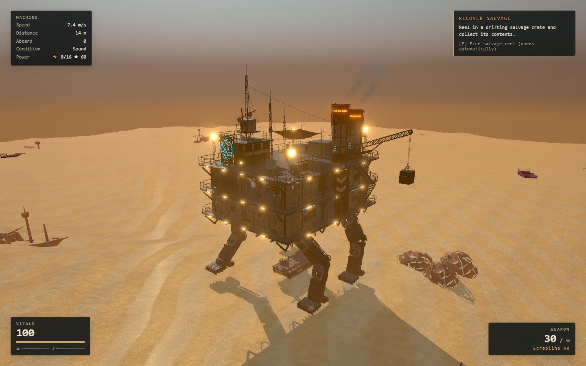

# Iron Nomad playable machine

The reference-derived Iron Nomad now replaces the game's main vehicle. Start the
game normally, or use `/?nomenu=1` to go straight to its upper deck.



## Playable layout

- Four independently articulated legs, driven by distance travelled. The IK uses
  the exported glTF Y-up pivots and compensates for the small hull pitch and roll.
- Three decks at **8.83, 11.83 and 14.83 metres**. Each is three metres apart on
  the existing build grid. The main footprint is 12 × 16 m, with perimeter walks.
- Two internal stairs on the port side connect all three floors. Floor openings,
  structural clearance, handrails and collision ramps share that layout. The
  exterior staircase and substantial authored surfaces also have collision.
- The furnaces, workshop bench, pressure vessel and one pump assembly were moved
  to clear the stairs. The reference master and its original ZIP remain intact;
  the edited source is in `assets/iron-nomad/gameplay/source/`.
- The helm, radio, starter generator, engine repairs and leg service locations
  are positioned for the new hull. All three decks support construction;
  machinery footprints and stair openings are reserved.
- The expedition gate opens at the starboard catwalk. Both campaign destinations
  and the opening rooftop have been moved to match the new height and width.
- The existing emissive fixtures, two workshop lights, rotating turbine and two
  exhaust plumes run in game. The plume effect uses one draw call.

## Runtime assets

| Asset | File size | Triangles |
|---|---:|---:|
| `public/models/authored/iron-nomad-playable.glb` | 17,113,900 bytes | 231,580 |
| `public/models/authored/iron-nomad-collision.glb` | 7,889,440 bytes | 110,148 |

The visual GLB retains the detailed material assemblies, using Meshopt and WebP.
The collision GLB contains static structural surfaces in game coordinates;
deck floors and smooth internal ramps are supplied by the runtime. The original
46-box proxy file is **not** the playable collision shell. Tiny hardware, cables,
fabric and moving legs are omitted from the static shell.

The runtime wrapper scales glTF XYZ by `(0.75, 5/6, 0.8)` and rotates 180 degrees
about Y. The model therefore faces the game's negative Z direction. Blender
geometry uses Z-up; glTF node positions and rotations are converted to Y-up.
`src/data/iron-nomad.json` records the shared layout dimensions.

## Saves

Saves add `machine.layout: "iron-nomad-v1"`. Earlier saves retain inventory,
equipment, progression and machine condition; the player starts safely on the
upper deck. Conflicting cell pieces are moved to available supported deck cells
while retaining their ids, health and container contents. Pieces that cannot be
placed remain in the saved structures list and are retried on a later load.
They are not refunded or silently discarded. Existing compatible saves keep the
player's saved position.

## Verification

The final production build, lint, and **1,068 unit tests across 99 files** pass.

- [Asset validation](asset-validation.json): both runtime GLBs have zero errors
  and zero warnings.
- [In-game traversal](initial-qa.json): both stairs in both directions, cabin
  collision, docking crossing, closed gate and the starter generator.
- [Rooftop opening](opening-qa.json): a running jump lands on the new deck and starts the machine.
- [Gameplay systems](systems-qa.json): elevated-deck salvage, current and legacy
  saves, preserved crate contents, and skiff boarding.
- Unit coverage includes glTF pivot conversion, planted foot position, reapplying
  and removing the skin/collision, lower-deck building support, and save recovery.

Short hardware runs on the local RTX 3070 at medium quality and 1440 × 900 were
approximately 60 FPS. These are local samples, not a performance guarantee for
large late-game bases or maximum enemy counts. The original full-detail model,
FBX and standalone viewer remain available separately.

## Rebuild

From the repository root, with Blender 5.1 on PATH:

```powershell
blender --background --python tools/art/iron_nomad/prepare_runtime.py
python tools/art/iron_nomad/clean_gltf.py assets/iron-nomad/gameplay/exports
$env:MMF_GLTF_INPUT = (Resolve-Path assets/iron-nomad/gameplay/exports).Path
$env:MMF_GLTF_OUTPUT = (Resolve-Path assets/iron-nomad/gameplay/optimized).Path
$env:MMF_GLTF_REPORT = Join-Path $env:MMF_GLTF_OUTPUT 'optimization-report.json'
node tools/art/iron_nomad/optimize.mjs iron-nomad-game
Copy-Item assets/iron-nomad/gameplay/optimized/iron-nomad-game.glb public/models/authored/iron-nomad-playable.glb
Copy-Item assets/iron-nomad/gameplay/exports/iron-nomad-collision.glb public/models/authored/iron-nomad-collision.glb
```

Run `gameplay_qa.mjs` and `gameplay_systems_qa.mjs` against the dev server on
127.0.0.1:5193. These use a separate headless browser context with isolated saves.
The model and source textures are original project artwork; no asset purchase or
external model-generation service was used.
