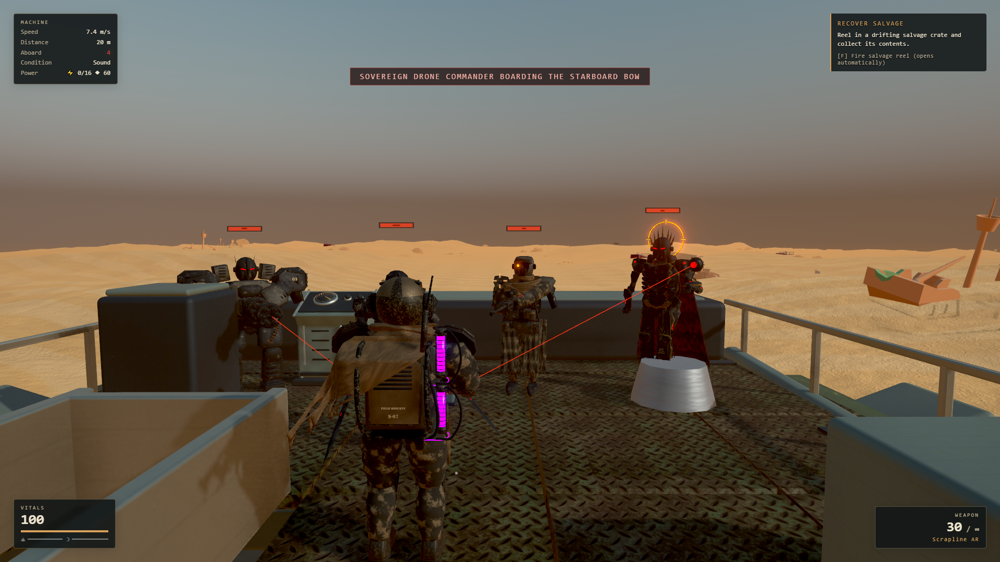

# Random mech enemies

The four reference-derived mechs now appear in ordinary infantry encounters after the guided tutorial is complete. Scavengers and engine-seeking raiders remain in the roster, and scripted boarding/destination encounters keep their existing composition.

| Enemy | Role | First eligible infantry wave | Health | Attack |
|---|---|---:|---:|---|
| Warden | Rifleman | 3 | 85 | 13m range, 0.85s warning, one 8-damage shot |
| Revenant | Blade attacker | 3 | 75 | 5.8m/s pursuit, 10-damage melee strike |
| Bastion | Heavy gunner | 5 | 180 | 11m range, 1.15s warning, three 4-damage shots |
| Sovereign | Drone commander | 7 | 140 | 15m range, 1.2s warning, one 13-damage drone shot |

Each eligible wave slot has a 75% chance of drawing an unlocked mech. Larger waves retain an engine raider. At most one Bastion or Sovereign appears per wave, and neither is selected below 35% player health. The first two infantry encounters, four-enemy cap, arrival staggering, warning distance, sanctuary and repair windows are preserved. Selection uses the director's saved random stream. Saved queues accept all six enemy IDs.

Ranged units commit to the red aiming line before firing. Moving out of that line dodges the shot; physical cover intercepts it. A barrel cannot fire through cover by protruding through it. Nearby destructible walls can be shot apart. Ranged units pursue when machinery blocks their sight. Revenant strikes also respect solid cover. Shots have positional audio and tracers, metal hits use sparks, all kills use the existing loot/progression events, and corpses collapse before returning to the pool.

## Runtime assets

`public/models/authored/{bastion,revenant,warden,sovereign}.glb` are combined body/equipment exports with Meshopt geometry and WebP textures. Each has five in-place animation clips and an `EnemyMuzzle` socket on the animated weapon/drone bone. Each instance has its own cloned skeleton, mixer and hit-flash materials; geometry and textures remain shared.

| Asset | Triangles, including weapon | Bones | Materials |
|---|---:|---:|---:|
| Bastion | 61,532 | 47 | 10 |
| Revenant | 48,452 | 48 | 10 |
| Warden | 57,067 | 47 | 15 |
| Sovereign | 57,759 | 47 | 13 |

Collision height is 1.92m for deck navigation. Bastion uses a wider 0.56m radius; the other units use 0.36m. Cloaks, blades, barrels and the halo are decorative extensions outside the movement capsule. The rig metadata defines standing height independently of equipment bounds so the weapons cannot shrink the character on import. Full-detail source models and the previous portable collection ZIP remain unchanged.

The eight-slot pool now retires an inactive instance of another definition when needed, avoiding failed encounters after its cache has filled with older types. No live enemy is displaced.

## Rebuild and verify

From the repository root, for each of `bastion`, `revenant`, `warden`, `sovereign`:

```powershell
& 'C:\Program Files\Blender Foundation\Blender 5.1\blender.exe' --background --factory-startup --python tools/art/mech_enemies/game_export.py -- bastion
```

Then:

```powershell
python tools/art/mech_enemies/clean_gltf.py assets/mech-enemies/gameplay
node tools/art/mech_enemies/game_optimize.mjs
npx vitest run tests/unit/mech-enemies.test.ts tests/unit/threatdirector.test.ts
npm run build
node tools/art/mech_enemies/game_review.mjs
```

Editable combat sources are in `assets/mech-enemies/gameplay/*_combat.blend`; reference masters stay in `assets/mech-enemies/source/`. The browser harness expects the dev game at `http://127.0.0.1:5193/` and stages four enemies with invulnerability for inspection. `gameplay-check.json` records actual hardware performance and shots, while `gltf-validation.json` records runtime file validation. The staged combat review is not a full campaign performance benchmark.

## Verified result

- Production build, targeted ESLint checks and all **1,063 unit tests across 98 files** pass.
- All four optimized runtime GLBs report **zero errors and zero warnings** in the glTF validator.
- Hardware Chrome at **1920×1080 High**, with all four active, measured **60.09 FPS** and **16.8ms p95 frame time** over the 10-second combat sample on the local RTX 3070.
- Browser review confirms actual skin deformation in all four characters, firing from all three ranged archetypes, four kill events, removal of colliders, corpse retirement, and reappearance through `Game.updateSpawns` with restored director queues. No browser errors occurred.


