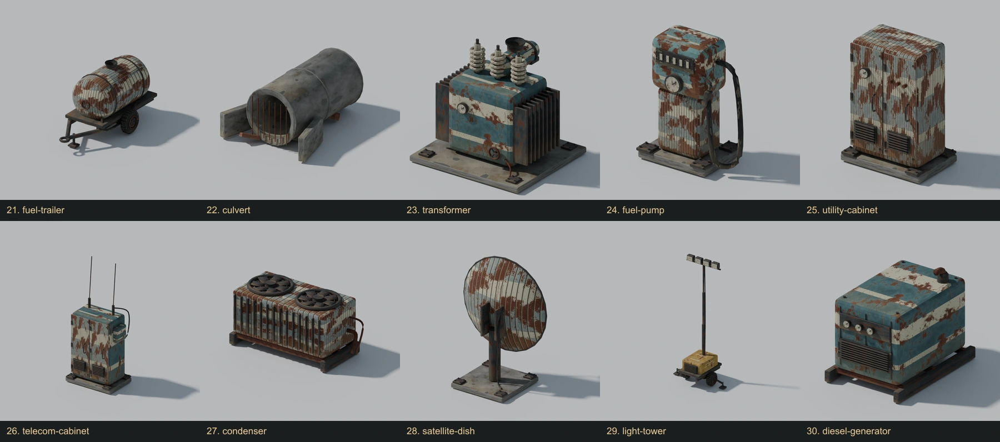

# Grounded machine, performance and 50-model art pass

The Nomad's construction now stays attached to its moving hull. Built floors meet the authored deck surfaces, workshop equipment has complete supports and aisle-facing controls, and the large protruding braces have been replaced with fitted supports.

The desert library now contains **50 distinct complete Blender assemblies: 14 refined originals and 36 new models**. The count excludes LODs, individual bolts, repeated parts and material variants. All 50 are integrated into seeded scenery, with realistic footprint sizes, grounded pivots and the existing clear docking/route corridors.

[Open the complete rendered gallery](index.html) · [Editable Blender source](../../../assets/desert-ruins/source/DesertRuins.blend) · [Runtime GLB](../../../public/models/props/ruins/desert-ruins.glb) · [Per-model manifest](../../../assets/desert-ruins/source/model-report.json)



## Grounding and machine repairs

- Build meshes inherit the hull transform. Their colliders share a driven hull body instead of separate stationary bodies.
- Floor geometry and colliders extend downward from the same deck plane on all three levels. Preview targeting uses that plane; depth bias prevents coplanar seam flicker.
- Station interactions, crates, lamps and production positions follow their actual world transforms. Save cells, contents and condition remain intact.
- Four complete workshop cabinets replace disconnected panels and switches. Equipment banks face the aisle; benches, pumps and vessels have bases and feet. Valves connect to stems, steam risers connect between decks, and overhead headers have hangers.
- Sixty short braces replace seventy-two oversized diagonal members. They terminate beneath decks and inside the structural frame.

## Performance changes

Resolution, graphics tiers, shadows, lighting, particle budgets, AI timing, combat rules and gameplay features are unchanged.

1. Skip contacts between explicitly posed, immovable hull bodies. Player/enemy collision and ray queries still see every surface.
2. Index rigid cloth triangles once, then query the exact triangles for camera obstruction. This preserves holes, edges, material sidedness and parent transforms; edited/skinned geometry uses the original fallback.
3. Prepare tactical mech accessory shaders under normal gameplay lighting as well as cinematic lighting. The first boarding appearance previously compiled a new PBR program and stalled a frame.
4. Reuse one build snapshot per machine-status refresh instead of serializing storage twice.
5. Reorder the new asset geometry for GPU vertex-cache locality, then use lossless mesh compression. Position, normal and UV streams round-trip byte-for-byte. The established texture policy and distance thresholds remain unchanged.

## Measurements

Chrome/D3D11, RTX 3070, **1920 × 1080, High, DPR 1**, same `smoothness-review` seed and harness. Each scenario runs for ten seconds. The baseline includes the grounding fixes; the final build also includes all 50 environment models. Combat is a live simulation, so exact enemy positions and draw counts vary.

| Scenario | CPU render + simulation before | After | Reduction | Final FPS | Frames above 25 ms |
| --- | ---: | ---: | ---: | ---: | ---: |
| Deck | 7.01 ms | 4.95 ms | 29% | 60 | 0 |
| Rapid camera turns | 6.70 ms | 4.62 ms | 31% | 60 | 0 |
| Eight enemies + rapid turns | 8.86 ms | 7.69 ms | 13% | 60 | 0 |

Average physics-step time fell from **1.40–1.46 ms to 0.13–0.14 ms**, about 90–91%. The frame rate is capped by the display; these are CPU-cost improvements, not a claim of a higher FPS ceiling or a benchmark across all PCs. An intermediate run exposed a 177 ms shader compile; the corrected loading pass removed that hitch in the repeated test.

Evidence: [baseline](performance-before.json), [verified result](performance-after.json). The later water-tower correction moves three ladder attachment endpoints without changing runtime code, quality or model/triangle counts.

## Art and runtime budget

- Blender 5.1 source with individually editable component collections; smooth turned shells, curved hoses, three-segment worn bevels, actual openings and supported assemblies.
- One material and three shared atlas textures for the entire library; no extra material per new prop.
- One geometry batch, the same distance LOD policy, and the same maximum 14 objects per chunk. High uses 297 instances across the nine chunks and three lateral bands; Ultra uses at most 378.
- Final library download: approximately **31.1 MB** for 100 near/distant meshes, up from the smaller 14-model library. The 50-model source is approximately 20 MB. Additional geometry increases asset memory; the shared texture allocation and streaming instance budget remain unchanged.
- All models are original procedural Blender work. No third-party model licenses were introduced. Individual FBX exports are reproducible locally under `assets/desert-ruins/exports/` and excluded from Git.

## Verification

- **1,780 unit tests passed across 207 files**, plus ESLint, TypeScript and production build.
- Exact cloth-query results compared against Three raycasts across thousands of rays, front/back/double-sided geometry, holes, nonuniform scale and parent transforms.
- Real Rapier tests cover character support, stairs, collision filtering, ray hits, save restoration and hull attachment.
- Runtime attachment sweep: **zero visual drift**, maximum collision discrepancy under **0.006 mm** over 120 hull poses. The player capsule walked across the extension.
- 50 individual Blender reviews and five contact sheets. A second visual pass corrected tank support gaps, forklift roof supports, pylon attachments and water-tower ladder placement. Blender MCP on port 9876 loaded all 50 and rendered additional reverse views, preserving existing scenes.
- Runtime QA loaded all 50, verified grounded normalized bounds, and recycled the same scenery buffer at distances up to 1,000,000 m. Browser error lists were empty.
- [Asset validation](../../../assets/desert-ruins/source/refinement-50-validation.json): zero errors, all 400 compressed streams decoded, complete near/distant pairs. There are 100 expected portability advisories for the existing runtime-generated tangent-space normal mapping; no unexpected warnings.

## Rebuild

From the repository root, run Blender in the background with `--python tools/art/desert_ruins/build.py`, then:

```sh
node tools/art/desert_ruins/optimize.mjs desert-ruins
node tools/art/desert_ruins/validate_catalog.mjs
node tools/art/desert_ruins/review_catalog.mjs
npm run build
```

`MMF_REVIEW_MODELS=water-tower` limits only the review renders during a small correction; all models still rebuild/export. To inspect through the running Blender MCP, use `python tools/art/graphics_v2/mcp_client.py code --file tools/art/desert_ruins/review_catalog_mcp.py --timeout 300`.
