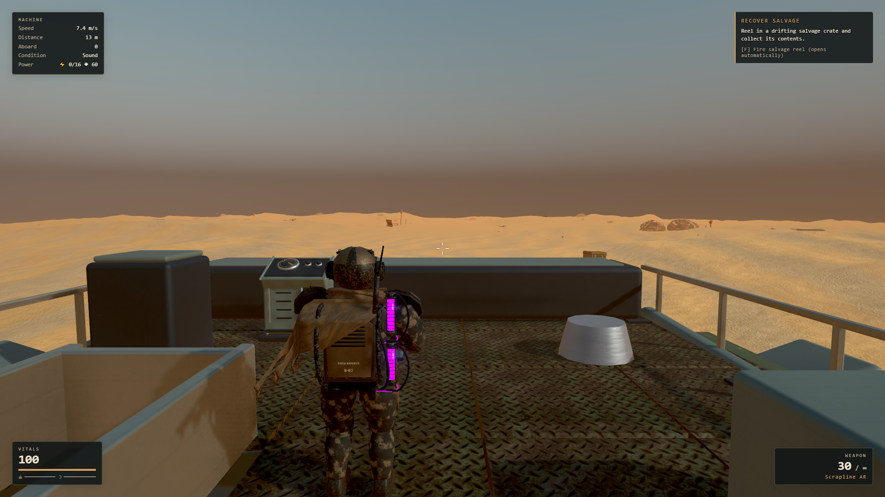

# S-07 playable main character

S-07 is the default character in new games and existing saves. The opening remains unarmed; gameplay keeps the existing rifle/shotgun progression and combat statistics.

- Blender-authored derivative with 50 bones, 12 armed/unarmed idle, walk, run, crouch and jump clips.
- Close-fitting cape, approximately 95k triangles and 5.89 MB compressed GLB. The detailed original remains untouched.
- Wrist socket holds both existing weapons with forward-facing muzzles and visual recoil.
- Existing capsule, stairs, camera collision, inventory and saves retain their existing behavior.
- Missing S-07 download falls back to the prior authored character, then the legacy/procedural path.

## Validation

Live hardware Chrome / RTX 3070, 1920 × 1080 High: movement, sprint, crouch, jump, rifle/shotgun switching, firing and unarmed pose passed with no browser errors. Ten-second ordinary deck sample averaged 60.04 FPS, p95 16.8 ms. This is not a worst-case combat benchmark. Full records are in `gameplay-check.json`.

The gameplay clip is an authored motion approximation, not motion capture. Cloth is skeleton-bound, not simulated. S-07 uses the existing game weapons; its standalone heavy weapon is still an art asset.

Rebuild: Blender background `tools/art/gunner_s07/game_export.py`, then `node tools/art/gunner_s07/game_optimize.mjs s07-player`. Preview/acceptance scripts live beside them.
