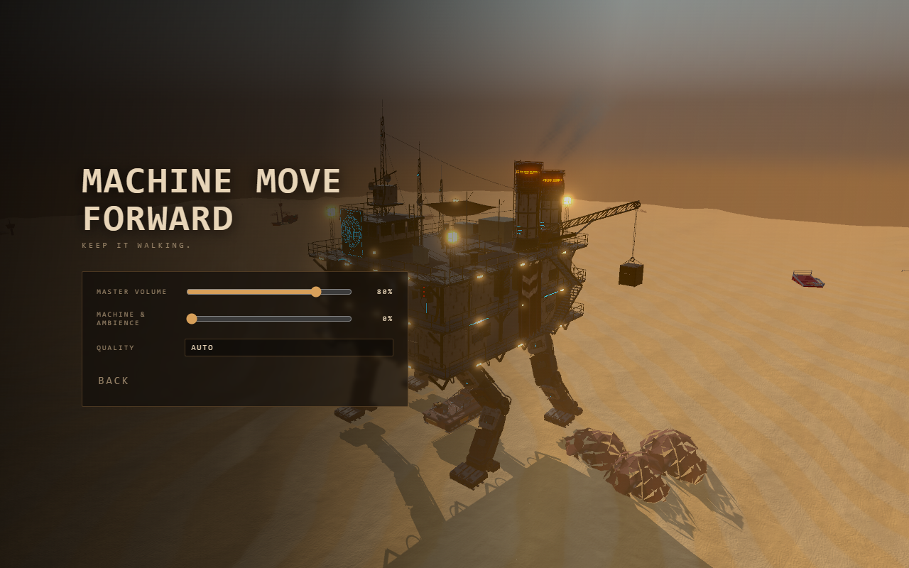

# Quieter machine ambience

The old mix stacked a filtered sawtooth engine with two detuned sawtooth music
voices. The revised engine uses a softly filtered triangle at much lower gain.
Its stopped-machine level is almost silent. Quiet sine atmosphere phrases last
14 seconds, with 22 seconds between phrases. Mechanical footsteps have a rounded
35ms attack and reduced level; interiors and active combat further duck machinery.

**Settings → Machine & ambience** controls engine, footsteps and calm atmosphere.
Combat, radio, construction and warnings retain their own levels under the master
slider. Existing settings adopt the new 60% ambience default without changing the
player's master volume or graphics preference. Zero ambience persists across reloads.
Menus, pause and hidden tabs fade the whole output to silence; mute stays in effect
when changing either slider or returning to play.

`node tools/audio-qa.mjs` uses real Chrome OfflineAudioContext rendering to compare
the previous steady mix with the new graph, check independent effects routing,
pause/background silence and persisted settings. The new sustained mix measures
**27.0 dB lower RMS** during the sampled phrase at full speed/default volume. This
is an audio-signal measurement, not a prediction of perceived loudness or speaker
output. Effects remain audible at zero ambience. See [verification.json](verification.json).

