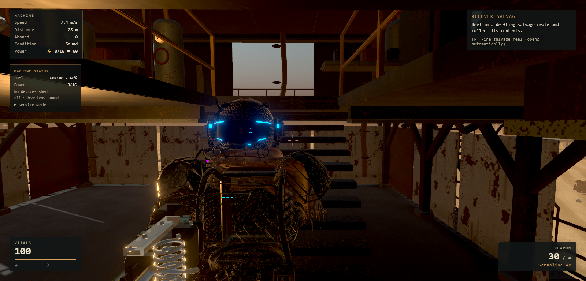
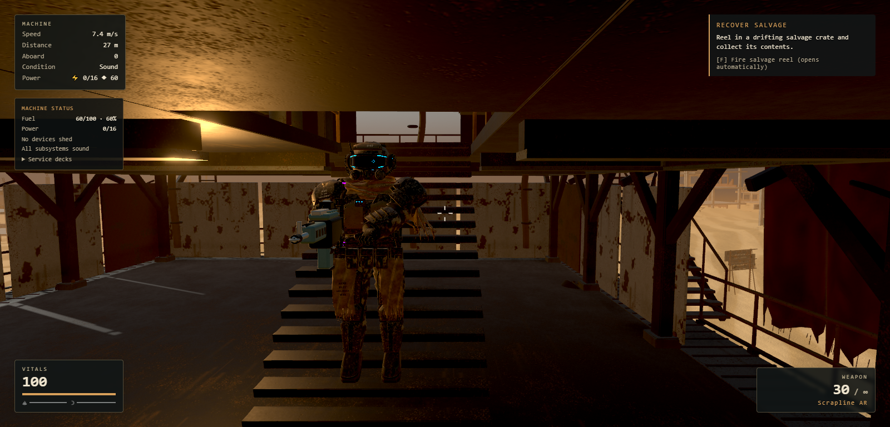

# Close camera framing correction

The 12 September 2026 screenshot prompted a follow-up to the gameplay polish
release. Two camera behaviors contributed: raw mouse rotation outran an eased
world-space orbit, and the high camera offset shortened the boom unnecessarily
under some stair landings.

The camera now builds its orbit from the current mouse heading on every rendered
frame. Target movement stays interpolated; collision distance recovers gradually,
and shoulder changes remain smooth. Volume casts run from the interpolated player
anchor to the final camera position. A lower boom is blended in only when it buys
useful obstacle clearance, with hysteresis around ceiling edges. Player fading
measures the rendered model position rather than the next physics position.

No model, material, damage, movement-physics, sensitivity or aim-FOV values changed.
Extremely confined views still fade the local model when there is no space for a
third-person camera; keeping the camera out of solid surfaces remains mandatory.

## Evidence

- Four new rapid-turn regressions failed against `e1277dd` at 30/60/144 FPS and
  on a render-only mouse update. All now pass; the player keeps the same projected
  position during yaw changes instead of leaving the viewport.
- Seven additional unit cases cover those failures, low-ceiling clearance and
  both shoulders in a narrow corridor at a wide aspect/FOV. Existing final-render
  collision, input sensitivity and translation-interpolation checks remain green.
- Lint, **1,187 tests in 119 files**, and the Pages production build pass.
- [Sixteen actual Nomad stair views](stair-views.json) show no camera overlap.
  The lower stair approach retains approximately **3.49 m** camera distance,
  compared with **1.71 m** before the correction.
- [Browser walking acceptance](walk-checks.json) covers both ramp ascents and
  descents, physical mouse/W/S/V/RMB input, visible upper-body framing, camera
  overlap, recovery out of cover and a direct render-only turn. Saves are isolated;
  stair starts and heading resets are prepared fixtures.

| Before: shortened boom | After: lower boom clears the landing |
| --- | --- |
|  |  |

Run `node tools/polish/close-camera-review.mjs` for the sixteen viewpoints, or
`node tools/polish/close-camera-walk.mjs` for browser acceptance and its review video.
Both default to the local game at port 5201 and accept `MMF_SITE` for the deployed
game. Outputs are ignored under `test-results/close-camera/`. The PR timeline records
the final deployment and public verification.
