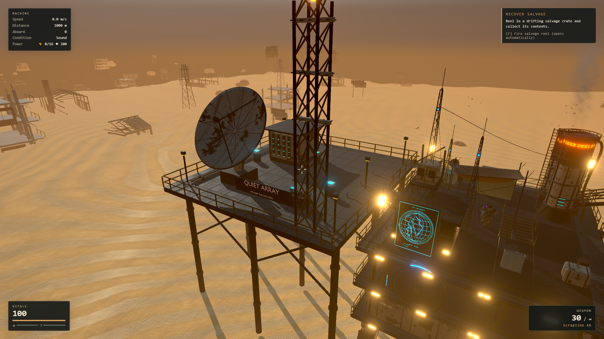
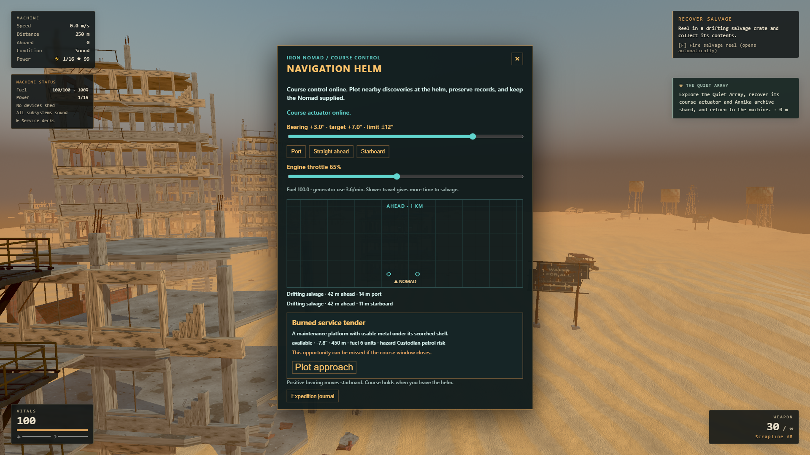

# Campaign progression

The current campaign begins with the Wreck One radio signal, continues through the Relay Foundry, and offers the optional Quiet Array expedition after the Foundry is complete. Quiet Array contains two calibration journals and an independent ANNIKA archive shard; the course actuator is gated by the two calibration readings, while the archive can be recovered on its own.

The powered Helm limits actuator steering to ±12 degrees and throttle to 35–100%. The route uses the actual global X coordinate across three reusable world bands. Three optional physical contacts can appear along the route: water caches, salvage wrecks, and memorials. Rewards use exact partial transfer counts and save their remainder. Unclaimed supplies remain available until an explicit departure.

Approach guidance can be cancelled safely. Expeditions require power and a safe, attack-free commitment; raids pause while the player is docked. The Quiet Array currently resumes the recurring raid loop after departure. Its story presents S-07 as a benevolent AI preserving human records; the fate of humanity remains uncertain.

Glass Orchard follows Quiet Array as an optional radio lead. An unanswered lead
leaves discovery travel available. Choose the 900m Caretaker Approach (boarding
skiff) or 1,100m Cold Vault approach (gunboat); each preserves a different
testimony and one intact isolator. Clear the patrol, restore the other isolator,
read the selected testimony and common memory record, then recover the human
seed bank, ANNIKA memory core and vector governor. Return aboard to depart.

The seed bank unlocks a buildable Seed Garden: two water capacity, six greens
capacity, three greens per 180 simulation seconds. Water is consumed on batch
completion. Full output pauses growth; full inventory leaves the harvest in
the bed. Water, output and progress persist through saves and equipment moves.
Voluntary demolition secures stored contents before removal. Combat destruction
drops overflow and does not refund building materials.

The vector governor unlocks steering to ±28 degrees. Every third newly detected
contact at tier two can be a Linekeeper repair depot, 120–150m laterally from
the current course, with a repair kit and a saved service record. The existing
700m schedule, 450m approach window and one-contact limit remain intact.

Last Garden at Meridian is now playable in the current development prototype.
The 1,250m Quiet Line brings a boarding skiff at 520m; the 1,050m Cordon Gap
brings a gunboat at 620m. Both routes require the Meridian transmitter and
archive objectives, the common record plus the route-selected civilian or
defense record, and the Meridian solution before tier-three steering (±45°)
becomes available. The powered Helm requires a deliberate two-click final
commitment after a safe checkpoint, then travels the final +32° bearing for
400m with a 12-second arrival presentation, Skip, and same-save Keep Walking.

The journal archive contains only records actually read. Older saves use
conservative proof from recovered uniques and never invent route testimony.
Save metadata preserves the latest readable timestamp and completed
transaction before confirmation. Tier-three discovery depots use the
265–290m lateral band; existing contacts retain their saved positions and
tier-two depots keep their 120–150m band. The full campaign remains a development prototype with
bounded steering rather than a 360-degree turn.

See the [Meridian delivery notes](meridian-delivery.md) and
[Meridian asset notes](../../assets/meridian/README.md) for the
delivery and art records.

See the [campaign direction](../superpowers/plans/2026-09-14-campaign-direction.md), [refined tasks](../superpowers/plans/2026-09-14-campaign-direction-tasks.md), and [asset pipeline](../../assets/quiet-array/README.md).

## Verification

The [campaign readiness delivery](readiness-delivery.md) covers staged loading,
survival forecasts, the Campaign Record and conditional ending recognition,
including real recovery actions, network failure fixtures and save/load checks.

Orchard implementation and evidence are recorded in
[the delivery report](orchard-delivery.md). Source art and rebuild instructions
are in [the Blender/Unreal delivery](../../assets/glass-orchard/README.md).

The following reports describe the earlier Quiet Array release:

- [Runtime report](validation/runtime-qa.json): 35 checks, including both signed steering approaches through thousands of real fixed steps, committed save/load, exact partial reward conservation, all three contact kinds, legacy migration, and 100 reuse cycles with stable scene/physics counts.
- [Visual and movement report](validation/visual-review.json): six checks, including 150 real movement steps across the Quiet Array gangway, all authored sites, and the powered Helm with an available contact.
- The 20-second local medium-quality 1920×1080 sample averaged 60.02 FPS, with 12.30 ms p95 render work and no frame intervals above 33 ms. This hardware-accelerated Chrome fixture measures a moving camera in the streamed world; it is not a guarantee for all hardware or an eight-enemy combat benchmark.
- Browser fixtures shorten story setup and directly position review cameras. They are distinct from an uninterrupted campaign playthrough. Screenshots intentionally retain the HUD, which may show the fixture's unrelated tutorial objective.
- All 1,257 unit tests across 130 files passed, along with lint and the production TypeScript/build check. The existing [chapter/tactics browser suite](validation/chapter-tactics.json) passed 52/52 with no runtime errors.

