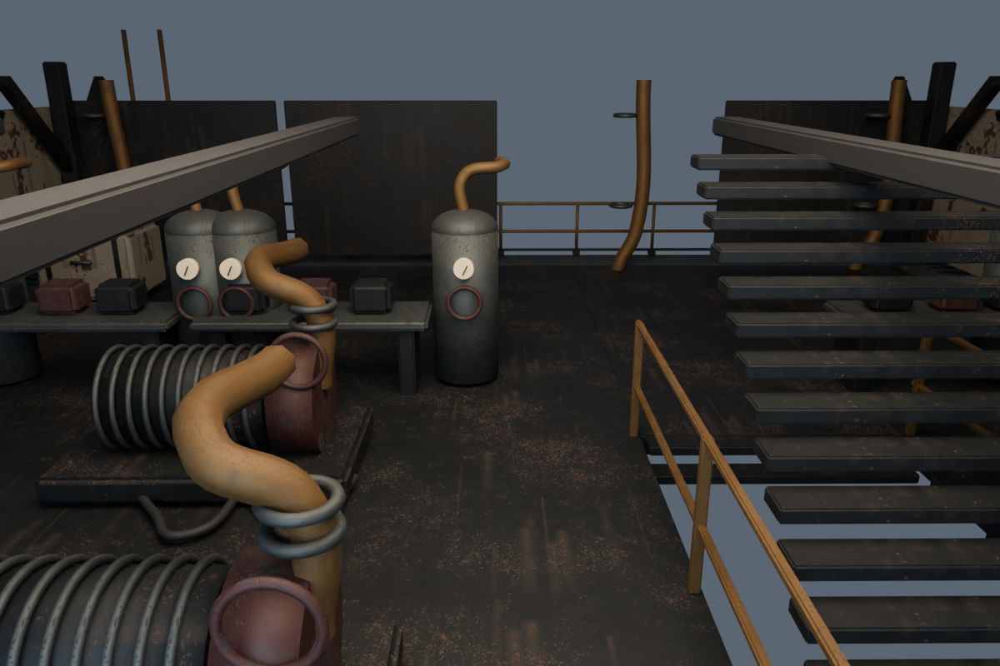

# Continuity and smoothness

Released in [PR #16](https://github.com/hwashburn1011/machine-move-forward/pull/16),
main commit `6487abd290e128acf0eaccd3bb623848dc80dbc9`. GitHub validation and
Pages deployment passed. The live page returned HTTP 200 and the deployed Nomad
GLB matched the tested SHA-256 `7555e87ddef3868e10c16148d4bf8a9b281198e5b70a496e3497d11bf982216f`.
Broader campaign/performance acceptance remains in progress.

L-12 can now use both internal stairways to follow the player and service equipment
on all three Nomad decks. Moving its dock cancels the current delivery while
preserving the live actor, which must walk to its new home. The opening chase now
retires its own pursuers when S-07 lands aboard, preventing stranded enemies below
deck from indefinitely blocking saving.

## Physical navigation and machine art

The slow caretaker's former downward adhesion overwhelmed its uphill velocity on
the 3 m rise / 4 m run ramps. Its grounded adhesion is now 0.2 m/s; airborne gravity,
player movement and enemy movement are unchanged. Directed ramp waypoints retain
the measured landings. Routes avoid built stations, validate physical segments and
keep bounded graph/path caches. Kinematic actors are excluded from the persistent
static-clearance cache and remain subject to physical collision during movement.

The Blender derivative previously relocated one pedestal separately from its
workbench into the middle-deck aisle. Relocation now follows the parent assembly's
tabletop position. Both the visible mesh and evaluated collision shell were rebuilt.

This is a review cutaway with inspection lighting, not a gameplay screenshot.
The complete editable sources retain the upper deck and surrounding machinery.
The separate review scene was appended through Blender MCP without replacing
already-open scenes.

- [Authored-machine Game fixture](continuity-validation/caretaker-multideck.json):
  8 checks, including a one-water transfer from the top deck to a bottom-deck
  garden, both service positions, cross-deck following, actor preservation,
  bounded movement and stale-token refusal after moving the dock.
- [Interruption and save regression](continuity-validation/caretaker-interruptions.json):
  15 checks, including valid-range panel interruption, power loss, building,
  death, demolition/recreation and save restoration.
- [Final physical stair soak](continuity-validation/caretaker-stairs.json): both
  measured ramps up/down, stationary/walking, grouped at 30/60/144 frame cadences
  (24 cases), then 100 consecutive trips with the same live actor. No teleport,
  bounded per-step movement, stable physics allocation and a six-entry path
  cache. This runs real Rapier movement; it is not a rendered FPS measurement.
- [Opening lifecycle soak](continuity-validation/opening-cleanup.json): 100
  repeated scene releases retire only their two owned pursuers, preserve a
  deliberately unrelated enemy, grant no kills/resources and retain stable
  pool/body/collider counts. This fixture calls scene lifecycle methods directly;
  the normal jump is covered by the separate campaign run.
- [Runtime GLB validation](../../assets/iron-nomad/gameplay/source/continuity-gltf-validation.json):
  zero errors/warnings for both optimized variants and both shipped GLBs.
- [Unreal geometry import](../../assets/iron-nomad/gameplay/source/continuity-unreal-validation.json):
  the corrected full FBX imports as one static review mesh at 27.77 × 22.93 ×
  31.29 m. The final commandlet reports zero errors/warnings after adding face
  smoothing groups. This validates geometry/scale, not Unreal gameplay or materials.

Both caretaker browser harnesses deliberately seed recruitment, structures and
resources to isolate behavior. They are not fresh-campaign progression evidence.

## Crowded combat

The corrected profiler warms up through actual animation frames before measuring.
The earlier synchronous warm-up could queue unfinished GPU work and produce
misleading long stalls. On the RTX 3070, 1920 × 1080 Medium, eight enemies and
rapid mouse rotation, the three valid main-branch samples were 59.25, 59.00 and
58.62 FPS (median 59.00). Each sample retained all eight enemies; p95 frame time
was 16.8 ms. See [raw baseline](../gameplay-polish/crowd-performance-final-all.json).

No production enemy optimization or quality reduction was justified by that
baseline. This is a local, warmed fixture result, not a broad 60 FPS guarantee.

The final alternating main/candidate runs retained all unfavorable samples:

| 1080p Medium | Run 1 | Run 2 | Run 3 | Median |
| --- | ---: | ---: | ---: | ---: |
| Main | 58.50 | 60.00 | 60.00 | 60.00 FPS |
| Candidate | 51.87 | 60.00 | 59.12 | 59.12 FPS |

Candidate Medium had 63 / 0 / 7 frames over 25 ms, and none over 50 ms.
Low/High single sanity samples were 50.87 / 54.12 FPS; Low included two frames
over 50 ms. Raw `crowd-main-*`, `crowd-candidate-*` files in
[the evidence directory](continuity-validation/) record bundle URLs, hardware,
camera input and work counters. Enemy trajectories and startup state varied
between processes despite matching initial spawn layout, so these runs do not
isolate a candidate regression or prove an improvement. Renderer CPU and
simulation cost both varied; lowering quality did not consistently improve FPS.
More reproducible profiling and frame-time improvement remain open work.

## Campaign continuity

The normal-input runner selects Story, performs the rooftop sprint/jump, saves
through the pause menu, continues from the title, catches a drifting salvage
crate with the normal reel control and checks its radio/reward persistence.
The initial attempt on main exposed the stranded rooftop pursuers and preserved
the failure evidence. The candidate cleanup fixes that observed blocker.

The accepted run passes cold browser restart, catalog/ray placement of three
floor plates, one refinery, one workbench and one manual turret, four component
crafts, turret entry and the normally delayed tutorial boarding start. Exact
remaining resources are 86 scrap, 1 component and 4 fuel. The
[provenance manifest](continuity-validation/continuity-manifest.md) links the
opening and first-loop events and identifies excluded attempts. One earlier
failed harness attempt lost Continue for an unresolved reason; a controlled clean
cold restart passed, and source review found no title-screen overwrite path.

Cheap logical runs disable authored models and use software rendering; they do
not count as visual/performance evidence. No campaign state, health or resources
are injected. The follow-up clones the real saved browser checkpoint to isolate
retries, then spends actual resources through normal controls.

An uninterrupted campaign through Meridian/Keep Walking, Survival continuity,
and a defensible unaccelerated duration estimate remain unfinished. Earlier
chapter fixtures do not substitute for those checks.

All 1,457 unit tests across 163 files, ESLint, TypeScript and the production build
pass. The existing large JavaScript bundle warning remains. Sol reviewed the
source changes and acceptance accounting; no release-blocking source defect was
found. The unresolved campaign and profiling work above is not marked complete.

## Reproduction

Run `tools/caretaker-stairs-check.mjs` against the dev server for the detailed
real-Rapier traversal soak. Use `MMF_AUTHORED=1` with
`tools/caretaker-multideck-check.mjs` for the full-machine Game fixture.
`tools/caretaker-game-check.mjs` covers interruptions and saved caretaker state.
See the [interaction map](continuity-interactions.md) and the
[task plan](../superpowers/plans/2026-09-15-continuity-and-smoothness-tasks.md)
for the continuing campaign run.
