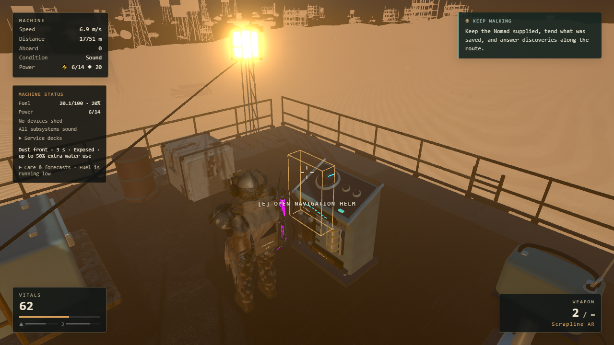
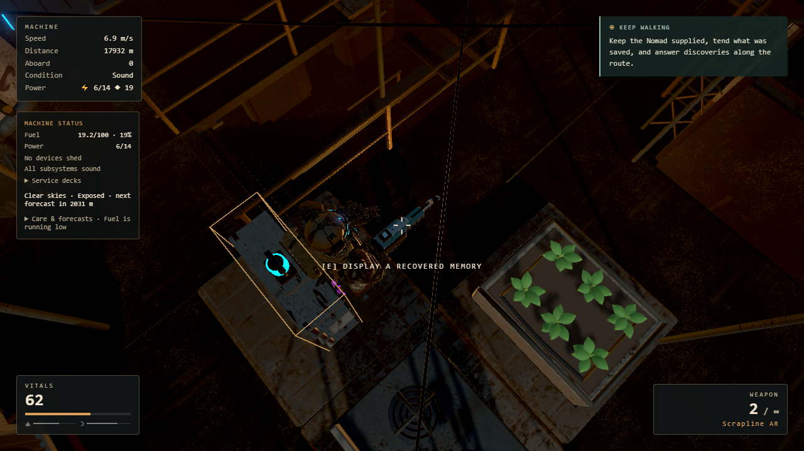

# Acceptance evidence

- `high-30-minute.json`: sustained High 1280×720 route; complete frame statistics,
  phase chronology, resource samples and explicit instrumentation limits.
- `medium-1080p-settings.json`: three-minute Medium 1920×1080 route with maximum
  FOV and sensitivity, including measured HUD separation.
- `cohesion.json`: 41 normal-input Helm, build, exhibit selection, clear, Save &
  Quit and cold-Continue checks. No player-save payloads are published here.
- `camera-matrix.json`: 11 captures covering both shoulders/hip/aim around the
  galley and middle stairs, plus confirmed normal descent and ascent.
- `library-workshop.json`: earlier pending library acceptance, identical-roster
  boarding construction measurements, and workshop approach/surface checks.
- `assets.json`: SHA-256/size of the two shipped original GLBs.
- `fuel-hud-layout.json` and `fuel-layout-empty.png`: isolated production-markup
  and CSS layout check, separate from gameplay evidence.
- `audio-mix.json`: decoded output metrics; `digitalSilence: true` means a null
  dBFS value represents zero amplitude, not missing output. The WebM clips retain
  original levels and are provided for human listening, which was not performed
  by this automation.

Raw run locations are included in each report and remain under the ignored local
`test-results` directory. Diagnostics clone source browser profiles before use.
Failed driver attempts remain in that directory and are described in the
[delivery record](../feel-pacing-cohesion-delivery.md).

[Engine/deck audio](audio-engine-deck.webm) · [Combat audio](audio-combat.webm) ·
[Pause audio](audio-pause.webm)
