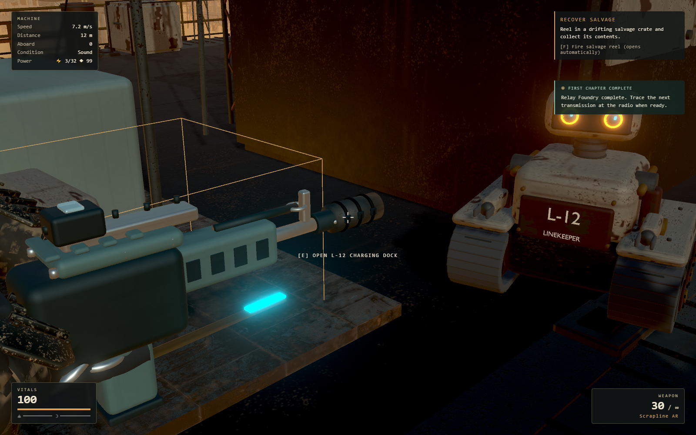

# Fieldwork and L-12 Linekeeper

The [refined tasks](../superpowers/plans/2026-09-15-fieldwork-companion-tasks.md)
and [contract](../superpowers/plans/2026-09-15-fieldwork-companion-contract.md)
cover this iteration. Sol refined and reviewed the rules, Luna implemented
systems, UI and tests, and Astra integrated the game, authored the Blender kit,
validated it in Unreal, and performed browser and visual checks.

## Playing the update

- After Relay Foundry, use **Workbench → Weapon attachments**. Research a
  rifle stabilizer, three-round burst cam, shotgun choke or scatter brake for
  12 scrap and 8 components each. Swap or remove researched attachments freely
  at a safe, powered workbench. The fieldwork panel draws 1 power. Attachments
  trade handling, range, cadence or reload time; base damage is unchanged.
- New campaigns offer **Story** with the existing infinite ammunition reserve,
  or **Survival** with finite reserves replenished by existing ammunition and
  crafting. The choice stays with the campaign. Existing saves remain Story.
- Restore **L-12** at a repair depot for 6 components. Build its charging dock
  under **Automation** for 40 scrap and 8 components; it draws 3 power.
  Companion mode follows you on the dock's deck. Steward mode moves completed
  producer output to built storage and brings crate water to thirsty gardens.
  Every transfer is one unit and commits only after physical arrival at both
  endpoints. L-12 has no inventory or combat role.

**Current movement boundary:** L-12 works on one deck. Real machine stair tests
found blocked landings; it waits when you change decks and never claims those
routes are reachable. Moving the dock redeploys one unit on the new deck when
safe and powered. This also applies to jobs: storage and producers must be on
that deck with a clear route. Cross-deck following is deferred.



## Artwork

The [original Blender kit](../../assets/fieldwork/README.md) includes a rounded,
weathered tracked helper, binocular sensor, articulated arms and wheels,
charging dock and four attachment models. The complete kit has 65,032 triangles
and a 5,097,532-byte runtime GLB. The six parts were validated as static meshes
in Unreal 5.8.2; browser gameplay uses the GLB. Blender MCP appended the review
scene while preserving existing scenes.

The glTF validator reports zero errors and warnings. Runtime geometry/materials
are borrowed from the asset cache. Small hub/fastener/lens geometry remains
visible but no longer incurs unnecessary shadow submissions. The original
rifle and shotgun visual muzzle sockets were corrected to their actual barrel
axis; [binary checks](fieldwork-validation/weapon-sockets.json) confirm that
vertex/material buffers remain unchanged. Hitscan is unchanged.

## Validation

These are isolated automated fixtures, not a complete manual campaign. Story
facts, free build placement and resource setup are prepared explicitly; the
checks then use real Game, DOM, physics, inventory and save systems. Browser
audio is disabled. No new chapter or campaign-length playtest is claimed.

| Check | Result |
| --- | --- |
| Full unit suite | 1,450 tests passed across 163 files |
| ESLint, TypeScript and production build | Passed; existing large JavaScript chunk warning remains |
| [Weapons/profile browser](fieldwork-validation/weapons-profile.json) | 22/22: real chooser, all four purchases, equip/remove, burst interruption, finite ammo crafting/reload, current and old saves, power refusal |
| [Caretaker lifecycle browser](fieldwork-validation/caretaker-lifecycle.json) | 14/14: physical source/target visits and water transfer, panel/build/death/power interruption, dock demolition/recreation, cross-deck dock relocation, save/load and stale endpoint refusal |
| [Recovery browser](fieldwork-validation/caretaker-recovery.json) | 6/6: actual depot candidate/UI, affordability, exact one-time payment and durable save fields |
| [Stair refusal](fieldwork-validation/caretaker-stair-refusal.json) | 2/2: blocked cross-deck routes refused in both directions, live actor waits safely |
| [Authored visuals](fieldwork-validation/authored-visuals.json) | L-12 and all four held attachments inspected in the actual game |
| Resource conservation | 100 mixed transfer/relocation/restore/removal unit cycles, checked separately for water, greens and scrap |
| Actor lifetime | 100 real actor removal/recreation cycles; geometry, texture, shader, body, collider and power demand counts stable |

The [Medium performance sample](fieldwork-validation/performance-medium.json)
uses full authored models at 1920×1080 on the local RTX 3070, three eight-second
scenarios. It measured **60.00 / 60.00 / 49.02 FPS** for deck, rapid mouse look,
and rapid look with eight live enemies. There were 0 / 0 / 83 frames over 25 ms
and 0 / 0 / 1 over 50 ms. The adjacent [control run](fieldwork-validation/performance-control-medium.json)
without the added companion/dock measured 60.00 / 59.50 / 48.02 FPS. These are
short instrumented samples with variable enemy positions, not proof of a speed
increase or a locked-60 guarantee. The crowded fight remains a performance
limitation in both cases.

After warm-up the actor soak retained 523 geometries, 505 textures, 169 shader
programs, 29 bodies, 43 colliders and 3 registered power demand throughout.

## Reproduce

With Vite on port 5201:

```text
npm test
npm run lint
npm run build -- --base=/machine-move-forward/
node tools/fieldwork-companion-check.mjs
node tools/caretaker-recovery-check.mjs
node tools/caretaker-game-check.mjs
node tools/caretaker-stairs-check.mjs
node tools/fieldwork-visual-check.mjs
node tools/performance-smoothness.mjs --seconds=8 --quality=medium --fieldwork --label=fieldwork-medium
```

Run browser/GPU checks serially. Their contexts do not use a player's existing
browser saves. Blender/Unreal rebuild and interchange scripts are under
`tools/art/fieldwork/`.
