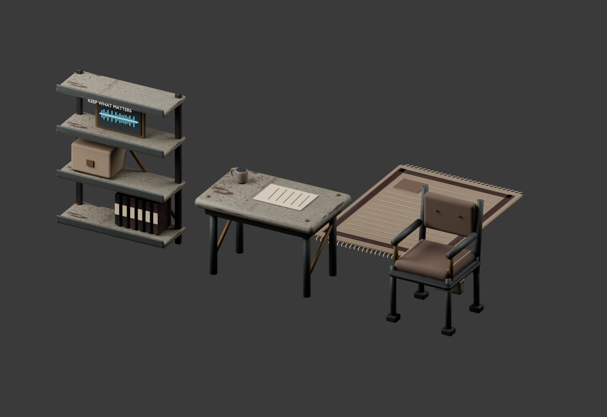
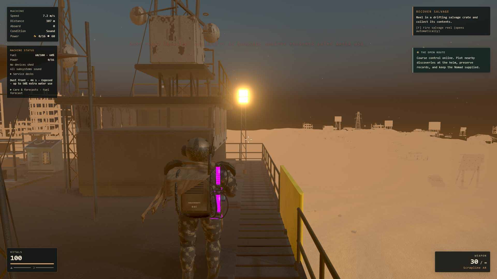

# A home aboard the Nomad

This iteration follows the [contract](../superpowers/plans/2026-09-15-home-weather-contract.md)
and [refined tasks](../superpowers/plans/2026-09-15-home-weather-tasks.md).
Sol refined and reviewed the work, Luna implemented pure rules, UI and test
scaffolding, and Astra integrated the game, authored the Blender furniture,
validated the assets in Unreal, and ran the final browser checks.

## Playable changes

- **Quiet maintenance and keepsakes.** Build an enclosed room, a chair, and a
  table or rug. Press E beside the chair to restore 2 HP/s while still and safe
  (1 HP/s while hungry). Movement, fire/aim, damage, combat, a broken room or
  another interaction stops maintenance. The character stands beside the chair;
  there is no sitting animation, passive buff, time skip or world pause. Press E
  at a shelf to choose an already recovered record. Its selection survives
  relocation and save/load, but never creates or deletes campaign facts.
- **A choice at salvage wrecks.** Secure the ordinary 24 scrap/2 components, or
  return aboard and confirm a broadcast through the Radio's wreck salvage
  choices. One existing port-side skiff attacks while the wreck gangway is
  retracted. Successful defense unlocks a total of 48 scrap/6 components at the
  wreck. Dying during defense retains only the ordinary cache. Saving, leaving
  and collecting are blocked during the encounter; inventory overflow remains
  at the site and survives reload. This optional fight does not also pay the
  ordinary skiff cache or advance the radio raid wave.
- **Passing dust fronts.** A 35-second warning precedes a 70-second front and
  20-second clearing. Dust rises over ten seconds and gradually clears. Exposure
  adds up to 50% water use; actual enclosed rooms prevent that extra use. Weather
  waits through the opening guide, stops and story sequences. Ordinary combat
  can overlap it. No new sound loop, structural damage or enemy spawn is added.

## Original artwork



The editable [Blender kit](../../assets/home-life/home-furnishings.blend) contains
rounded tubing, worn hatch metal, padded seating, a woven rug, stored records,
and a keepsake waveform that illuminates when assigned. Four separate FBX assets
were imported into Unreal at the intended centimetre scale, and a review scene
was appended through the running Blender MCP. Existing review scenes were retained.

The runtime GLB is **3,824,044 bytes and 31,800 triangles for the full kit**.
It borrows geometry and materials from the retained model cache; placed objects
own their transforms. Small kit textures have distinct material names so they
cannot overwrite larger campaign materials. It adds approximately 3.8 MB to
critical visual loading. [Asset notes and rebuild tools](../../assets/home-life/README.md),
[glTF validation](../../assets/home-life/gltf-validation.json) (zero errors and
warnings), [Unreal import report](../../assets/home-life/unreal-validation.json).

## Validation

These are automated browser fixtures using actual Game APIs and selected real
keyboard/button paths, not an uninterrupted manual playthrough. Late campaign
and contact states are explicitly prepared. Combat checks use damage APIs;
they do not claim mouse-aimed combat or walking the entire gangway. Browser
audio is disabled, and no audio changes were made.

| Check | Result |
| --- | --- |
| Full unit suite | 1,403 tests passed across 153 files |
| ESLint, TypeScript, production build | Passed; existing large JavaScript chunk warning remains |
| [Authored home/weather](home-weather-validation/home.json) | 13/13; E, movement, damage, hungry health cap, real enclosure/shelter, shelf UI, relocation and save/load, old-save filtering, pause and roof breach |
| [Home without authored models](home-weather-validation/home-fallback.json) | 12/12; simpler visual fallback retains behavior |
| [Salvage acceptance](home-weather-validation/salvage.json) | 13/13; secure/broadcast UI, hull destruction and actual spawned boarder deaths, payout isolation, partial rewards and death fallback |
| [High performance and shelf soak](home-weather-validation/performance-high.json) | Three 12-second scenarios at 1920×1080 with eight furnishings and full dust; 100 shelf replace/assign/rotate/serialize cycles |
| [Medium performance and shelf soak](home-weather-validation/performance-medium.json) | Same setup: 60.00/59.83/59.91 FPS, 0/2/1 frames over 25 ms, none over 50 ms; another stable 100 shelf cycles |

The High sample on the local RTX 3070 averaged **59.00 FPS on deck, 55.09 FPS
with rapid mouse look, and 55.17 FPS with rapid look and eight live mechs**.
The three scenarios recorded 12/59/53 frames over 25 ms, and 0/0/1 over 50 ms.
This instrumented stress case is not a locked-60 claim. Hardware, browser load,
camera angle and build size affect performance. Dust retained one sky bake
throughout; its grit is capped at 384 points (96 at Low).

After warm-up the 100-cycle shelf soak retained exactly **482 geometries,
512 textures, 184 shader programs, 30 physics bodies and 45 colliders**.
It verifies borrowed asset lifetime and saved selection, using free placement
in an isolated fixture. Paid resource conservation is covered separately by
the existing building unit tests. Defended save remainders 0/6, 20/4, 48/0 and
0/0 have regression tests, as do weather phase transitions at 30/60/144 Hz.



Reproduce with a local server on port 5201:

```sh
node tools/campaign/home-life-game.mjs
node tools/campaign/salvage-risk-game.mjs
node tools/performance-smoothness.mjs --home-weather --label=home-weather --seconds=12
```

Set `MMF_QA_MODELS=1` for the authored home pass, `MMF_SITE` to change the
functional-test origin, and `MMF_QA_OUT` for report output. Run GPU tests serially.
The default performance tier is High; `--quality=medium` selects Medium.

The existing save format receives only optional shelf, route-choice and weather
data. Old saves retain the campaign and receive a fresh 600 m weather runway.
The story, ending, ordinary attack values and paid building costs are unchanged.
