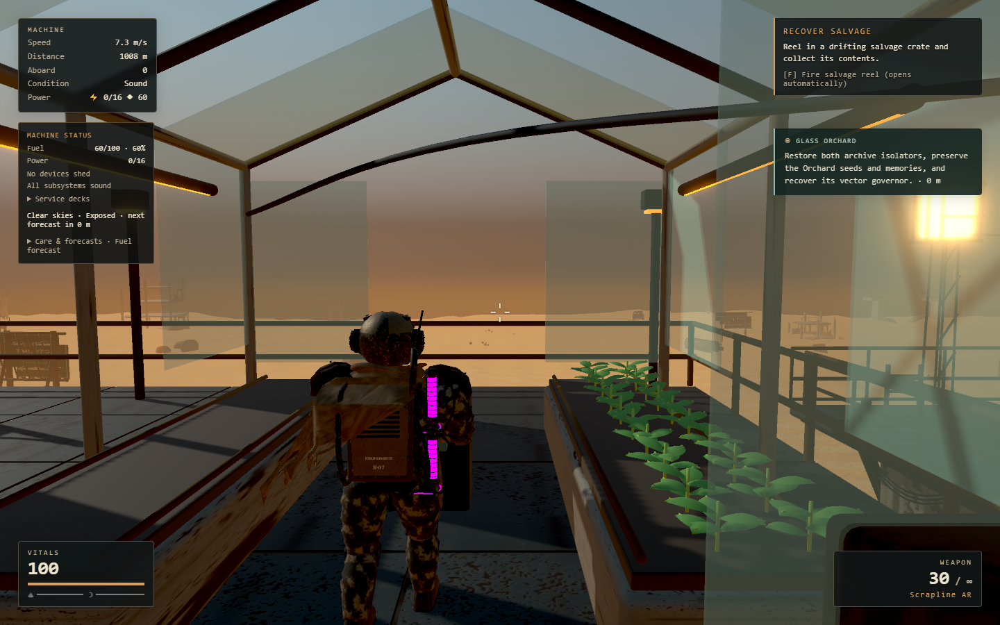

# Late campaign continuity and Orchard clearance

This pass continues the accepted Quiet Array Story campaign. It also corrects
an Orchard doorway obstruction found while preparing its traversal route.

## Completed recovery checkpoint

The normal-input infrastructure lineage starts from Quiet Array's accepted
`run-2026-09-15T14-23-53-655Z` profile. Keyboard, mouse, build-catalog and crafting
controls deposit the four carried fuel, rebuild the refinery for 80 scrap,
craft two component batches for 16 scrap, place an 8-scrap floor and build a
40-scrap/5-component condenser. No gameplay state is granted or overwritten.

The resulting inventory has **30 scrap and 2 components**, with **10 pieces**
and **60 health**. The original damaged refinery floor remains at 40/120:
the real refinery prompt was reachable without repairing it. The final
accepted checkpoint is `run-2026-09-15T15-28-40-193Z`. Paused Save & Quit and
a complete browser restart preserve the inventory, structure identities and
condition, subsystem health, campaign records, ending state and course.
See [the checkpoint evidence](late-recovery-validation/infrastructure.json).

The condenser exposes a real recovery constraint: the refinery, condenser,
deck gun, radio and helm demand 19 power from a 16-capacity generator. The
station class is shed, leaving the deck gun powered. Water production cannot
start until that load is reduced or more generation is built. This infrastructure
checkpoint proves construction and persistence; the following sustain attempts
then recover power and needs through ordinary play.

Normal demolition of the idle refinery refunds **48 scrap**, retains its floor,
and reduces demand to **9/16**. The condenser then produces real water, which
is collected with E and consumed through the inventory: the first drink raises
hydration from 23.09 to 83.06 while consuming exactly one water. Ordinary raids
remain active and their health losses persist. A later normal build sequence
adds a planter, stove and one support floor for **53 scrap and 2 components**.

The accepted sustain checkpoint is `run-2026-09-15T15-52-49-854Z`:
the first greens and condenser water are collected, cooked into a ration, and
consumed for a 60-point nourishment recovery. It then clears the remaining
attack, refuels normally, and passes paused Save & Quit plus a full browser
restart. The restored state has **703 scrap, 36 components, 25.864 tank fuel,
87 health, 61.29 hydration, 66.29 nourishment and 12 structures**, with the
same story, journal archive, subsystem condition and tier-one steering.
See the [sustain checkpoint evidence](late-recovery-validation/sustain.json).

The lineage includes ordinary deaths and automatic respawns during failed
driver attempts; it is not a death-free combat demonstration. Those events,
real resource gains and losses, and failed attempts remain in the manifest.
The live speed/burn estimate gives eight fuel for the 900 m Orchard route;
the actual route admission and journey remain part of the next slice.

## Tooling corrections and provenance

The [attempt manifest](late-recovery-validation/attempts.json) retains the
source profile and outcome of each bounded attempt. The runner initially
assumed the floor repair was mandatory, then lost its placement ray when
the browser emitted an absolute mouse move. Both are test-driver mistakes;
normal crafting and later explicit mouse-button placement worked.

Cold comparisons were corrected for the restore's intentional floor-first
ordering and for the separate ending state that Game composes into the save.
The complete campaign save is compared rather than just StoryDirector's
partial payload. These corrections did not mutate saves. Each retry cloned
the preceding real autosave or committed checkpoint.

Subsequent driver corrections route around the condenser when approaching the
generator and wait for the actual combat/build guard before opening the catalog.
The guard correctly rejected building during a raid. Resumed attempts trace
their saved parents back to the accepted infrastructure checkpoint and retain
previous water-consumption evidence; they do not reset combat or grant supplies.
One attempt clicked Save & Quit during another raid: the game correctly
refused it. The final run clears combat and verifies the safe-save boundary
before pausing and committing. Recovery ran against the existing production
bundle on origin 5205; the rebuilt Orchard geometry was checked separately
against the current source.

## Orchard art correction

The port switch cabinet occupied the southern greenhouse doorway. Its old
side passage left only about 0.19 m of center-path width after the player
capsule margin. The cabinet now sits beside the doorway at local x=-7.1;
Blender geometry, runtime GLB, fallback marker and gameplay collider agree.
The model remains at 164,116 triangles and validates with no GLB errors or
warnings. The Blender MCP review scene was added without replacing the
user's active Nomad workbench review.

An isolated full-art fixture walked the actual character through the
corrected entrance using normal-speed forward input. Both checks passed,
with no runtime errors. This is geometry evidence, not a continuous Orchard
completion. See the [route reference](orchard-normal-route-map.md) and
[fixture report](orchard-clearance-validation/report.json).

All **1,487 tests across 168 files** pass, including the doorway collision
regression. Lint, TypeScript and the production build pass. The remaining
late-campaign validation proceeds from recovery through the caretaker-route
expedition and Meridian; those continuous completions are not claimed here.
