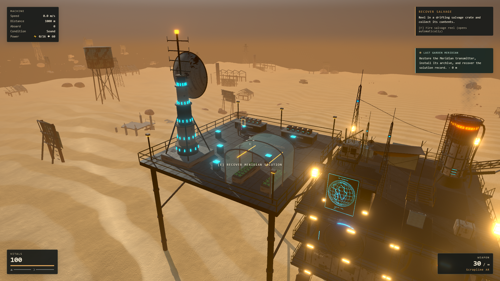
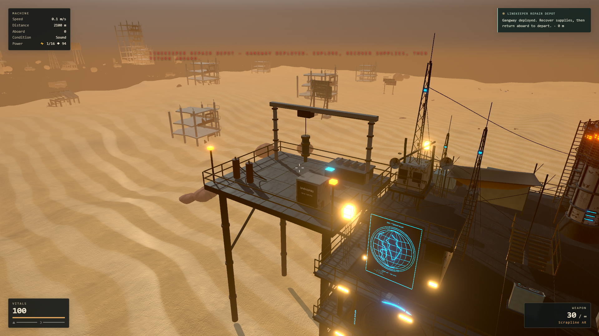
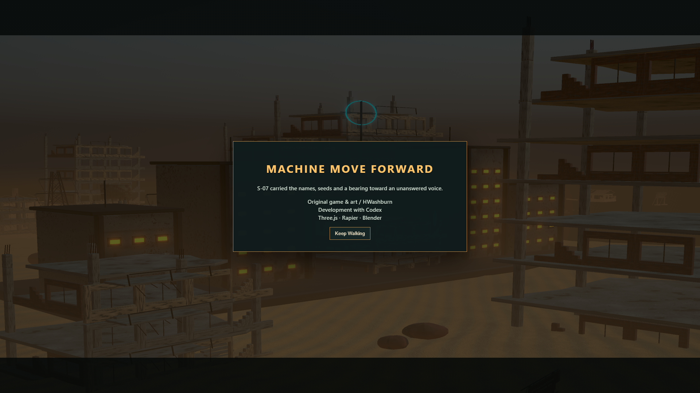

# Last Garden at Meridian delivery

This iteration implements the [refined tasks](../superpowers/plans/2026-09-15-meridian-tasks.md)
and [frozen integration contract](../superpowers/plans/2026-09-15-meridian-contract.md).
Sol handled progression/save review; Luna implemented bounded data, ending,
navigation and UI tasks; Astra built the Blender assets, integrated the game,
and ran the graphics and browser verification.

## Playable behavior

1. The Last Garden is a passive radio offer after Glass Orchard. Choose the
   1,250m Quiet Line (skiff at 520m remaining) or the 1,050m Cordon Gap (gunboat
   at 620m). Unresolved combat holds the destination at 220m. Restore the local
   transmitter and archive, read the common record and selected route testimony,
   then recover the Meridian solution and return aboard to depart. Installing
   the archive preserves the already recovered Orchard memory-core fact.
2. The solution unlocks ±45-degree steering. A deliberate two-click action at
   the powered Helm writes a safe checkpoint before locking the final +32-degree
   course. Normal travel and resource use continue for 400 forward metres,
   followed by a 12-simulation-second arrival and credits. Pause stops its clock;
   Skip and Keep Walking release control through one idempotent completion edge.
3. Keep Walking continues the existing save, retaining the machine, construction,
   supplies, gardens, damage, needs, upgrades, course and discoveries. The
   expedition archive groups records already read by chapter. Tier-three repair
   depots appear 265–290m off course; old tier-two contacts retain their positions
   and rewards. Existing raids and discovery rules resume after the normal
   sanctuary recovery window.

The refuge channel carries a recent but unverified reply. Neither the environment
nor the story confirms who maintains it or resolves humanity's fate. The campaign
has a playable ending; the wider game remains a development prototype.

## Save and control guarantees

- The ending has a single Game-owned director inside optional campaign save
  data. It cannot grant story completion or navigation authority on its own.
- A one-use checkpoint ticket is identity checked, frozen, and revalidated
  after the asynchronous save. A changed deck, failed write, or incoming threat
  prevents takeover. The user can retry after the blocker clears.
- IndexedDB writes resolve after transaction completion, including rejection of
  a late abort. Continue selects the newest readable save, including the named
  Meridian checkpoint, instead of always preferring an older quicksave.
- Restored journal archives accept authored IDs. Legacy proofs recover only
  unambiguous required records; they never invent which route testimony a
  completed old save saw.
- Arrival follows the same forward/lateral projection as course control. The
  ending cannot take over while S-07 is dead; normal respawn completes first.
- Completion does not reset the world or issue another inventory reward. Camera,
  cursor, pause, title and new-game ownership use the existing lifecycle.

## Validation

All 1,330 unit tests across 142 files pass, alongside lint, TypeScript and the
production build. The existing large-bundle advisory remains. Browser fixtures
seed earlier campaign progress and accelerate route setup; they are distinct
from an uninterrupted campaign playthrough.

- 65/65 [runtime campaign/ending checks](meridian-validation/runtime.json) exercise
  both real vehicle damage callbacks, route holds, physical interactions, every
  save phase, checkpoint failures and same-save completion.
- 10/10 [movement and graphics checks](meridian-validation/visual.json) walk the actual
  Rapier capsule from the gangway to all mandatory consoles, test glass and
  greenhouse access, and drive wider guidance into a real repair depot.
- A 20-second 1920×1080 medium camera sample on the local RTX 3070 averaged
  60.05 FPS, with a 16.8ms p95 frame interval, 15.1ms p95 render work, and no
  intervals above 33ms. This is a scenery/camera fixture, not a guarantee for
  every hardware or combat configuration.
- 100 Meridian/depot replacements held at 459 geometries and 505 textures after
  warm-up. [The sustained lifecycle report](meridian-validation/soak.json) covers
  100 garden placement, watering, growth, relocation, real save/load and demolition
  cycles over 600.8 real seconds (598.4 simulation seconds). Water is conserved
  and refunds match exactly; fixture refunds are removed after verification to
  avoid filling storage. After warm-up the fixture retains 24 physics bodies,
  436 geometries, 490 textures and 163 shader programs. Spawning is disabled
  in this lifecycle fixture; combat is covered separately.
- 9/9 [control lifecycle checks](meridian-validation/lifecycle.json) use actual
  pointer lock, trusted Keep Walking/Skip clicks, pause/resume, focus-loss,
  title and New Game transitions. There are no browser runtime errors.
- Existing campaign regression suites pass: 35/35 Quiet Array checks and
  52/52 [chapter/tactics checks](meridian-validation/chapter-tactics.json),
  including the recurring assault, sabotage and theft systems.
- [Original Blender sources and Unreal review](../../assets/meridian/README.md)
  include zero glTF errors/warnings and two successful native Unreal 5.8.2
  imports. Blender MCP preserved seven existing scenes and appended Meridian.

