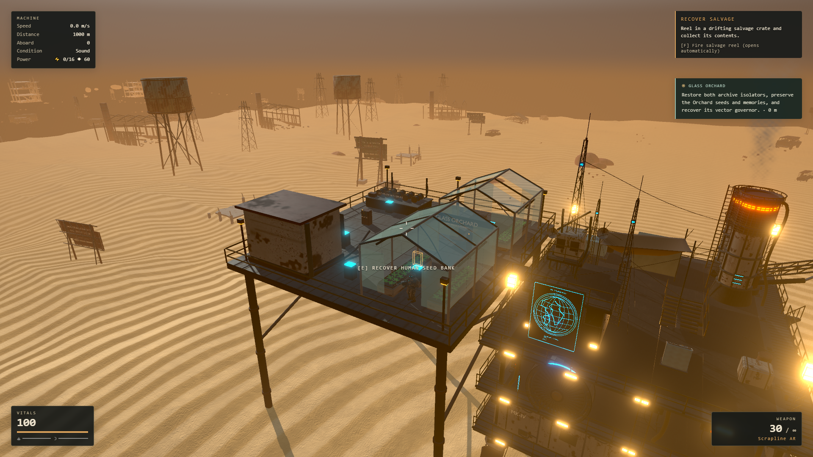
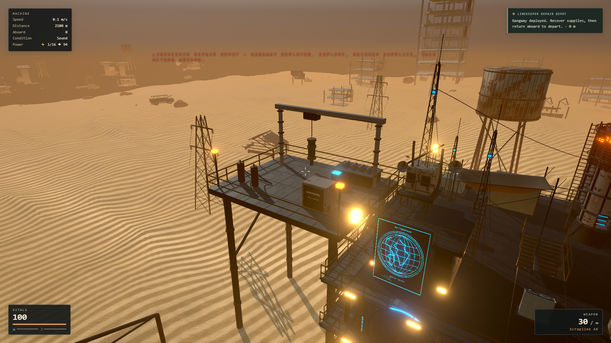

# Glass Orchard delivery

This iteration implements the three tasks in
[the refined plan](../superpowers/plans/2026-09-14-glass-orchard-tasks.md) using
[the frozen contract](../superpowers/plans/2026-09-14-orchard-contract.md).
Sol refined the state/save rules and reviewed correctness; Luna implemented
bounded data, garden, navigation, resource and UI work; Astra built the models
and integrated the game, encounters, physics and browser validation.

## Playable behavior

1. Glass Orchard is offered after Quiet Array. The two routes use the existing
   boarding-skiff and gunboat systems, with a 220m hold while combat remains.
   Each route starts with one intact isolator and preserves a different journal.
   The selected record, common memory, both isolators and three recoveries gate
   completion. The main story rewards cannot be lost through inventory overflow.
2. The human seed bank unlocks the Seed Garden. Press E nearby to add up to two
   water or harvest ready greens. Each batch uses one water and grows three
   greens over 180 simulation seconds, storing up to six. Existing planters and
   combat damage/timing remain unchanged. Garden saves use the existing build
   piece state, including progress and output.
3. The vector governor unlocks ±28-degree course authority and distant repair
   depots. The helm previews reachability and plots guidance. A repair kit and
   Linekeeper recording use the same exact reward ledger as earlier contacts.
   Partial rewards remain until explicit departure.

Unanswered story offers no longer suppress optional discoveries. Accepted
story routes own the shared destination; committed discoveries require leaving
or cancelling before a story trace can replace them.

## Corrections found during review

- Queued story patrol ownership survives both direct and ordinary director
  handoffs. Actual scene completion resolves it once; loading a queued patrol
  re-arms its request instead of silently clearing or stranding it.
- Required records, objectives and recovered facts drive departure availability.
  All physical story actions resolve live targets and check interaction reach.
- Garden transfers and cascading demolition use atomic capacity planning across
  surviving storage. Full inventories, shared final slots and event reentry
  cannot duplicate output or remove water before acceptance.
- Real 30, 60 and 144 Hz growth schedules produce the same completed batches.
- Greenhouse glass, beds, consoles and depot equipment have matching colliders.
- Expedition cards and status rows have readable spacing. Shared HUD cache keys
  prevent a phase event from permanently replacing the chapter's title.

## Evidence

- 1,300 unit tests across 136 files pass; lint, TypeScript and production build
  pass. The existing large-bundle advisory remains.
- [Orchard browser checks](orchard-validation/runtime.json): real Game route
  selection, vehicle damage callbacks, recoveries, docking/departure, garden
  interaction/growth and actual save/load. Earlier chapters are seeded as
  completed fixtures; route travel and growth are accelerated for these checks.
- [Movement, graphics and depot checks](orchard-validation/visual.json): real
  player capsule crosses the gangway, glass blocks sideways movement and the
  greenhouse entrance admits the player. Wider guidance physically reaches the
  depot and its reward/record survive saving.
- 100 Orchard/depot replacements retain 459 geometries and 505 textures after
  warm-up. A 20-second 1920×1080 medium camera sample on the local RTX 3070
  averages 60.07 FPS; render-work p95 is 10.4ms and frame-interval p95 16.8ms,
  with no intervals over 33ms. This is a scenery/camera fixture, not a guarantee
  for every machine, hardware configuration or dense combat scene.
- Three original Blender sources, inspected source renders, zero glTF errors
  or warnings, and successful native Unreal 5.8.2 imports. Blender MCP loaded
  a separate Orchard review scene while preserving the six existing scenes.

Last Garden at Meridian is not included in this iteration. Humanity's fate
remains uncertain; the playable campaign continues into open survival after
the Orchard.
