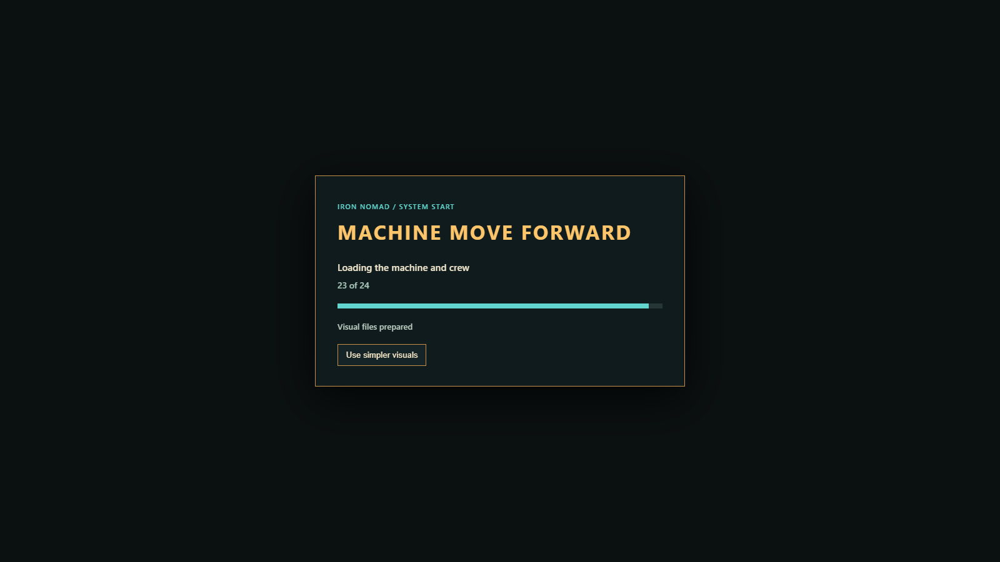
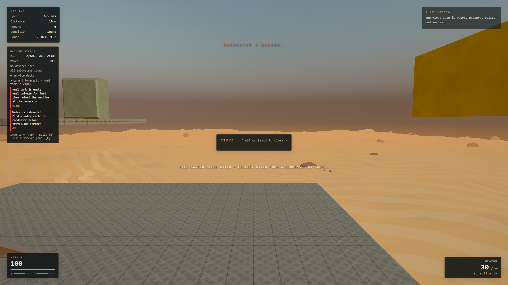
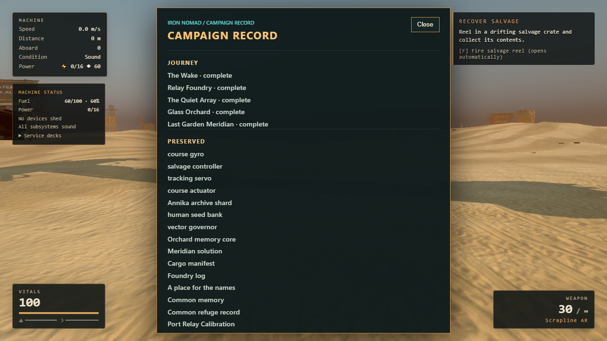
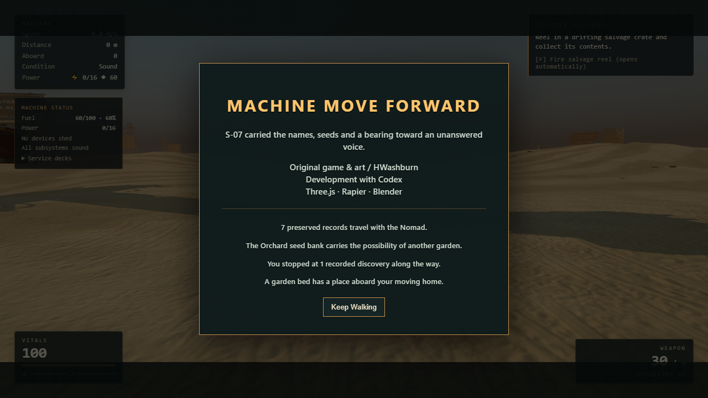

# Campaign readiness

This iteration makes the existing campaign easier to start, maintain and revisit.
It follows the [integration contract](../superpowers/plans/2026-09-15-campaign-readiness-contract.md)
and [refined tasks](../superpowers/plans/2026-09-15-campaign-readiness-tasks.md).
Sol refined and reviewed the work; Luna implemented the projections, panels and
browser harnesses; Astra integrated the loading/cache lifecycle and ran browser
and visual acceptance. Combat rules, progression rewards and save schemas are unchanged.

## Playable changes

- **Recoverable loading.** The boot screen shows stages, completed visual files
  and fallback notices. The opening, player, machine and combat art load first.
  Ten later campaign/site models are prefetched as bytes and decoded only at
  paused destination transitions or before restoring their saved instances.
  Requests have 45-second deadlines. A slow initial boot offers **Use simpler
  visuals** after 15 seconds; a failed startup offers **Retry**. Live destination
  loading cannot reload an unsaved game. Published model sources remain stable
  until their game owner is disposed.
- **Care & forecasts.** After the first-run guide, expand the existing machine
  status card for fuel duration/range, actual power demand, water/food recovery,
  a growing garden's ETA, repairs and safe-save guidance. The panel resolves
  current control bindings. Dismissed topics reset on load/new game and blockers
  can reappear. These hints use the existing generator, stove, garden, inventory
  and repair actions; they do not change production rates or costs.
- **Campaign Record.** Open it from the Radio or Helm to review completed
  chapters, preserved equipment and records, read journal entries, and separate
  visited/missed discoveries. Keep Walking suggestions describe the current
  machine without granting rewards. Credits recognize actual preserved records,
  seeds, visited sites and a built garden while retaining Meridian's unanswered
  voice and same-save continuation.

## Validation

The fixtures run actual game APIs and browser buttons, with explicit setup for
late chapters, resource shortages and failures. They are not an uninterrupted
manual campaign playthrough. GPU jobs ran serially in hardware Chrome on the
local RTX 3070. Audio content and mixing were not changed; these browser checks
disable sound and do not claim an audible review.

| Check | Result |
| --- | --- |
| Unit tests | 1,376 passed across 149 files |
| ESLint, TypeScript and production build | Passed; existing large-bundle warning remains |
| [Loading matrix](readiness-validation/loading.json) | 8/8: normal startup, critical/late 404s, deadline fallback, simpler-visual click, docked Meridian, arrival and malformed story data |
| [Network recovery](readiness-validation/network-recovery.json) | 2/2: stalled late model settles without changing physics; offline reload preserves the save on reconnect |
| [Recovery actions](readiness-validation/recovery.json) | 17/17: refuel, drink/eat, power shedding, held repair, garden water/grow/harvest/save/load, powered stove, hook/gangway/encounter save restrictions, Radio/Helm log controls |
| [Campaign Record](readiness-validation/record.json) | 23/23: fresh/partial/complete records, known archive filtering, small-screen bounds/scrolling, credits/Keep Walking save/load and resource preservation |
| [Meridian regression](readiness-validation/meridian.json) | 65/65, both routes and same-save ending continuation |
| [Real pointer-lock lifecycle](readiness-validation/lifecycle.json) | 9/9, including ending focus loss, Resume, Skip, Keep Walking and New Game |
| [Repeated save/rebuild soak](readiness-validation/soak.json) | 100 cycles over 150 seconds, exact resource conservation, unchanged ending and bounded scene/physics counts |

The only console errors in the loading matrix are the two deliberately injected
404s; there are no unexpected runtime errors. Local saves remain available after
network loss. **Offline startup is not supported**: this project has no offline
application cache, and an offline reload returned the browser's disconnected
page. Reconnecting restored normal startup and preserved the saved inventory.

The [before](readiness-validation/boot-before.json) and
[after](readiness-validation/boot-after.json) startup samples use isolated browser
contexts at 1600×900, medium quality. Time to the ready title changed from
23.49 to 16.55 seconds; completed art transfers at that point changed from
166.34 MB to 67.59 MB. This is one local sample per build, not a hardware or
network guarantee. Later art still downloads, and requesting a new destination
can show a short preparation screen. No detail was removed from the assets.

After warm-up, the 100-cycle soak retained 436 geometries, 490 textures, 163
shader programs and 24 physics bodies. Each cycle placed, watered, moved,
saved/restored and demolished a garden, checking its state and exact refund.
This uses the existing eager art regression fixture; the separate loading
matrix exercises staged cache publication and Continue.

The [performance sample](readiness-validation/performance.json) ran deck viewing,
rapid mouse look, and rapid look with eight live mechs for 12 seconds each at
1920×1080, high quality. All three averaged 59.83–60.00 FPS. Rapid look had two
frame intervals above 25 ms; the other samples had none, and no sample had a
frame interval above 50 ms. In the crowded case, p95 render CPU work was 8.4 ms and
p95 fixed-step work was 7.9 ms. This is a short local hardware sample with an
invulnerable test player, not a guarantee for long sessions or other PCs.









## Reproduce

Start the local Vite server on port 5201, then run browser scripts one at a time.

```powershell
npm test
npm run lint
npm run build
$env:MMF_LOADING_CASES='default,critical-404,late-404,stalled,stalled-simpler,continue-meridian,continue-arrival,corrupt-save,late-stalled,offline-recovery'
node tools/campaign/readiness-loading.mjs
node tools/campaign/readiness-recovery.mjs
$env:MMF_AUTHORED='1'
node tools/campaign/readiness-record.mjs
node tools/campaign/meridian-qa.mjs
node tools/campaign/meridian-lifecycle.mjs
$env:MMF_SOAK_CYCLES='100'
$env:MMF_SOAK_INTERVAL='1500'
node tools/campaign/meridian-soak.mjs
$env:MMF_QA_OUT='test-results/readiness-performance'
node tools/performance-smoothness.mjs --label=readiness --seconds=12
```

Production boots use staged loading by default. Existing `?nomenu=1` regression
fixtures keep eager loading; add `&staged=1` to test the production asset split
without the rooftop opening. Missing models retain the existing procedural
geometry and authoritative collision/interaction definitions.
