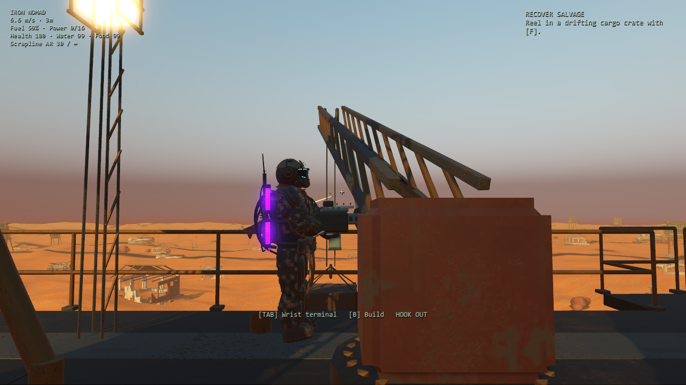

# Native gameplay parity fixes — 23 September 2026

Compared the native port against the retained Three.js gameplay code, starting with the reported grapple and sand behavior. These were gaps in the initial native implementation, not changes to the browser game.

## Fixed

- **Salvage hook:** replaced target-only instant selection with a visible outbound/returning throw, 34 m range and 42 m/s speed, swept cargo contact, a persistent amber cable, throw/catch audio and aim feedback. Misses return empty. Flight direction is fixed at launch; returning cargo follows the player. No per-frame tracer allocations for the cable.
- **Input contexts:** block personal grappling during construction, mounted-gun use, menus and death. Remapped reel keys work and appear in the prompt. Restore C as the browser's secondary crouch key. Escape exits placement or dismounts before opening Pause.
- **Radioactive ground:** port the current browser precontact recovery rule, including dune height. Record actual supported machine/destination positions, validate collision and clearance, and reject departed sites and removed floors before recovery. No arbitrary flat-height health drain.
- **Death/recovery:** dismount and restore the camera before advancing the respawn timer; cancel building, reeling, reloads and rest; block dead-player interaction. Preserve three-second respawn and two-second protection. A demolished floor cannot become a respawn point.
- **Terminal and machine access:** pause the simulation while using the wrist terminal aboard, including player-built deck extensions. Off-machine inventory no longer freezes gravity. Starting a scan or mounting a gun closes the terminal. Suppress accidental gunfire from a held menu click.
- **Recovered receiver:** add the original radio model omitted by the visible-only machine bake. Restore collision, module visibility, signal progress and powered lamp, physical E service access, and navigation rebaking when the receiver appears. Keep adjacent helm access available.
- **Persistence and presentation:** prevent saves mid-throw/mounted, clear hook/camera/death state on load, and cancel the fuel-canister gesture when aiming/firing or killed.

## Verification

- `tests/play_parity.gd`: 56 assertions exercising actual F/Tab/E/Escape/C/R/1/2 key events, remapping, missed/caught throws, first receiver, scanner buttons, gunfire/reloads, radiation recovery, invalid anchors, extended decks, destination support, mounted death/grace and save/load cleanup.
- Rendered runs use the RTX 3070 and actual held mouse-fire input. Headless runs cannot capture a mouse and invoke the weapon trigger directly for that one check; keyboard and physics checks use the same path in both runs.
- Existing 108 campaign/integration and 13 traversal/encounter assertions rerun to cover progression, storage/crafting, stairs, gangway and boarding after the changes.
- Tests use isolated native test saves and do not overwrite personal campaigns/settings. No Three.js source/assets were changed.

This pass checks these concrete defects and adjacent systems. It does not establish that every native behavior now matches the browser or replace a long manual campaign playthrough.

Evidence: [play parity](results/play-parity.json), [integration](results/integration.json), [traversal](results/traversal.json).

