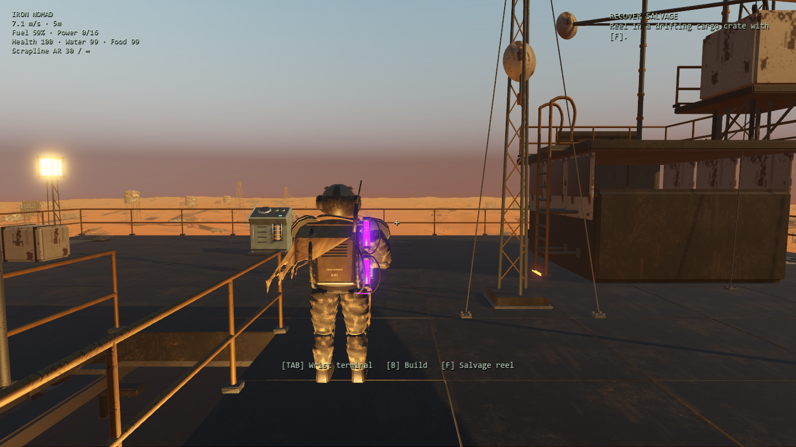
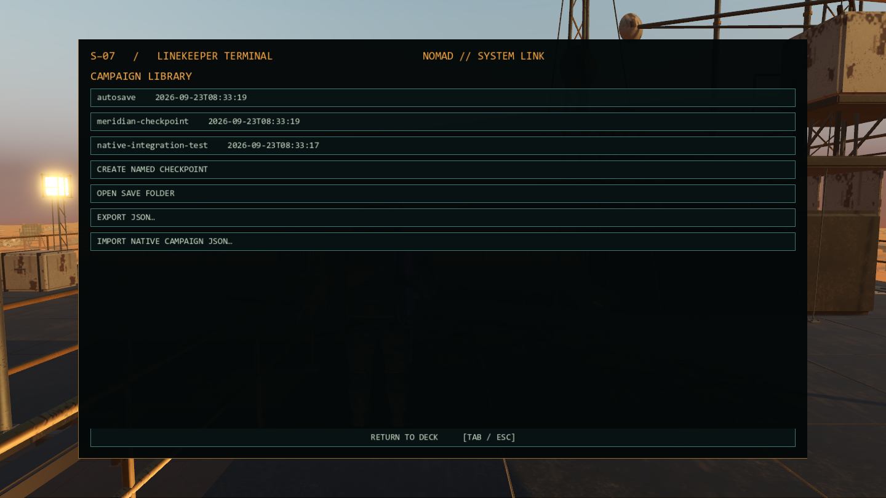
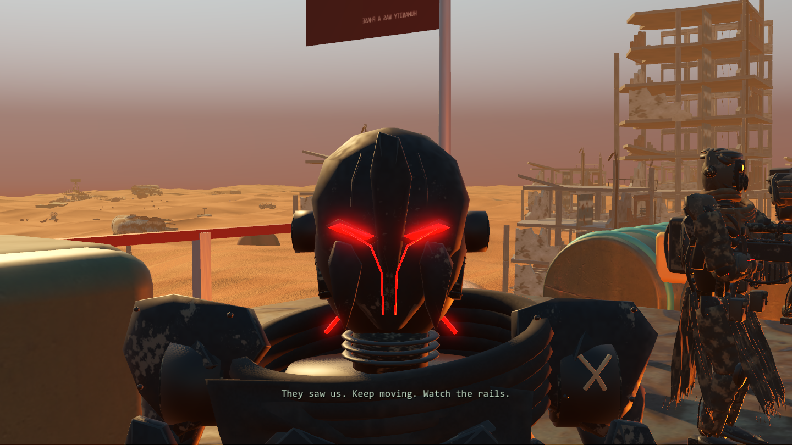

# Native port review — 23 September 2026

This is a playable native Godot port candidate beside the retained Three.js game, on branch `codex/godot-native-port`. It is not an embedded browser and does not replace the browser build. Original source baseline: `5d9f596`.

## Implemented scope

| Area | Native implementation and evidence |
| --- | --- |
| Art | All 55 original GLBs copied with source SHA-256 checks; 2,876 compressed buffer views losslessly decoded. All 55 instantiate in Godot with mesh content. Full-resolution original textures and skeletal animation clips retained. |
| Machine | Actual four-leg Nomad, exported authored/procedural structure, 76 collision shapes, all three decks, side stairs/bypass, turbine and grounded leg animation. Native traversal tests walk both stairs and the gangway using input actions. |
| World | Original 50 ruin/artifact archetypes, original scatter geometry, three 256 m lateral bands, nine longitudinal chunks per band, seed-based districts, dune and sky shader ports, dust/fog/smoke. Eighteen original TypeScript fixture cases match native district placements. |
| Player | S-07 model and rifle/shotgun, directional motion, crouch/jump/sprint, shoulder swap, obstruction sphere, close-camera fade, upper-body aiming/reloads, foot placement, wrist terminal, fuel gesture, attachment models. |
| Combat | Four authored mechs and both legacy enemy types, native navigation and obstacle collision, committed ranged attacks, Revenant lunge, Bastion vulnerability, Sovereign drone, Warden flank routing, guided skiff, random boarding, theft/sabotage missions, gunboat weakpoints, and manual/automatic turrets. Weapon definitions, damage falloff, attack numbers and loot data come from the reference game. |
| Resources/construction | 24 build pieces, camera-aimed placement, level/rotation previews, relocation, support cascade on demolition, retained contents, crafting, storage transfers/sorting, fuel crawl, class-based power shedding, repair/research, farming/water, shelter/rest, keepsakes, L-12 tasks. |
| Campaign | Rooftop opening; build/refine/repair-scanner onboarding; three-minute powered scan and three-second safe delay; crossfire/Revenant reveal; original five destinations, route definitions, journals, unique items/objective gates, optional contacts and depot; checkpointed Meridian arrival and Keep Walking. No new story chapter was added. |
| Persistence/UI | Native terminal/HUD/title/pause/settings; configurable controls, mouse sensitivity, FOV, sound, graphics and VSync; campaign library, named checkpoints, checksummed native JSON import/export, atomic save replacement/backup, autosaves and validated restoration. |
| Audio | 27 WAVs baked from original sound recipes, reused voice pool, soft machinery/calm loops, weapon/impact/reload/footstep cues and combat ducking. |

## Validation performed

- **108 integration assertions**, passing both headless and on the RTX 3070 renderer. Includes terminal pages, resource transactions, scanner/cutscene trigger, boarding, destination dependency ordering, all five campaign completions, ending checkpoint, optional sites, malformed-save rejection, round trips and construction support rules.
- **13 traversal/encounter assertions**: actual input-driven lower/middle/upper stair travel, outer bypass, walking across the first expedition gangway while staying above the ground, gunboat disarm retreat, guided skiff tuning/crew and the legacy raider's engine objective.
- **55/55 asset load checks** and source-file checksum verification. Source art has not been changed by conversion.
- Retained Three.js suite: **1,786 tests passed across 209 files**; production build passed. The existing large-bundle advisory remains.
- GPU rendering and timing runs at 1920×1080; see [PERFORMANCE.md](PERFORMANCE.md). Captures and compact result JSON are retained with this review; complete local logs are in `test-results/godot-native/` and adjacent `godot-*.log` files.

The campaign test accelerates travel/scanning and resolves scripted patrol state to exercise dependencies. It is not an uninterrupted manual playthrough, and does not prove every route or every possible construction layout. Separate encounter tests exercise boarding/gunboat rules. Performance runs use eight active mechs and rapid camera movement.

## Differences and acceptance limits

- Native Godot rendering, lighting, particles, UI layout, animation blending, camera obstruction and navigation are newly implemented. They are not pixel-identical or frame-for-frame identical to Three.js/Rapier. The enemy strategy roles are retained, but exact paths and physical contacts can differ.
- Native saves have their own schema and directory. **Browser save migration is not implemented.** JSON exchange in the native library is for native campaigns only. Browser saves remain untouched.
- Godot graphics presets select native MSAA/SSAO/glow/shadow settings; they do not reproduce every browser post-processing option. Full-resolution assets remain available at every preset.
- Browser-only developer overlays, debug hotkeys and web trailer/gallery pages remain in the existing Three.js project. They are not part of native gameplay UI.
- This delivery runs the project through the portable engine. A signed/installer-ready Windows export and export templates are not included.
- Long manual sessions, alternative route combinations, heavily rebuilt decks, and comparison on another GPU still need acceptance testing. The current checks support a playable comparison build; they do not certify complete behavior/visual parity.

## Reproduction and ownership

Start with [the native README](../../godot/README.md) and `godot/Play Godot.cmd`. The `.blend` artwork and all original browser assets remain where they were. No model was replaced with a simplified placeholder to improve the benchmark. Converted meshes, baked scene assets, WAVs and import caches are local reproducible outputs, excluded from Git. The original [asset attribution and license terms](../../ASSETS.md) continue to apply.

## Native captures

These are actual Godot renders from the integration run, not reference artwork.

