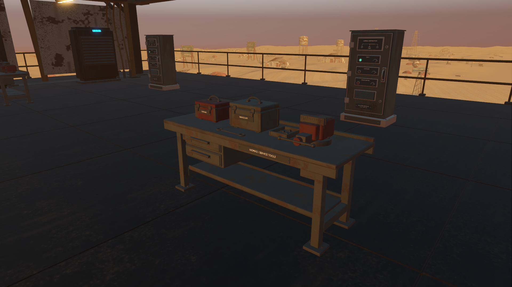
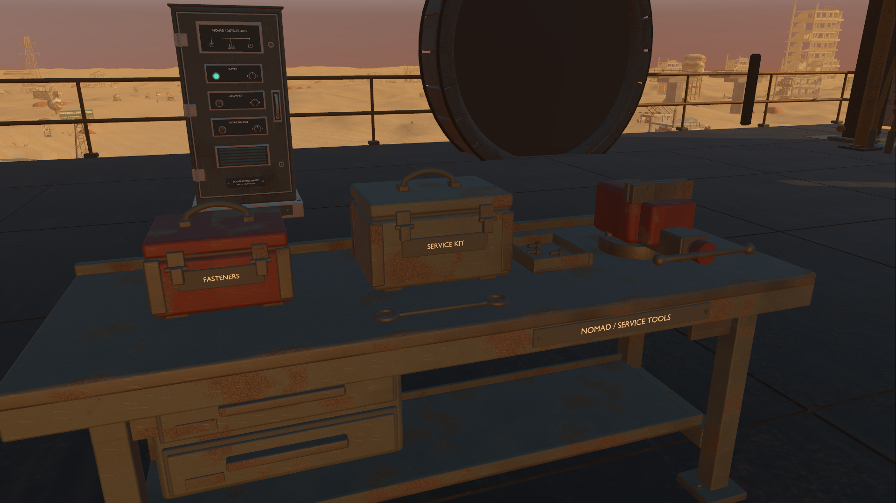

# Refined service benches and companion waypoint recovery

Starting revision: `d4f74bc`, branch `codex/godot-native-port`. Native review exposed six plain middle-deck benches with solid pedestals and block-shaped cases sitting about 8 mm above their worktops.

## Model and placement

One original Blender master now supplies all six benches: bolted deck shoes, welded endframes, folded steel worktop and shelf, suspended drawers, a complete swivel vise, gasketed tool cases with working-looking closure hardware, a parts tray and a ring spanner. Fore benches turn toward +Z and aft benches face −Z, presenting the labels, drawers and vise handles to their usable aisles. These remain decorative service furnishings, not new crafting stations.

The 212 editable parts export as five shared material batches, 46,741 full-resolution triangles and a 4,687,252-byte GLB. Three original 512² PBR materials supply restrained wear, roughness and normal detail. Metre-based UV projection avoids stretched wear on thin metal edges. Standard Godot LOD generation and compression remain enabled.

Inspection corrected worktop and shelf support gaps, drawer suspension, overly clean red paint, and crossmembers that extended through their legs and produced dark coplanar bands. The final assembly is 1.93 m wide, 0.6695 m deep and 1.0483 m high, within its previous complete envelope. All four shoes contact the deck and the worktop retains its original 0.75833 m height above the floor.

Only complete bench components leave five measured shared batches. Four remainders preserve their stable runtime names and original materials; the fifth contains no geometry after the previous pressure-vessel removal and this bench replacement. The source tool compares every untouched coordinate before export. Native tests independently compare the imported remainders against the frozen machine within 1 mm, including the preceding vessel, cabinet and pump removals. Frozen Three.js assets remain unchanged.

## Matching physical contact

The original bench collision used 1,656 triangles. Those complete triangles are removed from collider 75, composing the preceding 4,000 pump removals. Every unrelated triangle is retained in its original order and winding. Six bodies share a single 252-triangle coarse bench shape, a net reduction of 144 bench collision triangles.

The simplified shape covers the shoes, legs, crossmembers, shelf, worktop, drawers, cases and main vise body. Cosmetic lettering, bolts and handles do not add dense collision. Tests confirm actual player stopping at all six benches, worktop ray contact at the visible height, open space between the new legs, and absence of ghost collision from removed cases and pedestals.

## Companion defect exposed by regression

The first broader audit failed its existing L12 companion route. A diagnostic rerun reproduced a stationary companion near its starting point despite an available path. The next baked waypoint was approximately 6.35 cm above physical feet and 4.92 cm away horizontally. Its combined distance remained just above the agent's 8 cm waypoint radius, but the old 5 cm horizontal movement cutoff refused to approach any closer.

The companion now approaches within 5 mm horizontally and caps each step at the remaining waypoint distance, preserving its 1.35 m/s speed limit. This allows navigation to advance without introducing overshoot. The same audit route succeeds with approximately 0.8 m remaining to the player, without lengthening the test or relaxing its assertion. New walls still block the companion, unavailable routes still stop it, and boarding enemy navigation still passes. The route diagnostics are retained in [navigation evidence](results/benches-navigation.json).

## Verification

All **779 selected assertions pass**. The [bench suite](results/benches-tests.json) passes 87 assertions covering exact retained render/physics geometry, source sites and orientation, full bounds, original tabletop height, shared resources, imported triangle validity, player movement, rays and rigid attachment through machine gait. The [selected regression report](results/benches-regressions.json) covers the prior machine refinements, integration, gameplay parity, traversal, camera clearance, canopy and caretaker automation. Final selected runtime logs contain no errors or warnings.

The 37 caretaker workload assertions ran in the native renderer, including real inventory delivery, interruption, station access, track motion and deck contact. A headless run initially reported an apparent submerged track because dummy rendering returns identity MultiMesh transforms. The fixture now marks that one visual check unavailable in headless mode instead of treating placeholder data as real geometry. The unchanged native assertion passes with a measured track bottom at 16.02545 m over the 16.03 m deck, within 5 mm. [Caretaker evidence](results/benches-caretaker.json) preserves that measurement and the 512 selector-parity cases.

Blender support checks verify contact bounds between frame, shelf, worktop, drawer straps, case feet and vise components. Full exported triangle checks find zero intersections across 72 comparisons against surrounding frozen structure and the current pumps, cabinets and receivers, excluding intended deck contact. All three GLBs validate with zero errors or warnings. Studio, Blender MCP and native views were inspected; the MCP review scene was appended without replacing existing user scenes.

## Rendering cost

Four matching native views were measured at 1920 × 1080 on the RTX 3070, high Forward+/Vulkan with 4× MSAA and VSync off. Each used two seconds of warmup and four seconds of sampling; screenshots were captured afterward. Both model versions remained resident in both runs, and the legacy view restored only the relevant bench batches while preserving previous improvements. Runs were sequential without other Godot tests or Blender renders.

| View | Before GPU median | After GPU median | Difference | Draws, before → after |
|---|---:|---:|---:|---:|
| Fore bench and workshop | 3.100 ms | 3.270 ms | +0.170 ms | 1109 → 1176 |
| Case and vise detail | 2.631 ms | 2.896 ms | +0.265 ms | 323 → 337 |
| Aft bench | 2.452 ms | 2.566 ms | +0.114 ms | 411 → 430 |
| Workshop overview | 3.127 ms | 3.163 ms | +0.036 ms | 499 → 520 |

The [profile](results/benches-profile.json) measures added visible detail with physics frozen. The collision reduction is not presented as a measured gameplay FPS gain. No new story, progression or resource rules were added. The broad goal remains active: other simple machine fixtures, full-campaign feel and older intermittent frame stalls still warrant investigation.
