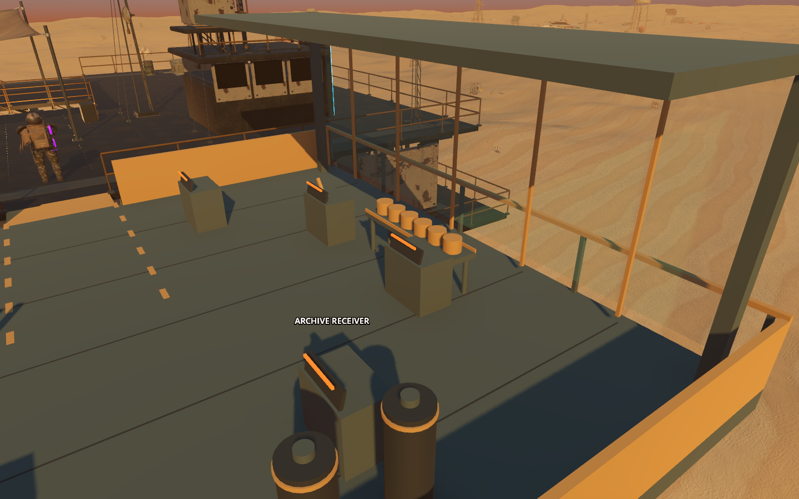
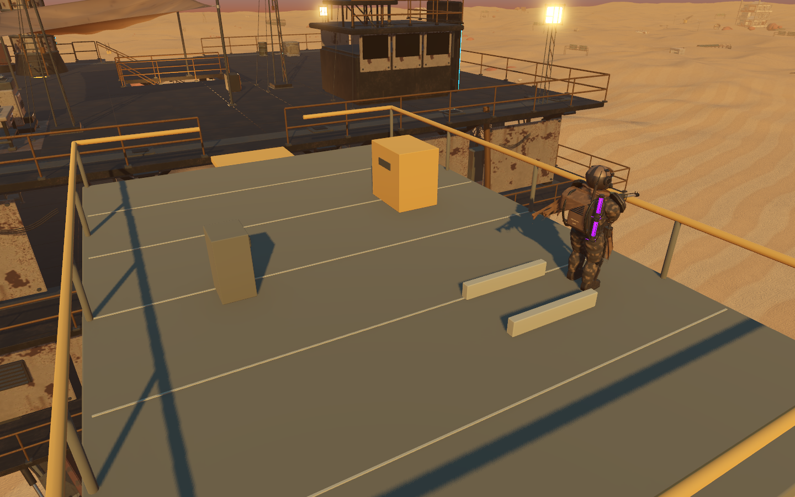

# Beta physical quality pass — 1 October 2026

The receiving berth and all three optional equipment recovery platforms now
match their visible geometry more closely. This pass fixes specific supported
movement and collision defects; it is not certification of every asset or of
the complete V1 beta.

| Area | Previous behavior | Current behavior |
| --- | --- | --- |
| Berth reservoirs | Floated 25 cm above the deck; S-07 could walk through them | Grounded cylinders with matching collision, collars and caps |
| Seed preservation row | Six cups floated without support | Cups rest on a four-legged propagation bench; both cups and bench are solid |
| Berth relay masts | Visible poles had no collision | Cylindrical collision matches their actual radii |
| Recovery controls | Release cabinet and both entry-side rails were passable | Physical faces match the visible cabinet and rails; docking opening remains clear |
| Recovery cradle | Assembly intersected its supports; removal left a full-height invisible blocker | Assembly rests 24 cm above the deck on the authored feet; removal clears its collision, leaving only the feet |
| Repaired original port crane | Hiding the art alone would retain the old box and arm collision | A reversible per-instance shape removes only the identified crane triangles |

The physical test reproduced **34 failing checks out of 65** before the
changes. The final headless and GPU runs passed **65/65**. Tests use actual
S-07 walking, local recovery interactions, supported deck return paths, exact
partial collision queries and isolated saves. Cup/reservoir support is measured
within 5 mm. All three equipment types are recovered and then walked through.

The separate crane collision test passed **48/48**: it removes 3,020 triangles,
compares every retained triangle exactly, checks 90 deck positions and 30 rail
contacts, restores the original shape, and verifies another loaded machine is
unaffected. The helper refuses an incompatible source hash rather than applying
old offsets to new geometry.





Results: [before](results/beta-physical/before.json),
[native after](results/beta-physical/after-native.json),
[crane collision](results/beta-physical/crane-collision.json).

Run with Godot 4.7.2 from the repository root:

```powershell
& test-results/godot-tools/Godot_v4.7.2-stable_win64_console.exe --headless --path godot --script res://tests/beta_physical_quality.gd
& test-results/godot-tools/Godot_v4.7.2-stable_win64_console.exe --headless --path godot --script res://tests/beta_crane_collision.gd
```

Omit `--headless` from the first command to regenerate the two native images.
After rebuilding `nomad-native.scn`, regenerate the crane manifest with
`--headless --path godot --script res://tools/bake_beta_crane_collision.gd`,
then rerun the collision test. The baker matches the named crane's vertices and
surfaces and completes connected components; it does not erase everything in
the crane's bounding box.

The receiving berth and recovery platform still need a dedicated surface and
hero-prop art pass to reach the weathering and detail of the main machine. These
checks establish physical integrity and useful character-scale reference views,
not a claim that those scenes have finished art.
