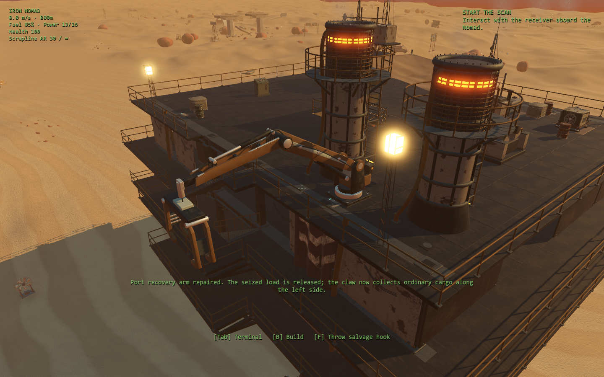
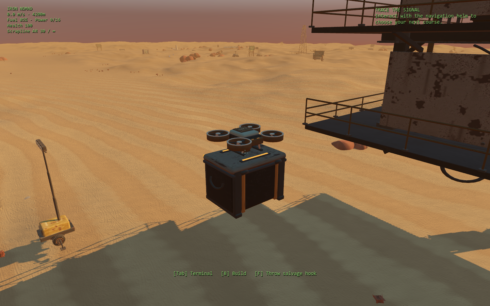

# Recovery and guardian beta iteration — 1 October 2026

This native Godot iteration adds an early useful repair, an earned visible
salvage drone, and a named late-route guardian. It also fixes specific floating,
pass-through and invisible geometry. The existing five-destination campaign,
R-9, L-12, optional requests and playable receiving-berth ending remain the
story backbone.

## Try the additions

Launch `godot/Play Godot.cmd`, then choose **Playtest checkpoints**. These
starts and their saves are separate from the current campaign.

| Checkpoint | What is provided | What to do |
| --- | --- | --- |
| 32 / Meridian — Gatekeeper guardian | Late-route machine, weapons and two decoys | Read the lock, leave the fixed ground marks, then shoot the cyan fire-control unit during cooling; disabling the gun or using a decoy also clears the crossing |
| 33 / Port recovery — restore the claw | Repaired receiver, one explicit test actuator and an approaching cargo crate | Use the left-side crane base and fit the actuator; watch the ordinary cargo pickup |
| 34 / Salvage — Mender utility drone | Foundry controller, a powered drone dock and cargo | Watch the flight and latch, then open the dock's storage; try removing power or filling its store |

In the normal campaign, repair the receiver first. At a workbench, craft a
**Port crane actuator** for **8 scrap + 2 components**, approach the crane base
on the upper deck's left side, and fit it. The old seized crane and box are
replaced by the recovery arm. The actuator is consumed once; repair persists.

The port arm draws **2 power**. Its clear working arc extends around the left
hoist, with ordinary cargo selected within 7 m horizontally and 28 m along the
cable. It leaves starboard cargo to the handheld hook. Use the crane panel to
stop/start it, or the engineering device policy. Full storage leaves the crate
held by the claw until space is available. Losing power after pickup retains
the gripped load; losing power before pickup releases the unlatched claim.

Relay Foundry's existing **salvage controller** unlocks the **Salvage drone
dock**, using the collector's existing **55 scrap + 6 components**, **4 power**
and **six storage slots**. Existing collectors become these docks without
losing stored items or their IDs. A Mender utility drone launches through a
clear path, approaches cargo within 24 m, latches it, moves clear of the
Nomad's exterior stair bays, rises and returns. It settles onto the dock after
delivery. New sorties wait during active combat; a latched load can finish its
return on reserve after dock power loss. Cargo sweeps check actual crate
volume, including new construction already overlapping a paused load.

Full stores retain exact remainder quantities at the latch. Saves preserve
held cargo and its contents; moving retrievals must finish before saving.
Moving or dismantling an occupied dock retains recovered cargo aboard. These
small drones and the early port arm do not take heavy cargo: the later optional
**Recovery gantry** retains that purpose and its existing 4-power hoist.





## Art and physical quality

The [recovery family](../../assets/native-salvage-beta/README.md) contains six
original editable Blender models: the arm, drone, fitted dock, spares cassette,
coil and cell. The first three are integrated into play. The three smaller
props are prepared for later salvage-table work; they do not yet appear as new
collectible types. No random variations or quantity increases are presented as
finished new gameplay.

The art review corrected unsupported brackets, excessive wear noise, dock
clearance and claw-to-crate penetration. Runtime uses the reviewed closed-jaw
carry height. Blender MCP contains the editable review assembly; the previous
scene was preserved. All six GLBs pass format validation with zero errors and
warnings. Model triangles, material batches, pivots and rebuild instructions
are in the asset manifest and README.

The [physical-quality review](beta-physical-quality.md) documents grounded
Meridian reservoirs, supported seed cups, solid masts and recovery cabinets,
entry rails, and removal of recovered devices' invisible collision. Repairing
the old crane also removes its exact 3,020 baked collision triangles while
preserving the surrounding deck and rails. Loading an unrepaired campaign
restores the original shape. The machine was rebaked and its source manifest
updated to include the pre-existing native changes already in the workspace.

## Story, danger and quiet time

[Gatekeeper G-01](cordon-guardian.md) replaces the existing gunboat on Meridian's
optional Cordon Gap. It connects the Order's false civilian bearing to a
recognizable encounter: aim lock, committed salvo, exposed cooling window.
It uses the existing authored hull and actual subsystem targets. Destroying
the engine extends the opening; disabling its fire control or deploying a
decoy offers alternatives to destroying it. The other route retains its
existing skiff encounter.

Resolution supplies a recovery interval and a short navigation acknowledgment,
or an L-12 line when that companion was actually recovered. Ordinary salvaging,
building and keeping the Nomad running remain useful during quieter travel.
The new arm gives an early sense of restoring one's home; the drone is a later
reward for following the story.

## Verification

The combined report is
[beta-recovery-and-guardian-2026-10-01.json](results/beta-recovery-and-guardian-2026-10-01.json).
It records the final suite results and source fingerprints. The first combined
run exposed an obstructed old hoist fixture and a checkpoint spawn collision;
both were corrected before the final run. Moving-machine tests also caught a
loaded drone rising into the exterior stairs, now prevented by its clear-side
route.

The final run passed **1,460 checks across 17 suites**, with the same source
fingerprint before and after every suite. The salvage suite also passed its
**32 checks with native Vulkan rendering on the RTX 3070**. No script errors
were reported in either final run. Six final native salvage views were rendered
and inspected. These counts do not include failed development runs as passes.

Reproduce the affected checks from the repository root:

```powershell
python -X utf8 tools/godot/run-narrative-regressions.py beta_salvage beta_salvage_edges beta_physical_quality beta_crane_collision cordon_guardian salvage_feedback later_expeditions recovery_operations construction_usability controls_interactions playtest_checkpoints pacing_contracts narrative_delivery narrative_edge_cases integration autosave_worker compiled_machine
& test-results/godot-tools/Godot_v4.7.2-stable_win64_console.exe --path godot --script res://tests/beta_salvage_review.gd
```

Tests use isolated saves. Native images use the actual Vulkan renderer;
headless logic checks are not performance benchmarks or natural campaign
playthroughs. The pre-iteration source snapshot remains at
`test-results/beta-iteration/baseline-sources.zip`.

## Remaining V1 acceptance work

- Run uninterrupted opening → Foundry and Orchard → Meridian sessions with
  ordinary earned supplies; judge story comprehension, repair affordability,
  quiet intervals and guardian difficulty without prepared checkpoint stock.
- Give the receiving berth and recovery platforms a dedicated surface/detail
  pass to match the main machine. Their corrected physics does not make their
  current plain art final.
- Profile extended play with several drones and a heavily customized machine;
  test flight paths against unusual player construction and low-spec settings.
- Decide the beta scope for machine painting, broader movable starter
  equipment, dedicated guardian art and the three new collectible props.

This is a playable beta development iteration, not a declaration that the full
V1 release or every model is finished.
