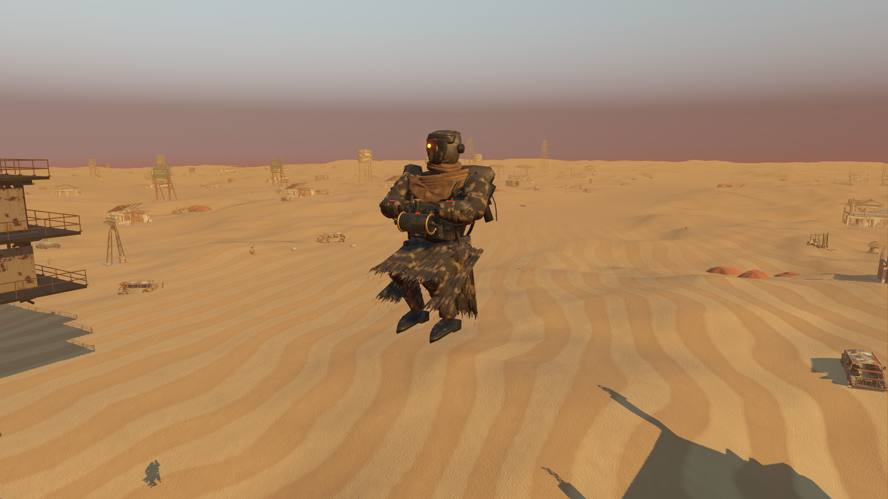
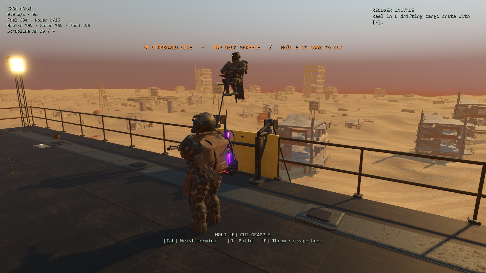

# Grounded crew and credible grapple boarding

Starting revision: `9865934`. Incoming crew floated above the authored skiff seats, played a walking clip while rising through the machine's decks, and shared a repeatedly created tracer unrelated to their hands. An early return also prevented enemies killed during approach/ascent from ever reaching corpse cleanup.

## Completed tasks

1. Build original Blender clamp and powered-ascender assemblies with grounded shoes, jaws, captive hardware, grooved rollers, fitted gears, grips and cable terminations. Review source, live Blender MCP and native close views; retain 133 editable parts and two shared runtime meshes.
2. Position crew on the actual skiff markers. Route them outside the machine, above its top railing and onto the existing entry points. Account for the wider port staircase and the heavy mech's larger capsule. Sample the real collision world once when the hook attaches; try neighboring landing lanes if construction blocks the normal one. Crew unable to find a clear route remain aboard and leave with the skiff.
3. Fit supported hoist poses to all six existing rigs. Keep both wrists on the actual ascender grips, bend knees while suspended, tuck over the railing and restore combat presentation on landing. Carry the winch and weapons around opposite sides of the body during stow/retrieval. Keep the commander's orb attached to its original equipment bone.
4. Use two persistent shared cable instances connected to the rendered fairlead and harness-eye positions. Avoid duplicate interpolation and unchanged transform uploads. Clear cables and disable the severed hook's hit target immediately; disconnect the global render callback when its owner leaves the scene.
5. Let interrupted climbers fall with physical deck collision and reach the normal five-second corpse expiry. Keep harnesses attached to their bodies. Remove unboarded escaping crew when their craft despawns, and clear boarding presentation during save restoration.
6. Compare the original ship/controller contracts, inspect both sides and the normal player camera/HUD, exercise actual hold-to-cut input, and run broader gameplay/weather regressions. Correct the older integration fixture's forced positive-X ship position to match its actual chosen side.

## Art and visual review

[Editable source and rebuild instructions](../../assets/native-boarding/README.md). The 3.77 MB GLB has 45,071 triangles across two model nodes, shared materials and two original 512-pixel PBR sets. Native import generates LODs. It adds no lights or collision bodies; glTF validation has zero errors/warnings and native geometry checks find no collapsed triangles.



The isolated rig view above intentionally omits the ship cable. The following image uses the actual top deck, normal player camera/spring arm, existing HUD and attached boarding clamp. The fixture freezes the encounter timeline for inspection; the production climb remains continuous.



Also retained: [port ascent beside its staircase](previews/boarding-port.png), [starboard ascent](previews/boarding-starboard.png), [Bastion pose](previews/boarding-bastion.png), [after holding E to sever the grapple](previews/boarding-severed.png) and [live Blender MCP](previews/boarding-blender.png). The bright yellow plate beside the clamp is the existing machine gate; hiding the whole clamp confirms it belongs to the machine, not the new asset.

## Behavior and verification

**1,159 assertions pass across 18 suites:** boarding 69, ship contract 18, enemy equipment 137, prior enemy combat contract 42, enemy animation 113, integration 108, parity audit 132, controls/interactions 66, play parity 58, story presentation 59, crossfire handoff 66, traversal 13, audio lifecycle 50, desert/weather 28, opening handoff 32, autosave worker 31, salvage feedback 75 and recovered supplies 62. The 69 focused checks also pass with native Vulkan rendering, including actual MultiMesh buffer reads; that rerun is not counted twice. Final selected regression, native review and import logs contain no script errors or resource-leak warnings.

The focused checks cover 101 capsule samples per route on both sides, both normal and wider heavy shapes, authored skiff contact, wrist/grip fit on all six rigs, bent knees, pose release, real cable endpoints, stable buffers, pause, cutting, falling/landing, corpse expiry, blocked landing lanes and complete route obstruction. Headless rendering does not return usable MultiMesh transforms, so headless checks use the exact cached upload transforms and the native GPU run independently checks the real buffer.

The stored pre-change ship contract spans six scenarios and **4,320 ticks**: ordinary raid, tutorial, severed hook, destroyed craft and both gunboat disable combinations. It retains ship state, crew activation/missions, health, shells, damage and seeded rewards. It intentionally excludes changed ascent paths, pose, severed-hook collision and dead-body cleanup. The original enemy controller's separate 42 comparisons also still pass without regenerating expectations.

Normal unobstructed activation remains at **5.5 and 7 seconds**; tutorial activation remains at **4.5 and 6.75 seconds**. Existing hook health, cut hold duration, combat definitions, mission assignment and rewards are unchanged. Blocked routes now refuse to phase through player construction. No story beat or new progression was added. All fixtures use isolated save directories and `test_mode`; personal settings remain untouched. The desert suite still verifies sparse grounded details, restrained wind and normal water use regardless of dust exposure or shelter.

## Measurements

RTX 3070, 1920×1080, high Forward+/Vulkan, 4× MSAA, VSync off. Sequential native runs share the same machine, camera and crew. The encounter timeline is fixed at each sample; native skeletal animation and effects remain active. Samples use two seconds of warmup and four seconds of measurement, with captures afterward and Blender in solid shading. These are fixed-view rendering costs, not a whole-game frame-pacing benchmark.

| Encounter time | Before GPU median | After GPU median | Before frame median | After frame median | Render/shadow draws before → after |
|---|---:|---:|---:|---:|---:|
| Attached, 0 s | 4.115 ms | 4.131 ms | 4.839 ms | 4.752 ms | 1,424 → 1,463 |
| Ascent, 3.75 s | 4.121 ms | 4.106 ms | 4.709 ms | 4.674 ms | 1,424 → 1,484 |
| Vault, 4.8 s | 4.086 ms | 4.081 ms | 4.615 ms | 4.659 ms | 1,424 → 1,473 |
| Both aboard, 7 s | 4.069 ms | 4.070 ms | 4.592 ms | 4.638 ms | 1,414 → 1,453 |

The GPU differences (−0.015 to +0.016 ms) are effectively unchanged within host variation despite additional visible geometry. This does **not** establish an FPS improvement. Persistent cables remove the former per-tick tracer insertion; 100 unchanged endpoint updates produce no transform uploads.

The separate headless real-physics fixture measured one-time two-crew route preparation over 15 samples: 0.186 ms median / 0.217 ms maximum for clear approaches, and 0.898 ms median / 1.023 ms maximum with the whole side blocked. These CPU timings describe this machine and fixture, not a guaranteed frame budget. No collision sampling runs during ordinary per-frame cable drawing. Raw results are under `results/boarding-*`.

```powershell
& test-results/godot-tools/Godot_v4.7.2-stable_win64_console.exe --headless --path godot --script res://tests/boarding.gd --fixed-fps 60
& test-results/godot-tools/Godot_v4.7.2-stable_win64_console.exe --headless --path godot --script res://tests/boarding_contract.gd --fixed-fps 60
& test-results/godot-tools/Godot_v4.7.2-stable_win64_console.exe --path godot --script res://tests/boarding_review.gd -- --poses --label=poses
& test-results/godot-tools/Godot_v4.7.2-stable_win64_console.exe --path godot --script res://tests/boarding_review.gd -- --deck --label=player
& C:\Python311\python.exe tools/godot/boarding-baseline.py
& test-results/godot-tools/Godot_v4.7.2-stable_win64_console.exe --path godot --script res://tests/boarding_review.gd -- --profile --label=before --source=res://../test-results/godot-native/boarding-prior.gd
& test-results/godot-tools/Godot_v4.7.2-stable_win64_console.exe --path godot --script res://tests/boarding_review.gd -- --profile --label=after
```

The broader goal remains active. Legacy robot surfaces, plain skiff/gate surfaces, full-campaign human play feel and independently observed startup/intermittent stalls still merit attention.
