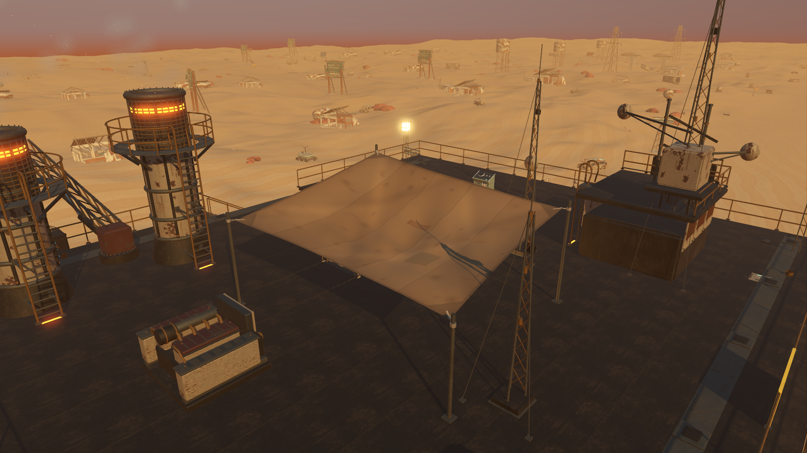
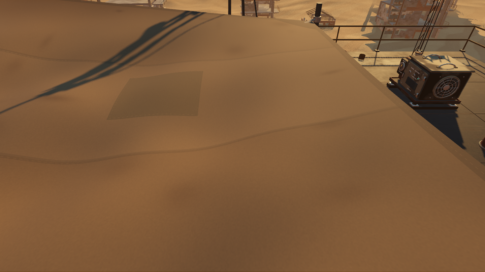
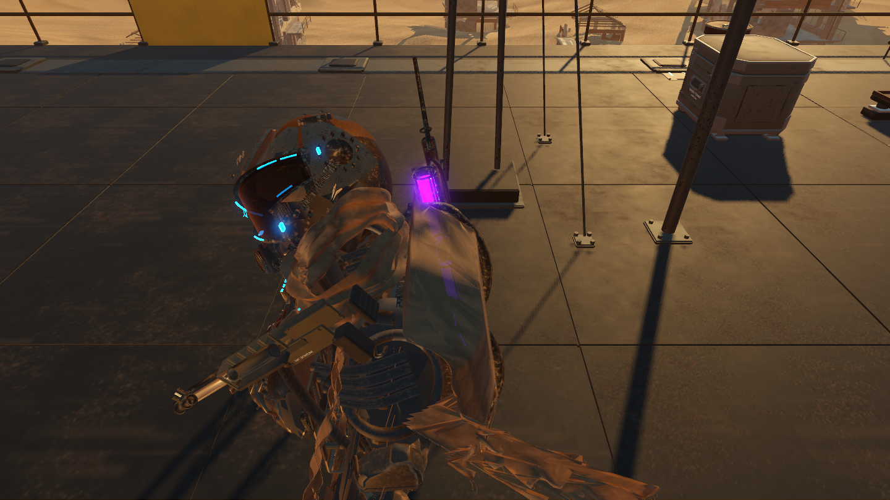

# Repaired canvas and clear views beneath the canopy

Baseline: `67d01a1`. The previous turn made verified progress on the opening rooftop and exposed the Nomad's very plain canopy. This pass refines that existing covering and fixes a camera defect found while reviewing it. It adds no story, progression or survival requirement.

## Completed work

1. Inspect the original Blender master and the actual native batches. Confirm the four posts already reach the deck; identify the shared banner/metal batches before replacing any geometry.
2. Author the canopy in Blender with five sewn panels, returned hems, corner reinforcements, three stitched repairs, wrinkles, weathering, fitted pole clamps and real tensioning hardware. Preserve post locations and improve standing clearance.
3. Retain unrelated banner and maintenance geometry exactly and reuse its original material resources. Export only three new material batches and portable maps, keeping editable source and reproducible build scripts.
4. Add restrained GPU fabric motion with fixed corners and matching seams/patches. Pause it with the game and modestly strengthen it during existing dust storms. Correct Blender's initial export of the pin weights into the wrong color channel.
5. Reproduce camera penetration beneath the fabric, then add a coarse camera-only surface. Exclude it from player movement, shots and enemy navigation. Verify actual camera paths and inspect native before/after views.
6. Measure matched native rendering cost; check geometry preservation, controls, walking, camera handling, opening presentation and gameplay regressions.



## Art and attachment

The [asset package](../../assets/native-canopy/README.md) includes the editable Blender sources, studio images, build instructions and practical canvas-construction references. No downloaded art is bundled. The live Blender MCP review successfully appended the 68-part source while preserving existing scenes.

The runtime export is **31,532 triangles, three material batches and 2.66 MB**. Two retained batches preserve the other banner and service parts; the imported coordinate comparison found **zero positional difference** in both directions, including the original shared materials. The four support posts/feet retain their original mesh resources and transforms. No new deck equipment or gameplay obstruction is introduced.

The new canvas corners sit 24 cm inward of the original posts and connect through tensioners. Its nominal lowest point is 18.47848 m over a 16.03 m deck. Maximum downward displacement still leaves about **2.41 m** of clearance. Original canvas hung as low as about 18.315 m. The repaired fabric uses a fine repeating normal map with larger-scale original weathering, rather than stretching a single surface detail scale across the whole roof.

Wind is intentionally restrained: maximum displacement is 1.575 cm in clear weather and 3.5 cm in a full storm. It uses two shader uniforms per world tick, with no runtime mesh reconstruction, physical cloth solver, new lights or particles. Vertex weights pin the corner attachments. The source remains a conventional portable model; this small billow is native shader presentation.

## Camera defect and fix

The actual player camera crossed the rendered canopy in **14 of 64** sampled views when its boom considered only the original world collision. The character could be completely hidden by the canvas:



A 960-triangle proxy on physics layer 6 (mask value 32) now participates only in camera sweeps. The existing spring arm retracts normally beneath it. The proxy follows the fabric and includes a margin for its movement. Player collision masks and ordinary weapon/world queries exclude it; enemy navigation explicitly excludes that layer, so it cannot bake an artificial walkable roof.



All **64 views** now have clear player-to-camera segments, tested against the cloth at its neutral height and conservative ±3.5 cm extremes (**192 surface checks**). Native renders confirm the practical improvement. Existing close-camera character fading continues to work. This is sampled coverage at the tested positions/pitches, not a proof against every possible future machine modification.

## Rendering cost

RTX 3070, 1920×1080 high Forward+/Vulkan, 4x MSAA, VSync off, uncapped. Identical fixed views, lighting and surrounding machine; both old/new resources resident with only one visible. Each sample has two seconds of settling and four seconds of measurement. Screenshots are taken afterward. Gameplay and cloth phase are frozen to isolate rendering cost.

| View | Old GPU median | Refined GPU median | Frame median before → after | Draw calls before → after |
| --- | ---: | ---: | ---: | ---: |
| Overview | 4.116 ms | 4.182 ms | 4.765 → 4.832 ms | 1139 → 1145 |
| Corner | 3.275 ms | 3.472 ms | 3.790 → 3.992 ms | 557 → 564 |
| Underneath | 2.477 ms | 2.579 ms | 2.963 → 3.068 ms | 420 → 422 |

This detail improvement costs **0.066–0.197 ms median GPU** in these views. It is not an overall FPS optimization or a lower-end-hardware guarantee. The matched renderer sample predates the subsequent camera-only collision fix; its visual asset and shaders are identical. Full results are retained in [canopy-profile.json](results/canopy-profile.json).

A separate **24-second actual-travel trace** includes the final camera proxy, continuously turning player camera and active fabric updates. After three game seconds, its 5,436 sampled frames have a **3.877 ms median, 5.834 ms p99 and 9.885 ms maximum**. The whole run includes four initial rendering frames above 16.67 ms, including a 267.265 ms first frame; these are not hidden from the result. One world update takes 4.422 ms during travel, without a frame exceeding the 16.67 ms budget then. See [travel evidence](results/canopy-travel-summary.json). This short run does not reproduce or resolve the older intermittent stalls, and is not a matched before/after gameplay performance result.

## Verification

**494 selected assertions pass:** canopy geometry/lifecycle 26, canopy camera 68, opening framing 22, access 13, traversal 13, integration 108, parity/navigation audit 132, playable parity 58 and rendered camera clearance 54. Final import, selected regression and travel-profile logs contain no Godot errors or warnings. [Canopy observations](results/canopy-tests.json) and [camera observations](results/canopy-camera-tests.json) are retained.

Focused checks validate imported `COLOR_0` pin weights, patch variation, nondegenerate geometry, portable texture bindings, maximum billow clearance, four attachment locations, exact retained geometry/materials, unchanged support meshes, stationary CPU transforms, pause/resume and unchanged gameplay state. Both exported GLBs pass glTF validation with zero errors/warnings; informational unused attributes and semantic anchor nodes remain.

The traversal and travel-profile tests now use the existing audio-drain helper when closing their test games. This resolves the leaked playback instances exposed by the traversal suite's shutdown and keeps the follow-up trace clean; it changes test cleanup, not gameplay audio.

Run from the repository root:

```powershell
& test-results/godot-tools/Godot_v4.7.2-stable_win64_console.exe --headless --path godot --script tests/canopy.gd
& test-results/godot-tools/Godot_v4.7.2-stable_win64_console.exe --path godot --script tests/canopy_camera.gd
& test-results/godot-tools/Godot_v4.7.2-stable_win64_console.exe --path godot --script tests/canopy_review.gd
```

Run native GPU profiling without other game instances or background Blender renders. The larger enhancement goal remains active; adjacent pressure fittings, full-campaign feel and independently observed intermittent frame stalls remain open.
