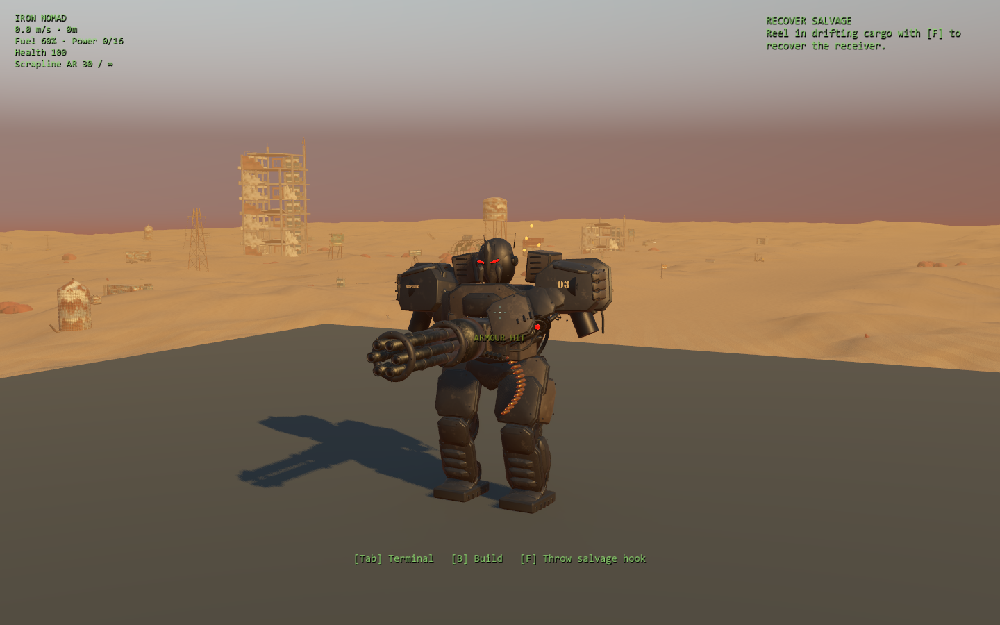

# Combat feedback, camera review and local playtest recording

Implemented and reviewed 28 September 2026. [Source-stamped results](results/combat-feel-2026-09-28.json) retain test counts, source hashes, preserved-baseline configuration and measurement limits.

Player firearm and crewed-gun impacts now report the result of one authoritative damage call. Armor, Bastion vent exposure, remaining health, range falloff and Sovereign protection determine that result before presentation. Automatic guns still cause visible target impacts and positional sound, but cannot claim a personal hit. World/owned/friendly collisions and zero damage do not produce successful player-hit text or reticle confirmation. A shotgun shell summarizes its pellets once; damage, ammo, attack timing, drop RNG and physical collision remain unchanged.

The existing upper-body reaction now gives a restrained side response at the point of impact and a slightly stronger exposed response, while leaving planted legs, movement and committed attacks alone. Death clears the overlay. Armor has a small warm radial spark pattern and metallic sound; exposed machinery has a narrower pale spray with the existing damaged-mechanism sound. Text, sound and particle shape/count supplement color. Native review caught overly large first-pass particles; final contact particles are 6–8 mm and use existing rendering/audio resources.



[Exposed impact](previews/combat-feel/bastion-exposed.png), [Raider at rest](previews/combat-feel/raider-ready.png), [during impact](previews/combat-feel/raider-impact.png), and [after recovery](previews/combat-feel/raider-recovered.png) are controlled native presentation fixtures in the real world lighting. They do not represent an uncoached encounter. Raw ready/impact/recovered captures for all six enemy kinds remain under `test-results/godot-native/feel-*.png`.

Camera and canopy clearance tests found no new controller defect, so collision, movement dimensions and camera sweep rules were preserved. Both headless and real native input tests pass around cover, close equipment, shoulders, FOV changes, held gear, cinematics and menu handoffs. Native wrist review passed its input/readability tests but found a small mesh intrusion following the separate 15% housing reduction. The integration owner adjusted the mount clearance; the construction reviewer subsequently passed 45 wrist and 21 construction/UI native checks on the corrected mount.

Two old audio-test failures were reproduced against the preserved source. The wrist click had extended the sound bank beyond an outdated three-cue prewarm assumption; wrist, cutter and refuge recipes now join the existing gun/radio recipes at setup, retaining their original PCM and gain. The finished-voice check had used simulated elapsed time even though audio progresses in wall time. Its bounded wall-time check now matches the existing mixer-lifetime test strategy. No shipping audio wait was added.

## Verification

**546 headless checks pass across 11 focused suites:** recorder 22, impact feedback 18, enemy replay 42, enemy animation 113, camera clearance 55, canopy camera 68, survivor combat 31, audio lifecycle 50, weapon presentation 68, locomotion 39 and encounter loading 40. **149 native checks pass:** impact attribution 18, physical-input survivor combat 31, camera clearance 55 and wrist terminal 45. These focused suites span the implementation; the separate [final frozen regression report](results/final-frozen-integration-2026-09-28.json) records 609 checks against matching start/end source fingerprint `05ed64e1d551778300593de28241cdbb6e4a282c1180280f767e0dbf29d319f5`. Counts overlap and must not be added as unique coverage.

The feedback tests cover positive/zero damage, no duplicate armor application, Bastion exposure before death, clamped lethal damage, disabled zones, source attribution, multi-pellet summary, owned/friendly protection, unchanged gameplay RNG and bounded audio nodes. Existing deterministic enemy replay remains unchanged. Native tests are presentation/input evidence; concurrent headless correctness workers mean their incidental timing output is not an isolated performance benchmark. Human judgments of responsiveness and listening remain pending C05.

## Preserved-source performance sample

Baseline source manifest: `4c88aa6cbe279d91ef21f1ac8a9aaee8abe2c0ecc1d8714cd73ca2f36b3a8869`. Runtime scripts/data came from `test-results/five-priority-baseline-2026-09-28/sources.zip` in a separate project, sharing unchanged art/imported resources. The initial mutable-worktree profiler smoke run is excluded from baseline conclusions.

RTX 3070, Godot 4.7.2, 1920×1080, high Forward+/Vulkan, 4× MSAA, VSync off. Each fresh process loads a checkpoint and uses a repeatable slow camera panorama while ordinary simulation continues. The 90-second Foundry detour runs each completed one normal automatic save and retained health 100. The 20-second defense/scout/workshop samples are passive stage views, not a claim that their combat or traversal was completed.

| Sample | Duration / cap | Steady p95 | Steady p99 | Steady max |
| --- | --- | ---: | ---: | ---: |
| Foundry detour | 90 s / 60 Hz | 16.874 ms | 17.075 ms | 18.838 ms |
| Defense | 20 s / 60 Hz | 16.863 ms | 16.969 ms | 19.035 ms |
| Scout | 20 s / 60 Hz | 16.841 ms | 17.066 ms | 19.049 ms |
| Workshop | 20 s / 60 Hz | 16.788 ms | 16.918 ms | 17.134 ms |
| Foundry detour, callback stamps | 90 s / uncapped | 7.407 ms | 13.004 ms | 24.129 ms |

“Steady” excludes the first five seconds, which remain in the raw reports. Those initial frames include 249–366 ms maxima, and synchronous checkpoint launch calls took 320–511 ms. These costs are not diagnosed or claimed fixed. No post-five-second frame exceeded 25 ms in this bounded set; the earlier historical intermittent steady-travel hitch was not reproduced, so no speculative optimization was applied.

These five preserved samples are an initial baseline, not a repeated before/after optimization comparison. The capped and uncapped runs are different workloads and cannot establish instrumentation overhead or a speedup. OS/driver cache state was uncontrolled. An idle Blender desktop process remained open; its measured CPU increase was 0.06 seconds over about two minutes, but its GPU use was not directly measured. No other Godot process or known render/bake job competed during baseline measurements.

## Combined-source recording and workload samples

[Nine native samples](results/final-native-performance-2026-09-28.json) used one frozen runtime fingerprint, `8da20c96c84c396ffca6d4fd324ed4ec2dfd0f490d25be70fdbe5ac24c833373`, before the later stairs preparation and final resource-contract fixes. All nine processes exited successfully. The machine, resolution, quality and VSync settings match the baseline above; each report retains full configuration, profiler hash, frames, GPU/CPU counters, semantic transitions, recorder events and source fingerprint. Commands and desktop process observations are retained in the host manifest. Reproduce this set with `tools/godot/run-feel-acceptance.ps1`.

| Sample | Duration / cap | Steady p95 | Steady p99 | Steady max |
| --- | --- | ---: | ---: | ---: |
| Recorder OFF 1 | 30 s / uncapped | 4.812 ms | 5.092 ms | 7.486 ms |
| Recorder ON 1 | 30 s / uncapped | 4.843 ms | 5.365 ms | 7.881 ms |
| Recorder OFF 2 | 30 s / uncapped | 5.152 ms | 5.532 ms | 9.799 ms |
| Recorder ON 2 | 30 s / uncapped | 5.674 ms | 5.975 ms | 7.331 ms |
| Recorder OFF 3 | 30 s / uncapped | 5.704 ms | 5.968 ms | 7.651 ms |
| Recorder ON 3 | 30 s / uncapped | 5.718 ms | 6.020 ms | 7.834 ms |
| Travel with ordinary autosave | 90 s / 60 Hz | 16.834 ms | 17.016 ms | 19.356 ms |
| Construction catalog/floor/stairs previews | 20 s / 60 Hz | 16.873 ms | 17.274 ms | 87.176 ms |
| Foundry physical mechanism | 20 s / 60 Hz | 17.182 ms | 17.380 ms | 19.105 ms |

The six recording samples alternate OFF/ON with identical lightweight frame probes; fine callback stamps are off in both modes. ON retained eight coarse events per run. Paired p95 differences were +0.031, +0.522 and +0.014 ms, alongside substantial variation between runs. This establishes measured behavior in a quiet travel segment, not a universal overhead percentage, burst stress result or zero-cost claim. Opt-in source hashing and explicit report export occur outside these frame windows. No post-five-second frame exceeded 25 ms in the travel samples; the 90-second run completed one ordinary autosave near simulation second 60 and retained health 100.

The construction probe opened the real catalog, chose floor and then stairs ghosts, and cancelled. It did not perform paid placement/undo or test a dense layout. The Foundry probe reached valid local controls through fixture-assisted positioning and completed bus, unlock, physical carriage motion and latch. It is mechanism rendering/collision evidence, not human walking evidence. Initial-window maxima across the nine runs were 163.745–250.439 ms; checkpoint launch calls took 203.611–449.223 ms. These startup costs remain unresolved. Only one Godot process ran at a time, while normal desktop activity and small report reads continued. Blender remained open with a 0.078-second CPU increase over 6 minutes 5 seconds; its GPU use and OS/driver caches were uncontrolled.

### First-use stairs preview attribution

The construction sample's one 87.176 ms outlier aligned with first stairs selection. Two identical fresh-process repetitions with narrow CPU/cache probes reproduced 96.475 and 81.302 ms frames. The synchronous `choose()` calls took 87.132 and 73.074 ms with an uncached stairs resource; already-cached floor selection took 0.094 and 0.097 ms. A separate deliberate split probe measured resource loading at 76.662 ms, scene instantiation at 0.024 ms, material overrides at 0.017 ms and subsequent cached selection at 0.059 ms. That diagnostic deliberately retained an 86.739 ms frame; it was not a shipping fix.

The stairs scene now joins the existing serial asynchronous title preparation queue. The queue retains one outstanding request, creates no actor or collider, and preserves session state/RNG and resource ownership. Full integration initially exposed renderer initialization errors when a different cold scene loaded while the new textured model was being prepared. An immediate uncached scene request now collects outstanding title preparation through its original owner before starting another synchronous resource load, then rechecks the cache. Preparation ticks remain asynchronous. Live preparers register and unregister on tree entry/exit, with no additional request/get or headless exception. The [final affected regressions](results/final-loader-regressions-2026-09-28.json) pass 40 loader, 109 integration and 290 checkpoint checks without errors or warnings. The loader tests include a real delayed worker proving unrelated-load ordering and registration cleanup.

[Five alternating causal-control/production pairs](results/stairs-preview-performance-2026-09-28.json) pass on the final frozen `05ed64e1…` source. The control removes only the new stairs queue entry before its first tick; all other final code, ownership correction, recording, fine callback probes, seed and 20-second construction schedule match. These runs are capped at 60 Hz. Reproduce them with `tools/godot/run-feel-acceptance.ps1 -StairsPairs`.

| Pair | Control stairs CPU | Production stairs CPU | Control steady p95 / p99 / max | Production steady p95 / p99 / max |
| --- | ---: | ---: | --- | --- |
| 1 | 79.438 ms | 0.339 ms | 17.163 / 17.555 / 91.768 ms | 17.518 / 18.148 / 19.061 ms |
| 2 | 79.677 ms | 0.076 ms | 17.211 / 17.801 / 88.752 ms | 17.144 / 17.594 / 18.845 ms |
| 3 | 77.315 ms | 0.074 ms | 17.259 / 17.859 / 88.345 ms | 17.502 / 18.480 / 24.617 ms |
| 4 | 80.057 ms | 0.075 ms | 17.191 / 17.493 / 91.228 ms | 17.155 / 17.579 / 19.576 ms |
| 5 | 85.183 ms | 0.077 ms | 17.193 / 17.665 / 97.535 ms | 17.160 / 17.660 / 19.093 ms |

Each control reproduced one post-five-second frame above 25 ms. Every production selection used the prepared resource, took less than the predeclared 5 ms limit and had no replacement frame above 25 ms anywhere in the post-five-second window. This fixes the measured first-stairs selection delay; capped medians stay near 16.66 ms, and no general FPS gain or historical travel-hitch fix is claimed.

The tradeoff is earlier resource residency and preparation work. The extra existing PackedScene is held from title preparation; title readiness can wait for it, and an immediate cold-load fallback can wait on an outstanding preparation request. Queue completion in this checkpoint fixture was 1.59–1.74 seconds after launch for controls and 1.73–1.98 seconds for production. Initial-window frame maxima still range from 134.758–208.087 ms, with 202.456–250.924 ms checkpoint launch calls. Those startup costs remain open. No second Godot process ran during the pairs; Blender's CPU increased 0.0625 seconds over 4 minutes 25 seconds, with background GPU/cache state unmeasured. Other hardware, the broader cold-cache/Continue matrix, uncoached campaign pacing and human feel/listening judgment remain outside this acceptance.

## Optional local recording

Launch with `-- --playtest-record` to enable recording. Normal play leaves it disabled. The pause menu then offers **Export playtest timings**; exporting writes a local JSON report and tells you its folder. Nothing is transmitted or automatically uploaded.

Records include schema, run ID, full runtime source fingerprint, seed, campaign/checkpoint/synthetic provenance, tuning revision, wall and simulation clocks, phase, primary activity, event and a limited payload. Checkpoint/load boundaries start a segment instead of implying one continuous campaign. Mutually exclusive activity dwell prevents overlapping travel/combat/menu minutes. Repeated state is coalesced; changing flags are sampled at most every five seconds. The integration owner adds authoritative resource/build/craft/save events after their actual transactions.

The default buffer holds at most 4,096 events and 4 MiB, with visible overflow and payload-truncation counts. The recorder never owns gameplay state/RNG and writes only on explicit export. Copies returned by `snapshot()` cannot mutate its internal buffer. Runtime source hashing happens only at opt-in setup; binary art provenance belongs to the build manifest.

Summarize an exported file with:

```powershell
python tools/godot/summarize-playtest.py path/to/recording.json --output path/to/summary.json
```

The report retains committed-event ledgers and provenance, rather than inventing earnings from status text or treating absent events as zero activity. Overflow means the event history is incomplete. Prepared checkpoints and synthetic tests cannot establish natural campaign balance or stand in for a human playthrough.
