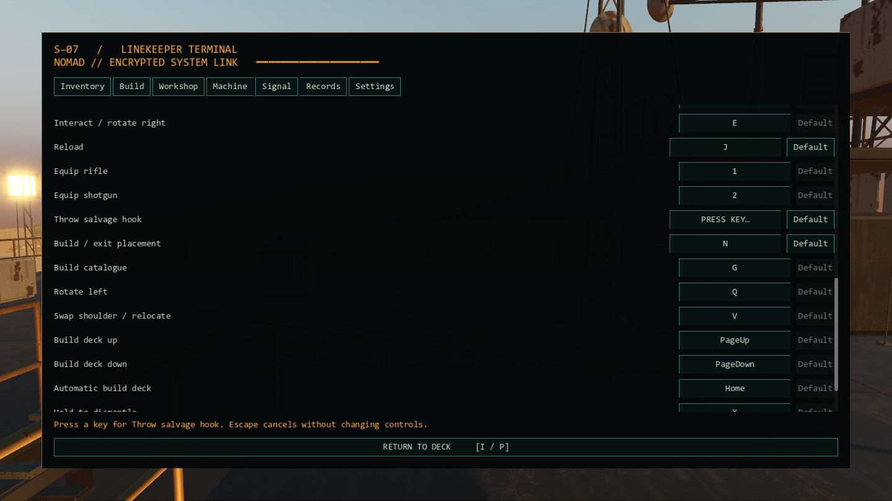
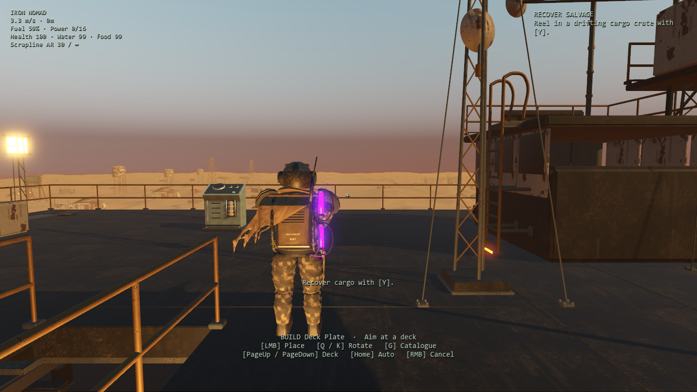

# Native controls and interaction consistency

Starting revision: `ac687b0`. The review found default-key hints after remapping, key capture that could stay armed after leaving Settings, and different priorities for the interaction prompt and its action. A grapple beside the receiver could block the receiver's input while the HUD continued to advertise it. Partial cut progress could survive walking away, and retreating grapples remained selectable.

## Implemented tasks

1. Centralize keyboard defaults, readable action names and conflict-swapping in `MMFControls`. Normalize malformed or conflicting saved mappings to usable unique controls. Keep the existing settings format and secondary C crouch shortcut when C is available. Release held keyboard actions when reconfiguring input.
2. Resolve semantic control hints at presentation time. Objectives, active/queued reminders, notices, receiver status, world-space service labels, boarding warnings, interaction prompts and the terminal return button use active bindings. Labels reflect the current physical-key layout when available. Cache formatted hints between configuration changes. Radio duration uses the displayed text length, avoiding extra time for internal tokens.
3. Make Settings capture explicit and cancellable. Ignore repeats, releases and events with no physical key. Escape cancels without changing the pause mapping. Navigation, closing the terminal and rebuilding a page clear capture. Show the waiting action and cancellation instruction in a fixed footer, keep controls and scroll position when changing a binding, and offer per-action/default-all restoration. Settings before a campaign can return to the title.
4. Use one resolver for both visible interaction and dispatched action: crewed gun, active boarding hook, receiver, optional site, campaign point, built equipment, helm. Preserve original reaches. Only an active grapple can preempt equipment; its retreating remnant cannot. Placement, menus, cinematics and death block deck interactions.
5. Let that same choice govern held interactions. Grapple cuts and optional service still require 1.2 seconds. Leaving reach, releasing use, changing targets, opening a menu or entering placement resets progress. Service cannot advance at the same time as cutting a nearby grapple. Existing navigation unlock and story-priority gates remain.
6. Add concise placement instructions for placement, rotation, catalogue, deck selection and cancellation. Correct existing malformed L–12 and ± characters in radio messages. Exercise physical events, interrupted holds and rendered UI, then run campaign/story/play regressions.





## Validation

Godot 4.7.2, Forward+/Vulkan, RTX 3070. **288 checks passed** across:

| Suite | Checks | Coverage |
| --- | ---: | --- |
| Controls/interactions, rendered | 65 | Physical movement, salvage, menus, reload and placement keys; capture cancellation, malformed mappings, swaps/defaults, persistence, dynamic hints, overlap priority, uninterrupted holds and native UI layout |
| Physical gameplay parity, rendered | 57 | Actual hook flight and cargo transfer, receiver, construction, weapon controls, radioactive-ground recovery, mounted death/respawn and save/load |
| Campaign integration, headless | 108 | Existing chapter progression, optional sites, resources, defenses, construction, save validation and round trips |
| Story/UI polish, headless | 58 | Existing console gates, radio queues, build catalogue, equipment map, combat timings and boarding indicators |

The focused suite uses `native-controls-tests/`; personal campaigns/settings are not written. Reports and logs are under `test-results/godot-native/controls-*`; the rendered focused report is retained in [results/controls-interactions.json](results/controls-interactions.json). Screenshots were inspected after checking that the active binding row and fixed footer were actually in view. Existing story and combat timings, rewards, reach distances, assets and rendering quality remain.

One headless story run executed concurrently with the rendered controls suite completed all 58 assertions but reported 11 leaked ObjectDB instances / 3 resources at shutdown. The original serialized run and four subsequent serialized verbose runs exited cleanly. The failing run did not include resource identities, so this remains an unresolved intermittent shutdown diagnostic; it is not evidence of a clean leak fix. No new audio/resource workaround was added here. The focused rendered, physical parity, integration and import logs contained no errors or warnings.

This iteration is a controls/usability correction, not an FPS claim. The retained Three.js game is unchanged. Native keyboard/mouse controls remain the supported input surface; gamepad remapping is outside this pass.

```powershell
powershell -NoProfile -ExecutionPolicy Bypass -File tools/godot/launch.ps1 -ControlsTest
powershell -NoProfile -ExecutionPolicy Bypass -File tools/godot/launch.ps1 -ParityTest
powershell -NoProfile -ExecutionPolicy Bypass -File tools/godot/launch.ps1 -Test -Headless
powershell -NoProfile -ExecutionPolicy Bypass -File tools/godot/launch.ps1 -StoryTest -Headless
```
