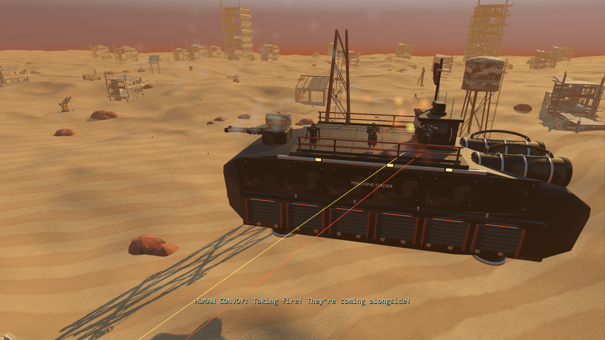

# Crossfire landscape and camera clearance

Starting revision: `5152574`. The preceding model review showed the battle ships crossing desert ruins and the returning camera passing close to a Nomad mast. This pass improves staging of that existing scene, without new story content.

## Implemented tasks

1. Retain the scenery's CPU placement bounds when each streamed chunk finishes, including natural details and ambient fittings. Build a value-only snapshot of the active landscape, machine, player construction and restored destination for route planning. Preserve every original scenery transform.
2. Search deterministic forward-right locations for the existing opposing formation. Check each ship's complete swept envelope, including the 44.2 m original travel, and the visible camera corridor against obstacles. Sample both full hull footprints over the route against the same dunes used by the renderer. Choose a constant low flight altitude with crest clearance.
3. Run the expensive search on a worker during the scanner's existing three-second stabilizing interval. Translate the result into the current moving-world coordinates and validate it again at activation. New obstructions invalidate the prepared route; direct cutscene saves retain a synchronous fallback. Cancellation and shutdown join the worker before releasing its value arrays.
4. Replace the deck-to-scene and scene-to-deck flythroughs with short concealed cuts. Keep the actual shoulder view through the entry fade, switch under a full-black plateau, and reveal the established battle view. Return to the current shoulder transform and FOV under another plateau. Place the fade below UI so captions and pause menus remain available. Finish, skip and campaign reset remove it immediately.
5. Test real rendered scenery instances, full hull paths, finer dune samples, multiple deck/shoulder/FOV settings, preparation/cancellation and new construction. Inspect the actual battle/return views and measure the normal scene entry without capture readbacks.



The same two ships, five actors, local deck positions, firing effects, faction flags, Revenant turn/close-up, captions, **17-second duration** and following raid interval remain. The formation's location/altitude can change to fit the existing landscape. No scenery is hidden, deleted or relocated for the encounter. The original Three.js edition is unchanged.

## Route behavior and limits

The search checks 195 candidate locations, preferring those closest to the original forward-right placement. Full ship bounds are swept through the original 2.6 m/s translation and expanded by 0.7 m. A separate volume encloses the visible establishing, approach and face-camera positions. Bounds are conservative; a narrow gap inside a ruin may be rejected even if individual triangles would fit.

Dunes are sampled across the full swept footprints on a grid no coarser than two metres, with 1.1 m crest allowance. The independent test uses one-metre cross-sections throughout the scene. All six tested landscapes retained more than one metre of observed clearance and used ordinary low routes. This is sampled terrain evidence, not an analytic guarantee for arbitrary future terrain shaders; the shader/CPU height contract remains unchanged.

If unusually dense or player-edited scenery blocks every ordinary candidate, the formation is placed above all horizontally overlapping obstacles. The crowded-world fixture verifies this explicit upper-route fallback. It avoids clipping and preserves story progress, but can produce a higher flight than normal. No ordinary tested landscape needed it.

Preparation uses no scene-tree, resource or render calls on the worker. Main-thread collection reuses chunk bounds instead of reading back MultiMesh buffers. One route worker is owned by the cinematic. Results stay tied to their snapshot's distance/lateral coordinates; activation accounts for intervening travel and steering. A stale or newly obstructed result is recomputed. Immediate save restoration or last-moment invalidation can therefore still perform synchronous work.

## Camera behavior

Entry fades down over 0.20 s, cuts at 0.26 s within the black plateau, and reveals the battle by 0.60 s. The original establishing/approach/face beats then continue. Return fades down from 16.3–16.5 s, switches at 16.6 s while fully concealed, and reveals the shoulder camera from 16.7–17.0 s. Control resumes at the original 17-second boundary. This eliminates the exposed flight across machine ceilings, masts and built equipment; the existing player camera still handles local deck obstruction.

[Establishing view](previews/clearance-wide.png), [Revenant contact](previews/clearance-contact.png) and [revealed return](previews/clearance-return.png) are native captures. Tests cover the lower, middle and upper deck, both shoulders and FOV 45/100. They check full opacity around both cut instants, exact player transforms before entry/after return, overlay cleanup and UI layer ordering.

## Timing and verification

RTX 3070, 1920×1080, high quality, Forward+/Vulkan, 4× MSAA, VSync off, 60 FPS cap. A normal scanner-completion run with captures disabled measured **3.318 ms entry CPU / 21.684 ms entry frame**. The preceding ship iteration measured 1.795 / 20.379 ms. The approximately 1.3 ms frame difference is a small additional staging cost, not an FPS improvement. The maximum pre-scene frame was 18.564 ms in this sample. The route was prepared and reused; its background search took 7.245 ms. A crowded diagnostic layout previously required about 98 ms synchronously, which motivated moving search off the activation frame.

The visible camera's largest angular frame was 2.018° in this clean sample. Larger pose changes occur intentionally while the view is fully concealed and are retained in the raw report, rather than being described as smooth camera motion. Scene entry and final control handoff had zero observed transform/FOV jumps. [Full timing data](results/clearance-timing.json) includes fade opacity for each frame. These are scene-specific measurements, not a full-game performance guarantee or a resolution of unrelated intermittent renderer stalls.

**503 assertions pass:** 107 clearance/preparation, 65 scanner/camera handoff, 54 unchanged scenery-contract, 108 integration, 58 story, 54 native camera and 57 native physical-input parity. [Validation summary](results/clearance-validation.json) and [clearance details](results/clearance-tests.json).

The clearance suite reads actual GPU-visible MultiMesh transforms independently of the planner's cached bounds. Six seeded layouts span distance 0–20,567 m and lateral offsets −271.3–523 m. Ship/camera envelopes are sampled through the full scene, with no detected scenery intersections. It also checks background preparation, travel/steering translation, newly placed blockers, cancellation with a started worker, unchanged gameplay RNG and the deliberately crowded fallback. This does not claim an exhaustive campaign playthrough.

An intermittent headless shutdown warning reappeared after the preceding iteration's test cleanup. Verbose output identified active `AudioStreamWAV`/playback references, including distant gunfire. The audio node now explicitly stops players and detaches their streams before releasing its bank on exit. Final verbose handoff and all selected regression logs contain no leaks, warnings or errors. Playback behavior during the game is unchanged.

```powershell
powershell -NoProfile -ExecutionPolicy Bypass -File tools/godot/launch.ps1 -CrossfireClearance
powershell -NoProfile -ExecutionPolicy Bypass -File tools/godot/launch.ps1 -CrossfireTest -Headless
powershell -NoProfile -ExecutionPolicy Bypass -File tools/godot/launch.ps1 -CrossfireReview
powershell -NoProfile -ExecutionPolicy Bypass -File tools/godot/launch.ps1 -CrossfireProfile
```

`-CrossfireClearance` requires native rendering because the headless renderer does not retain equivalent MultiMesh buffers. Tests use isolated saves and preserve personal settings. The broader enhancement goal remains active: full-campaign feel, control-hint cohesion, visual consistency and unrelated intermittent engine/render stalls remain open.
