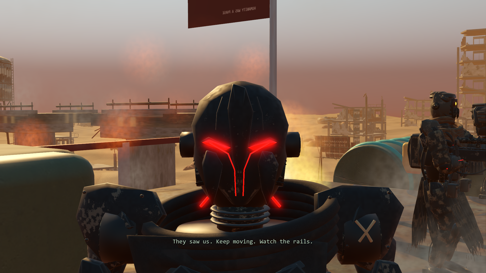

# Scanner crossfire preparation and camera continuity

Continues the [enhancement goal](enhancement-goal.md) from `dbd3aef`. A native real-time review found an approximately 0.84-second hitch when the scanner triggered the battle, an immediate 60-degree camera turn, and a 30-to-72-degree field-of-view jump when control returned. This pass improves the existing scene without extending its story or changing its timing.

## Implemented tasks

1. Capture the existing scanner completion, battle ships, Revenant close-up and return to the deck. Measure the entry function separately from rendered frame intervals. Repeat the comparison without screenshot readbacks so capture-induced physics catch-up cannot be mistaken for a camera defect.
2. Request the six existing scene resources sequentially in the background while the scanner is installed/scanning. Consume completed requests and assemble one part per physics tick: two ships and five actors. Keep one hidden, disabled prepared set, retaining the original models, transforms, scale, animations, fire and smoke.
3. Activate that set at the existing scanner signal. Direct saves restored into crossfire have no earlier preparation window, so they retain immediate synchronous construction as a fallback. Campaign changes discard prepared nodes; outstanding requests are consumed even when no longer needed, and shutdown drains them.
4. Blend the full camera pose from the player's actual view into the established shot, rather than instantly aiming at the ships. Ease the close-up back to the current shoulder camera and field of view before handing control back.
5. Verify scanner timing, scene lifetime, saved crossfire, skipping, multiple camera settings and existing gameplay/camera regressions. Retain native images, complete measurements and explicit limits.

The loader follows Godot's [background-loading contract](https://docs.godotengine.org/en/stable/tutorials/io/background_loading.html): gameplay polls status and only retrieves completed resources. The immediate save-resume fallback and orderly shutdown may deliberately wait for a pending request. Scene construction still runs on the main thread, one small part at a time.



The scanner still requires 180 seconds of powered, safe scanning, followed by the three-second stabilizing interval. Crossfire still runs for 17 seconds with the same captions, opponents, ship motion, effects and Revenant turn. Natural completion and skip still enter the original `raids` phase with the same recovery interval. No new story, reward, enemy or combat rule is introduced. The preserved Three.js game is unchanged.

## Native measurements

RTX 3070, 1920×1080, high quality, Vulkan/Forward+, 4× MSAA, VSync off, 60 FPS cap, 72-degree player field of view. Each run settles startup for three seconds, seeds the repaired scanner at its final eight seconds, waits the original three seconds, then plays the full battle in real time. Both timing runs disable screenshots. The baseline uses the original cinematic script from `dbd3aef` with the same current surrounding game.

| Observation | Original | Refined |
| --- | ---: | ---: |
| Entry function CPU | 821.152 ms | 1.900 ms |
| Frame containing entry | 839.947 ms | 20.267 ms |
| First-frame camera turn | 60.165° | 0° at measurement precision |
| Entry FOV before → after | 72° → 56° | 72° → 71.997° |
| Return FOV before → after | 30° → 72° | 71.988° → 72° |
| Largest angular frame in the scene | 60.165° | 2.505° |
| Pre-scene scanning frame median / p95 | 16.667 / 16.796 ms | 16.666 / 16.814 ms |
| Maximum pre-scene scanning frame | 18.163 ms | 18.316 ms |

There were no pre-scene scanning frames above 25 ms in either clean sample (660 baseline, 661 refined samples). The seven preparation steps cost 0.365–0.839 ms each. The final frame still travels about 2.1 cm along the returning camera path in both versions; that is continuous path movement, not a claimed positional fix. The original capture run's larger apparent return movement was screenshot-induced catch-up, which is why the clean comparison is authoritative.

[Baseline timing](results/crossfire-before-clean.json) and [refined timing](results/crossfire-after-clean.json) retain every measured frame. These are specific scene-entry measurements, not an overall FPS claim or a resolution of the unrelated intermittent rendering-stall investigation. Preparation brings the same assets into memory earlier and keeps at most one prepared set; their node resources are released on use/cancellation. Shared loaded assets retain the game's existing cache behavior.

## Verification

**341 assertions pass:** 64 focused crossfire checks, 108 integration, 58 story-polish, 54 native camera, and 57 native physical-input gameplay parity. Final import and suite logs have no script errors, engine errors or leak warnings. An early test retained its old session reference across save loading and exit; releasing that test-owned reference removed the leak warning before final validation.

The focused suite checks hidden preparation without gameplay/RNG changes, two ships/five actors/four emitters, original ship transforms and Revenant scale, the original scanner delay, reuse of prepared nodes, cleanup of completed and cancelled scenes, outstanding-request consumption, shutdown while a request is live, direct crossfire save restore, and skipping. Nine combinations of FOV 45/72/100 and yaw −2.8/0.5/2.8 radians verify exact entry pose and convergence to the player view. At 16.999 seconds, position error is below 0.0002 m and FOV error below 0.0002°; the original 30° face close-up remains intact.

[Focused results](results/crossfire-tests.json) and [regression summary](results/crossfire-validation.json) record the checks. [Wide shot](previews/crossfire-wide.png), [return to deck](previews/crossfire-return.png) and the close-up above are native captures using the unchanged assets.

Run from PowerShell:

```powershell
powershell -NoProfile -ExecutionPolicy Bypass -File tools/godot/launch.ps1 -CrossfireTest -Headless
powershell -NoProfile -ExecutionPolicy Bypass -File tools/godot/launch.ps1 -CrossfireReview
powershell -NoProfile -ExecutionPolicy Bypass -File tools/godot/launch.ps1 -CrossfireProfile
```

For the baseline diagnostic, extract `git show dbd3aef:godot/scripts/cinematics.gd` into `test-results/godot-native/crossfire-original.gd`, then run `crossfire_review.gd` directly with `-- --legacy --no-captures --label=before-clean`. Tests use isolated save folders and preserve personal settings. The normal three-minute scan is shortened only by the diagnostic's initial fixture; production duration is unchanged and checked separately.

The overall goal remains active. The wide shot exposes battle-ship hulls that are much simpler than the authored characters and main machine; these are a concrete next Blender refinement target. The scripted return can still pass near a mast from this starting position ([16.7-second view](previews/crossfire-return-path.png)); full flythrough clearance is not claimed. Full-campaign feel, control-hint cohesion and the separate intermittent rendering stalls also remain open.
