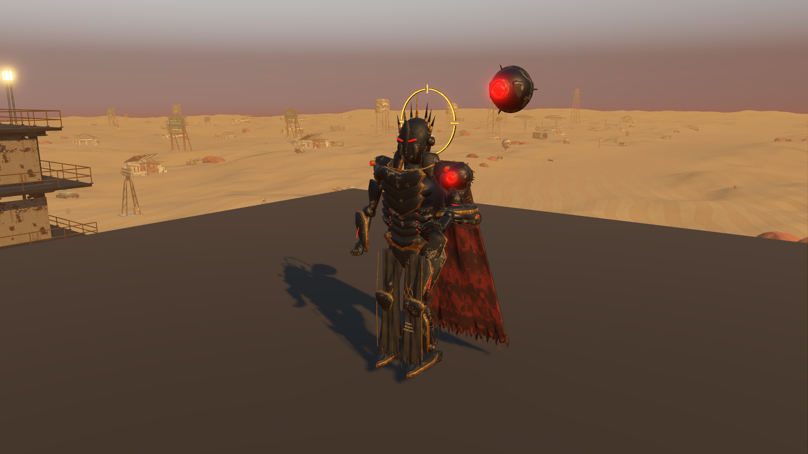
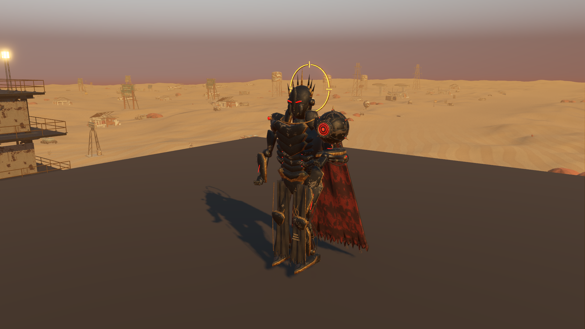

# Enemy equipment and shot presentation

Starting revision: `bb6d228`. Native inspection reproduced two commander orbs: one baked into its skinned body and an independent fallback above its head. Only the fallback accepted drone damage. Destroying it left a visible, invulnerable original orb; killing the commander left the fallback floating beside the corpse. Ranged enemies also drew tracers from chest height through cover, despite already having weapon sockets.

## Completed tasks

1. Review the user's mech reference, imported rigs, original Blender recipes and actual native views. Identify the dedicated `equipment_0` skin binding and its complete drone triangles; capture the unchanged baseline before editing.
2. Author a detailed Blender drone with curved armor, fitted seams, machined optics, short protected locators, captive hardware and a screened rear service cap. Review front/rear studio renders, the live MCP scene and native integration. Retain editable source and seven runtime batches with portable tangents and generated LODs.
3. Bake a geometry-only replacement for the original commander body. Remove precisely 3,856 old drone triangles and 1,884 LOD triangles. Preserve every other stored buffer, triangle order, LOD threshold and skin resource. Runtime instances reuse the original material/texture objects. The offline bake is part of native setup; no mesh trimming runs during gameplay.
4. Mount one drone on its existing animated equipment bone. Center its original generous 55 cm hit target on the visible orb through idle, walking, running, recoil and turning. Preserve 35 health, no armor, seven-metre shielding and the existing 20% mitigation. Destroy the whole visible orb once, remove its hit target and stop shielding; commander death performs the same cleanup. Its attack continues from its open palm after drone loss, preserving the existing controller rules.
5. Draw ranged shot effects from the real weapon sockets to the actual hit surface. A visual-only cover check stops the line at intervening geometry; a barrel protruding past nearby cover does not produce a backwards tracer. The original chest-based gameplay ray, hit masks, damage, attack timing, range and seeded loot remain decisive and unchanged. Shot audio follows the visible weapon.
6. Verify imported content, physical hit tests, destruction, cleanup, shield behavior, cover and damage; compare the prior combat controller over 1,680 ticks. Run broader gameplay regressions and measure matched native GPU views. Recheck desert/weather behavior.

## Art and runtime evidence

[Editable model and rebuild instructions](../../assets/native-drone/README.md). The final GLB contains 134 authored parts batched to seven meshes, 49,763 triangles and two original 512-pixel PBR sets. It validates with zero errors and warnings; the native import has zero collapsed triangles. It adds no persistent realtime lights and shares model resources across commanders.

Before: two independently placed orbs.



After: one detailed orb above the authored open hand.



Additional retained views show [drone destruction](previews/equipment-drone-destroyed.png), [commander death](previews/equipment-commander-fallen.png), [Warden shot origin](previews/equipment-warden-shot.png) and [Blender MCP review](previews/equipment-blender.png). The cyan cube beside the corpse is the unchanged existing loot marker. The studio pad exists only in the review fixture.

The ArrayMesh source representation and generated LODs were checked against the [Godot ArrayMesh documentation](https://docs.godotengine.org/en/stable/classes/class_arraymesh.html) and actual imported stored buffers. The bake requires the recorded source topology and refuses an unexpected drone triangle count; its manifest retains the source SHA-256. The regression independently compares all retained buffer data and every retained index, plus actual material identity on the runtime character.

## Verification

**904 assertions passed across 13 suites:** equipment 137, prior-controller combat comparison 42, enemy animation 113, integration 108, parity audit 132, controls/interactions 66, play parity 58, story presentation 59, crossfire handoff 66, traversal 13, audio lifecycle 50, desert/weather 28 and opening handoff 32. Final import, rendered review and selected test logs contain no script errors or resource-leak warnings. Tests use isolated save directories and `test_mode`; they do not write personal settings. Audio lifecycle and the broader parity audit run at their normal timing to allow actual mixer release.

The equipment checks exercise real animated bone transforms and physical rays at three rotations in four animation states; they retain the 55 cm target size and original health/shield rules. They also prove removal of the old baked drone at every LOD, reuse of all original body materials, shared new drone meshes, idempotent destruction, parent/corpse cleanup, correct shot origins during recoil, cover occlusion and unchanged clear-shot damage. The previous controller fixture is compared without regenerating its expectations.

The [desert pass](desert-life-review.md) remains verified: sparse grounded brush, roots, stones and gravel, subtle wind and drifting sand. Storm visibility remains, but exposure/shelter never increases water consumption and forecast text contains no shelter-for-water instruction. No new story content or progression changes were made.

## Measured rendering cost

RTX 3070, 1920×1080, high Forward+/Vulkan, 4× MSAA, VSync off. Same native environment, fixed cameras and full models, with two seconds warmup/four seconds sampling for each isolated enemy. World simulation is frozen while authored idle animation continues. Runs are sequential with Blender returned to idle solid shading; shots, explosions and screenshots occur outside timing. The final fixture clears transient lines between enemies and advances effects during destruction captures. After identifying that this also changed initial atmosphere updates, both sides were rerun through the identical final fixture: the original controller is loaded from `git show bb6d228:godot/scripts/enemy.gd` with only its global class-name declaration removed, using the fixture's `--source` argument. Original character assets remain unchanged.

| View | Before median GPU | After median GPU | Before median frame | After median frame | Draws before → after |
|---|---:|---:|---:|---:|---:|
| Warden | 2.679 ms | 2.687 ms | 3.146 ms | 3.180 ms | 549 → 549 |
| Bastion | 2.599 ms | 2.609 ms | 3.038 ms | 3.095 ms | 524 → 524 |
| Sovereign | 2.758 ms | 2.779 ms | 3.198 ms | 3.248 ms | 564 → 574 |

Median GPU differences span +0.008 to +0.021 ms, small and subject to host variation. The detailed commander adds ten total visible/shadow draws in this view; the unchanged ranged models retain their draw counts. This verifies acceptable cost for this presentation pass, not a whole-game FPS improvement. Rendering and regression JSON are retained as `results/equipment-*.json`.

```powershell
& test-results/godot-tools/Godot_v4.7.2-stable_win64_console.exe --headless --path godot --script res://tests/enemy_equipment.gd --fixed-fps 60
& test-results/godot-tools/Godot_v4.7.2-stable_win64_console.exe --path godot --script res://tests/enemy_equipment_review.gd -- --label=after
```

The broader enhancement goal remains active. Legacy robot surfaces, richer gait/boarding movement, simple loot markers, full-campaign human play feel and independently observed startup/intermittent frame stalls remain separate improvement candidates.
