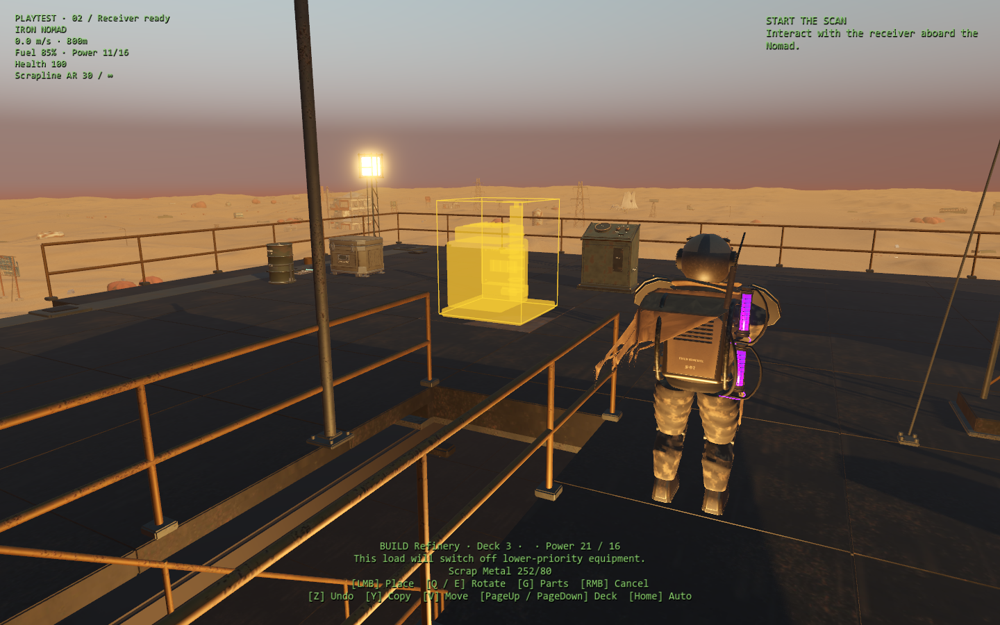

# Five-priority playable update

Implemented 28 September 2026 in the native Godot game, with three specialist subagents and shared integration review. All five priorities now have playable changes. The [task boards](../superpowers/plans/2026-09-27-five-priority-delivery-plan.md) distinguish implemented behavior from human acceptance and balance decisions still awaiting observations.

## Try the update

Launch **Play Godot.cmd** inside the `godot` folder. Use **Playtest checkpoints** from the title or pause screen to jump to any of the 19 prepared starts. Loadout previews, independent saves, restart and return-to-campaign remain available.

| Feature | What to try |
| --- | --- |
| Guidance | Start First steps aboard or Receiver ready. Follow the next-action text and optional world marker. Pin a recipe or build part to show real material requirements in the HUD and personal pack. Settings can disable objective markers independently of reminders. |
| Construction | Press **B**, choose a part, then **PLACE**. Use **Y** to copy an aimed part's blueprint and **Z** to undo an eligible recent placement or move. These keys can be rebound. Placement keeps materials, power, deck, clearance and controls visible. |
| Combat | Try defense/boarding. Armored and exposed impacts have distinct small particles, positional sound and restrained upper-body reactions. Personal confirmation follows actual player/manual-gun damage. |
| Expeditions | Try Wake, Foundry, Array, either Orchard approach and either Meridian approach. Walk between local service controls to operate visible machinery, then recover components at their stations. |
| Equipment and pacing | Local battery/drive panels show real backup reserve and normal/quiet comparisons. Encounter starts refuse overlap and retry correctly after a retreat. Ordinary cargo stays hookable until a recovered crane is installed and powered; unusable ammunition recipes no longer spend supplies. |
| Wrist computer | The physical housing is **15% smaller**. Its mount keeps the display clear of the forearm; reading camera and pointer still match the screen. |

The wrist contains personal pack and records. Workbench, refinery, receiver, helm, storage and site machinery retain their own physical interfaces. A materials pin is information and cannot remotely craft or operate equipment.

Firearms retain unlimited reload supply. Older ammunition inventory and weapon state remain intact; an obsolete ammo-recipe pin clears safely on load. The crane recovery site's explicit practice load and existing saved heavy cargo are retained. The [later resource audit](later-resource-audit.md) lists mandatory gates, optional costs and recovery limits.

Undo keeps at most ten paid-operation receipts for 120 seconds of simulation. It refunds the exact original payment only when the part, storage, support and safe return route still allow reversal. Using or damaging a part can make it ineligible. Operating autonomous machinery is excluded from full-refund undo until its use can be tracked completely; the displayed reason explains refusals. Copy selects a blueprint and charges ordinary construction costs when placed. Ordinary cutter dismantling remains available.

## Physical destinations

- **Wake:** isolate the feed, arrest the rotor and release the gyro cradle.
- **Foundry:** route power, unlock and move the gantry, then latch the recovery bay.
- **Array:** read calibration records and adjust each antenna at its own wheel.
- **Orchard:** restore route-specific access equipment; the other isolator stays intact.
- **Meridian:** service the archive carrier and transmitter through local controls.

These operations use captive equipment and consume no inventory items. They require no optional crane, battery, quiet drive, sand walking or timed jumping. Machinery checks its sweep for the player and pauses safely if obstructed. Saving becomes available after motion settles. Components and paired rewards are collected separately, preserving campaign ownership and older partial saves. See the [expedition guide](physical-expeditions.md).

## Record a playtest

On the checkpoint screen, enable **Record playtest timings locally** before starting. Alternatively launch with `-- --playtest-record`. Recording is off by default. When enabled, the pause menu offers **Export playtest timings** and reports the local output folder.

Reports distinguish campaign, checkpoint and synthetic runs, wall time, simulation time and primary activity. They include committed construction/crafting/transfer/save events and periodic resources. Storage transfers are net-zero. Loading a checkpoint starts a separate segment; toggling recording off excludes that interval. The bounded recorder writes only on explicit export and uploads nothing. The [recording guide](combat-feel-and-recording.md) includes a summary command and overflow limits.

## Verification and remaining evidence

| Evidence | Result / scope |
| --- | --- |
| [Final frozen acceptance](results/final-frozen-integration-2026-09-28.json) | **609 checks, no engine errors**, on one source fingerprint: construction, guidance, pacing, loading ownership, campaign integration and all 19 checkpoints. |
| [Combined affected regression](results/combined-headless-review-2026-09-28.json) | 517 checks across integration, parity, autosave, later expeditions, survivor, scout, boarding and raider-craft suites. Subsequent affected final checks retain their own source stamps in the [frozen integration report](results/final-frozen-integration-2026-09-28.json). |
| [Guidance](results/objective-guidance-2026-09-28.json) | 66 checks including all checkpoint objective states, pin validation, station isolation and marker visibility. |
| [Construction](results/construction-usability-2026-09-28.json) | 79 checks: exact refunds, full bags, used/damaged parts, support, occupied paths, remapped input and pure power previews. |
| [Native UI](results/five-priority-ui-review-2026-09-28.json) | 21 checks and eight reviewed captures at 1440×900 and 1200×900 with large text; actual placement, copy, undo and walking. Separate final native wrist suite: 45 checks. |
| [Expeditions](results/physical-expeditions.json) | 304 actual traversal checks across seven site/route variants in headless and native runs; separate state, lifecycle, checkpoint and final art evidence. More than 550 m of supported walking. |
| [Pacing contracts](results/pacing-contracts-2026-09-28.json) | 25 checks for scan migration, eligibility, encounter retry/overlap and pure equipment previews. Recorder toggle/bounds suite: 22 checks. |
| [Combat/performance](results/combat-feel-2026-09-28.json) | Damage attribution, deterministic enemy behavior, presentation/camera/audio and bounded native performance samples. |
| [Opening resources](results/opening-resource-ledger-2026-09-28.json) | 500 synthetic accounting cases under stated assumptions; not cargo collection safety or natural campaign balance. |
| [Resource refinements](results/native-resource-refinements-2026-09-28.json) | 81 checks for retired recipe compatibility, unchanged reloads, usable ordinary cargo and preserved heavy trial/restore behavior; existing later-expedition 85 checks also pass. |

Reports retain their own source/configuration provenance. Counts from different builds, duplicate headless/native runs and synthetic accounting assertions are not combined into a claimed single campaign pass. Tests use isolated saves; the user's campaign is not replaced.

The [final source manifest](results/five-priority-source-manifest-2026-09-28.json) identifies changed runtime files against the preserved working-tree snapshot. All 884 recorded art files remain unchanged; the physical wrist adjustment is in its mount/scale code.

The scanner remains 180 eligible seconds plus its existing three-second handoff. Route distances, encounter spacing, damage and reward quantities have not been retuned without observed campaign evidence. The historical intermittent steady-travel hitch was not reproduced in the preserved-source samples; startup and synchronous checkpoint-load costs remain separate from steady frame behavior. No universal smoothness or FPS improvement is claimed.

A reproduced first-stairs preview hitch was fixed by preparing that asset through the existing background queue. [Five matched native comparisons](results/stairs-preview-performance-2026-09-28.json) measured selection at 77–85 ms without preparation and 0.074–0.339 ms with it. All five production runs had no post-startup frame above 25 ms. Immediate cold loads also coordinate with outstanding preparation to avoid the renderer errors discovered during rapid-load testing. See the [performance evidence and limits](combat-feel-and-recording.md).

An uncoached opening and continuous campaign playthrough remain the main outstanding acceptance work. Automated reachability, accounting and checkpoint checks cannot establish discovery, enjoyment or journey pacing. Those observations should drive the next timer/reward adjustments and refinements.
